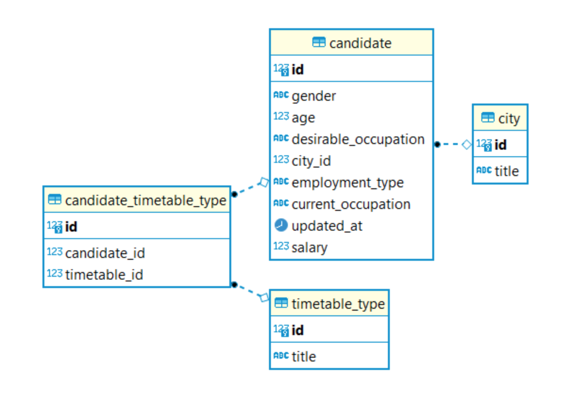

# Применение на практике знаний по теме "SQL"

*Проект по курсу [«Профессия Data Science»](https://lms.skillfactory.ru/courses/course-v1:Skillfactory+DST-PRO+15APR2020/about)\
от школы [SkillFactory](https://skillfactory.ru)*

## Цель проекта

Потренироваться в написании SQL-запросов на реальной базе данных соискателей HeadHunter. Выполнить практические задания, проанализировать полученные результаты и сделать выводы.

## Формулировка задания

Напоминаем, что датасет, с которым мы будем работать, уже вам знаком. Мы взяли те же данные HeadHunter, только разбили их по таблицам и перенесли в БД SQL. Такой процесс называется нормализацией (вы можете почитать про неё дополнительно, если вам понадобятся знания по проектированию баз данных).

### ER-диаграмма

### Этапы работы

- знакомство с датасетом;
- предварительный анализ данных;
- глобальный анализ показателей.
- анализ кандидатов;
