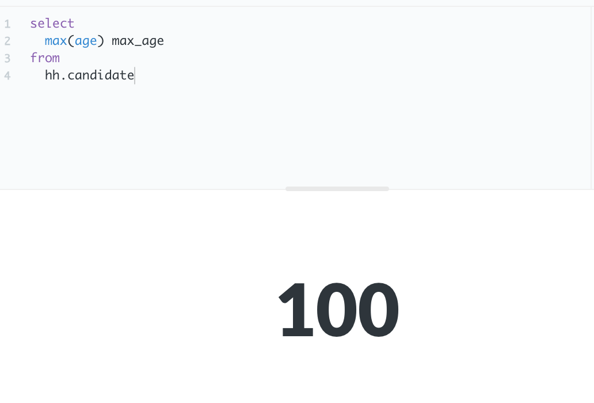
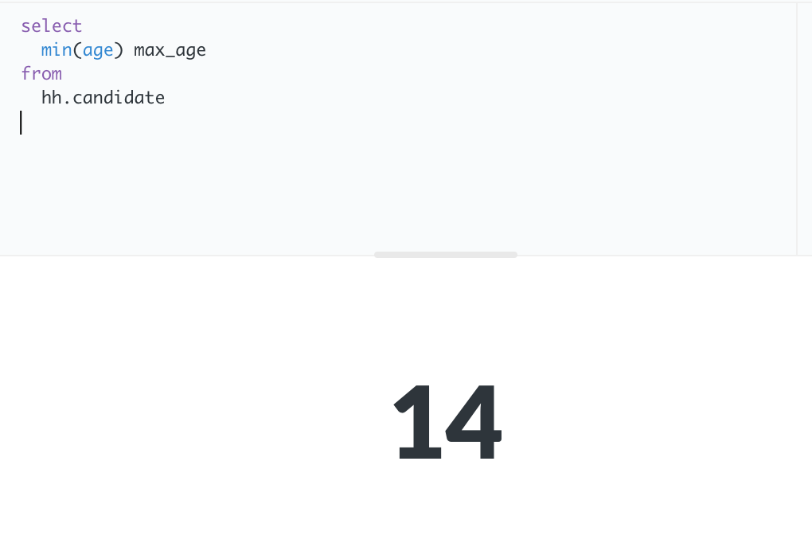
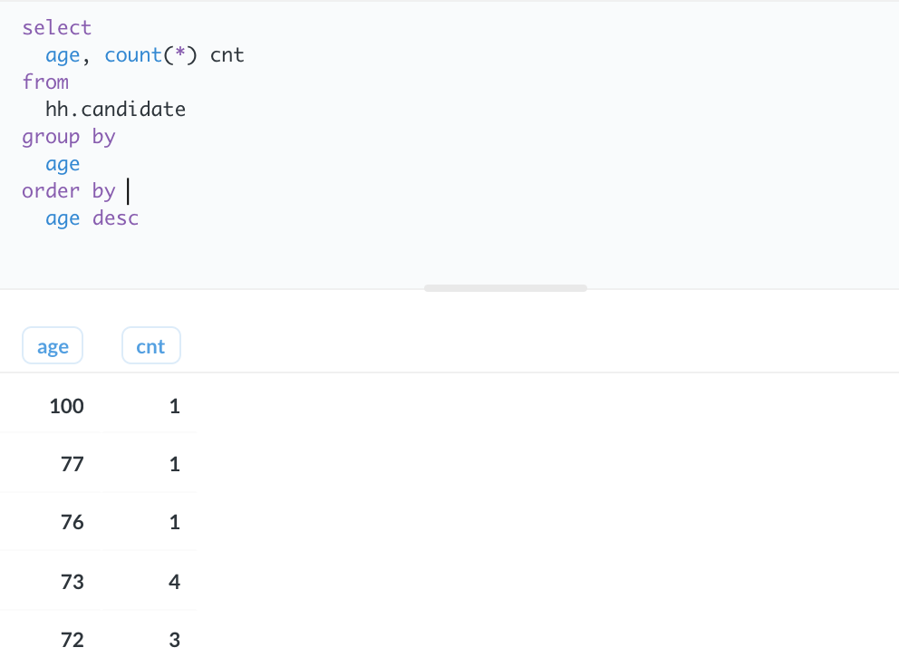
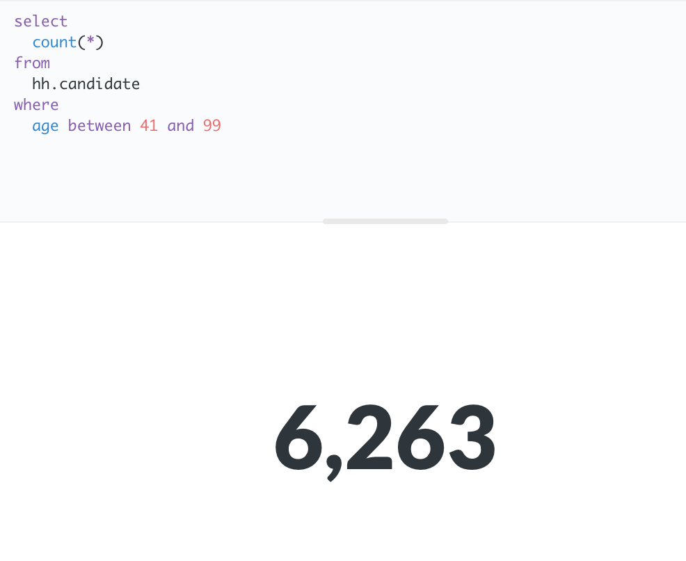

# Проект 2

## Задание 2.1

Рассчитайте максимальный возраст (max_age) кандидата в таблице.

```sql
select
  max(age) max_age
from
  hh.candidate
```



## Задание 2.2

Теперь давайте рассчитаем минимальный возраст (min_age) кандидата в таблице.

```sql
select
  min(age) max_age
from
  hh.candidate
```



## Задание 2.3

Напишите запрос, который позволит посчитать, сколько (cnt) человек какого возраста (age) у нас есть.
Отсортируйте результат по возрасту в обратном порядке.

```sql
select 
  age, count(*) cnt
from 
  hh.candidate
group by 
  age
order by 
  age desc
```



## Задание 2.4

По данным Росстата, средний возраст занятых в экономике России составляет 39.7 лет. Мы округлим это значение до 40. Найдите количество кандидатов, которые старше данного возраста. Не забудьте отфильтровать «ошибочный» возраст 100.

```sql
select 
  count(*)
from 
  hh.candidate
where
  age between 41 and 99
```


