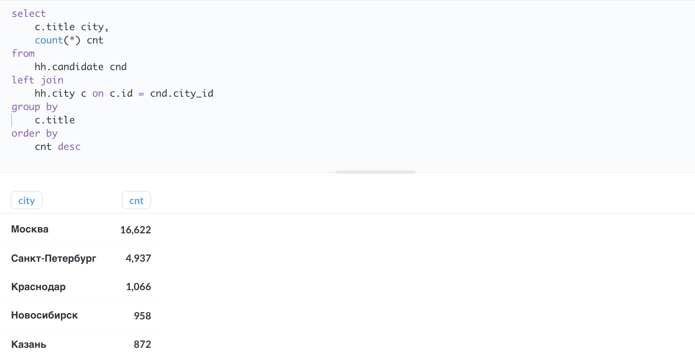
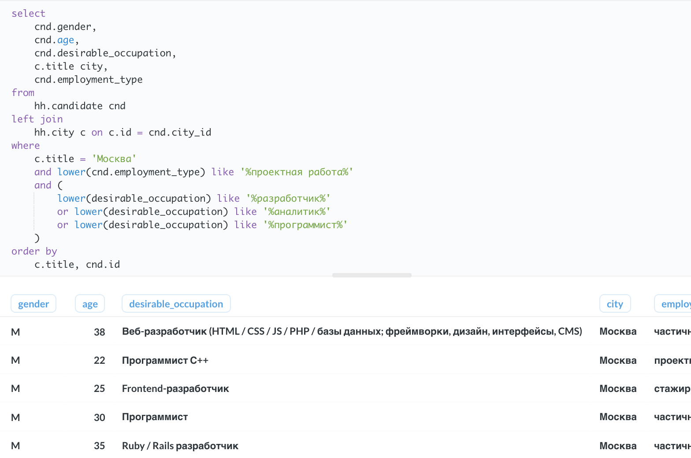
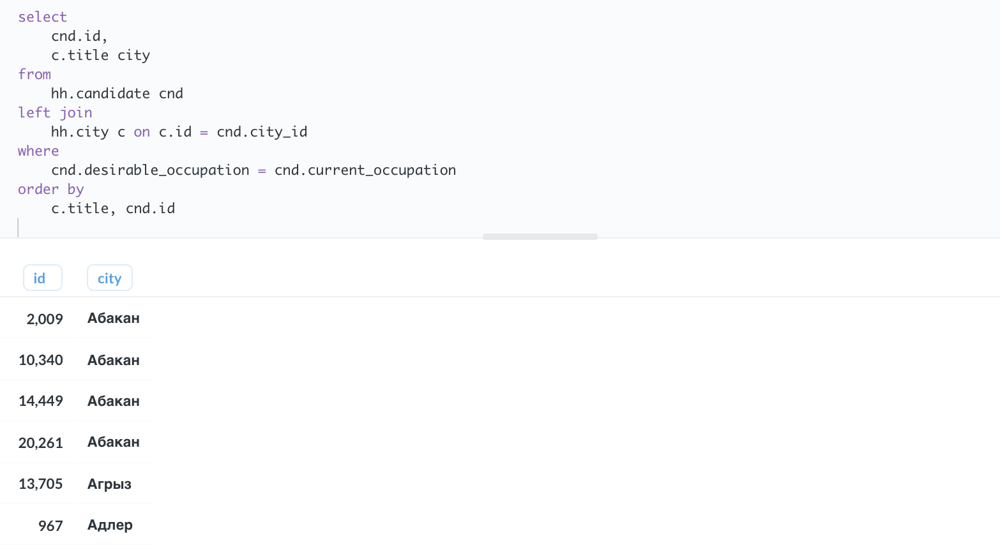
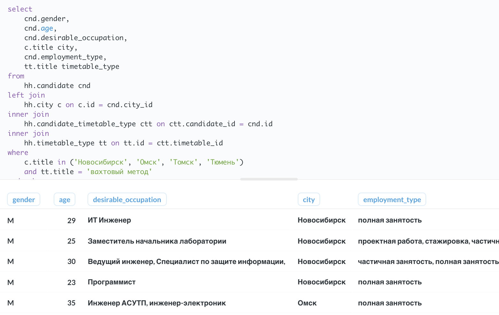
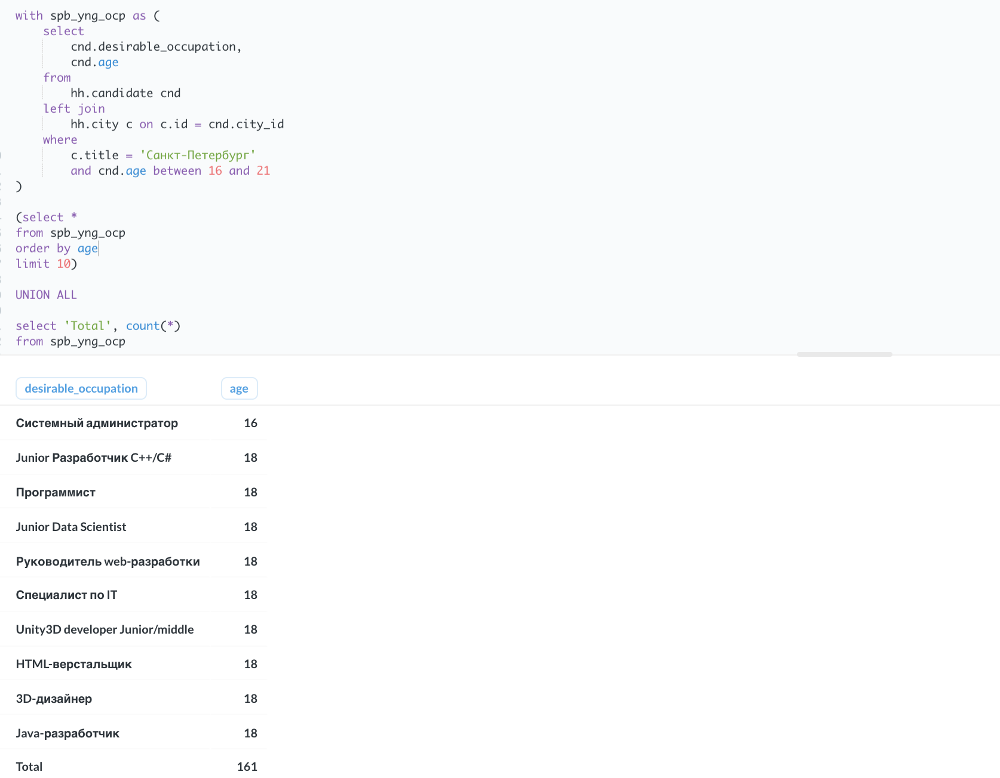

# Проект 2

## Задание 2.1

Рассчитайте максимальный возраст (max_age) кандидата в таблице.

```sql
select
    max(age) max_age
from
    hh.candidate
```


## Задание 2.2

Теперь давайте рассчитаем минимальный возраст (min_age) кандидата в таблице.

```sql
select
    min(age) max_age
from
    hh.candidate
```


## Задание 2.3

Напишите запрос, который позволит посчитать, сколько (cnt) человек какого возраста (age) у нас есть.

Отсортируйте результат по возрасту в обратном порядке.

```sql
select 
    age,
    count(*) cnt
from 
    hh.candidate
group by 
    -- группируем кандидатов по возрасту
    -- чтобы применить агрегирующую функцию
    age
order by 
    age desc
```


## Задание 2.4

По данным Росстата, средний возраст занятых в экономике России составляет 39.7 лет. Мы округлим это значение до 40.

Найдите количество кандидатов, которые старше данного возраста. Не забудьте отфильтровать «ошибочный» возраст 100.

```sql
select 
    count(*)
from 
    hh.candidate
where
    age between 41 and 99 
    -- Mожно было использовать два условия:
    -- `age > 40 and age < 100`
    -- Но мне кажется `between` легче считывается.
    -- (По производительности они одинаковы.)
```


## Задание 3.1

Напишите запрос, который позволит узнать, сколько (cnt) у нас кандидатов из каждого города (city).

Отсортируйте результат по количеству в обратном порядке.

```sql
select 
    c.title city,
    count(*) cnt
from 
    hh.candidate cnd
left join
    -- присоединяем таблицу-справочник `city`
    -- по `city_id` кандидата
    hh.city c on c.id = cnd.city_id
group by 
    -- группируем кандидатов по городам
    -- чтобы применить `count`
    c.title
order by 
    cnt desc
```



## Задание 3.2

Напишите запрос, который позволит понять, каких кандидатов из Москвы устроит «проектная работа».

Формат выборки: gender, age, desirable_occupation, city, employment_type.

Отсортируйте результат по id кандидата.

```sql
select
    cnd.gender,
    cnd.age,
    cnd.desirable_occupation,
    c.title city,
    cnd.employment_type
from
    hh.candidate cnd
left join
    -- присоединяем таблицу-справочник `city`
    hh.city c on c.id = cnd.city_id
where
    -- выбираем записи московских кандидатов
    c.title = 'Москва'
    -- с текстом "проектная работа" 
    -- в колонке `employment_type`
    -- (содержимое этой колонки преобразуем
    -- к нижнему регистру, на всякий случай)
    and lower(cnd.employment_type) like '%проектная работа%'
order by
    cnd.id
```


## Задание 3.3

Данных оказалось многовато. Отфильтруйте только самые популярные IT-профессии — разработчик, аналитик, программист.

Обратите внимание, что данные названия могут быть написаны как с большой, так и с маленькой буквы.

Отсортируйте результат по городу и id кандидата.

```sql
select 
    cnd.gender,
    cnd.age,
    cnd.desirable_occupation,
    c.title city,
    cnd.employment_type
from
    hh.candidate cnd
left join 
    hh.city c on c.id = cnd.city_id
where
    -- по-прежнему ищем в Москве
    c.title = 'Москва'
    -- кандидатов согласных на проектную работу
    and lower(cnd.employment_type) like '%проектная работа%'
    -- добавляем еще одно условие: желаемая профессия это 
    -- разработчик, аналитик или программист
    -- (переводим `desirable_occupation` в нижний регистр)
    and (
        lower(desirable_occupation) like '%разработчик%'
        or lower(desirable_occupation) like '%аналитик%'
        or lower(desirable_occupation) like '%программист%'
    )
order by
    c.title, cnd.id
```



## Задание 3.4

Для общей информации попробуйте выбрать номера и города кандидатов, у которых занимаемая должность совпадает с желаемой.

Формат выборки: id, city.

Отсортируйте результат по городу и id кандидата.

```sql
select
    cnd.id,
    c.title city
from
    hh.candidate cnd
left join
    hh.city c on c.id = cnd.city_id
where
    cnd.desirable_occupation = cnd.current_occupation
order by 
    c.title, cnd.id
```



## Задание 3.5

Определите количество кандидатов пенсионного возраста.

Пенсионный возраст для мужчин наступает в 65 лет, для женщин — в 60 лет.

```sql
-- отфильтровываем кандидатов, указавших возраст 100 лет
with filtered_cnd as (
    select
        *
    from
        hh.candidate
    where
        age < 100
)

select
    count(*)
from
    filtered_cnd
where
    -- выбираем мужчин 65+
    (gender = 'M' and age >= 65)
    -- или женщин 60+
    or (gender = 'F' and age >= 60)
```


## Задание 4.1

Для добывающей компании нам необходимо подобрать кандидатов из Новосибирска, Омска, Томска и Тюмени, которые готовы работать вахтовым методом.

Формат выборки: gender, age, desirable_occupation, city, employment_type, timetable_type.

Отсортируйте результат по городу и номеру кандидата.

```sql
select 
    cnd.gender,
    cnd.age,
    cnd.desirable_occupation,
    c.title city,
    cnd.employment_type,
    tt.title timetable_type
from
    hh.candidate cnd
left join
    hh.city c on c.id = cnd.city_id
inner join
    hh.candidate_timetable_type ctt on ctt.candidate_id = cnd.id
inner join
    hh.timetable_type tt on tt.id = ctt.timetable_id
where
    c.title in ('Новосибирск', 'Омск', 'Томск', 'Тюмень')
    and tt.title = 'вахтовый метод'
order by
    c.title, cnd.id
```



## Задание 4.2

Для заказчиков из Санкт-Петербурга нам необходимо собрать список из 10 желаемых профессий кандидатов из того же города от 16 до 21 года (в выборку включается 16 и 21, сортировка производится по возрасту) с указанием их возраста, а также добавить строку Total с общим количеством таких кандидатов.

```sql
-- выбираем желаемую профессию и возраст
with spb_yng_ocp as (
    select 
        cnd.desirable_occupation, 
        cnd.age
    from 
        hh.candidate cnd
    left join 
        hh.city c on c.id = cnd.city_id
    where 
        -- у кандидатов из СПб.
        c.title = 'Санкт-Петербург'
        -- в возрасте от 16 до 21 включительно
        and cnd.age between 16 and 21
)

(select *
from spb_yng_ocp
-- сортируем по возрасту
order by age
-- берем первые 10 строк
limit 10)

UNION ALL

-- добавляем нижний колонтитул
select 'Total', count(*) 
from spb_yng_ocp
```


