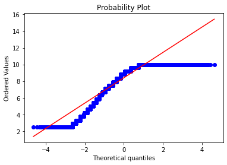
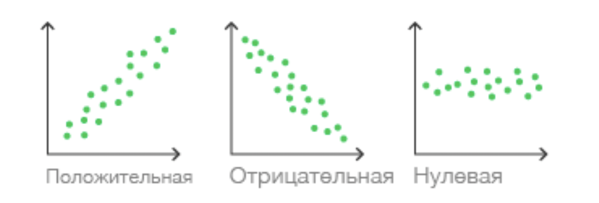
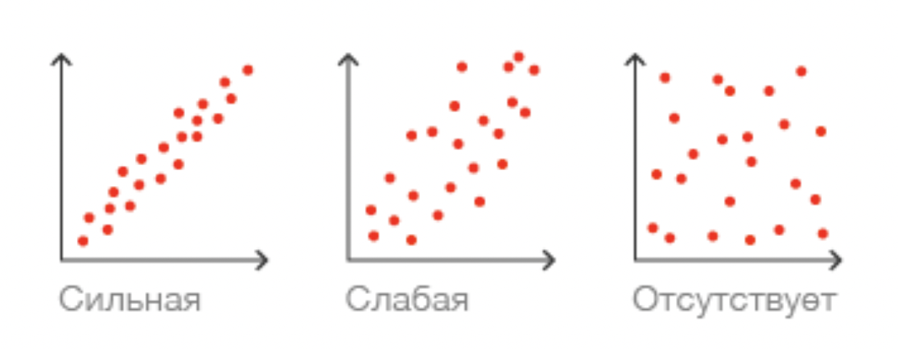
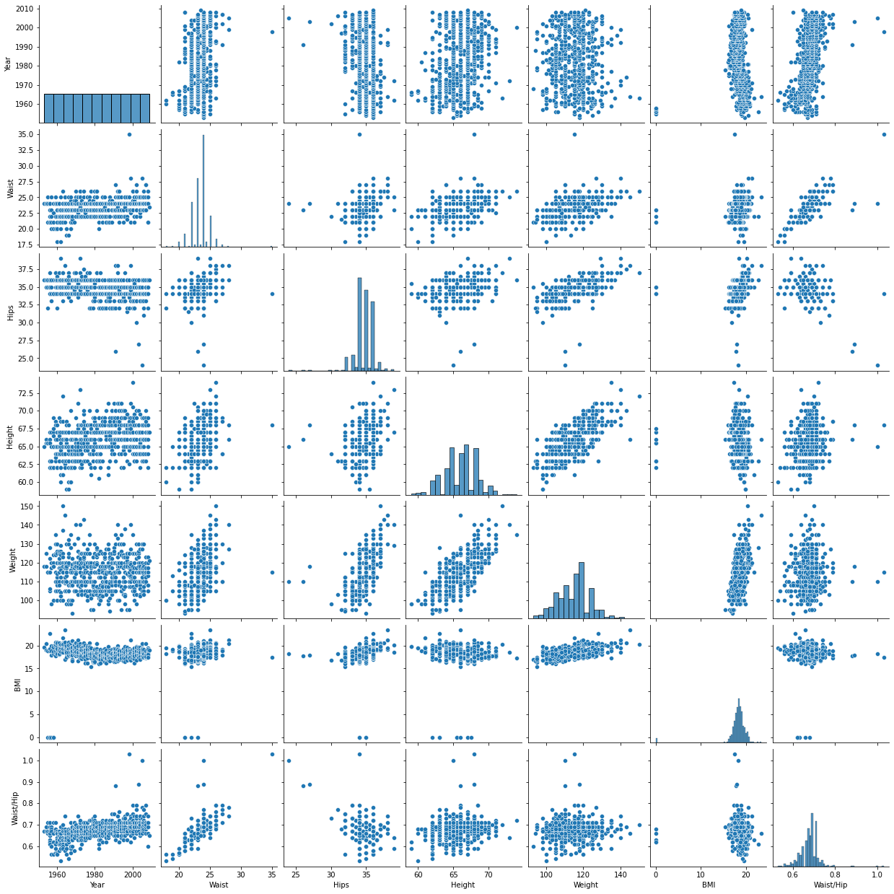
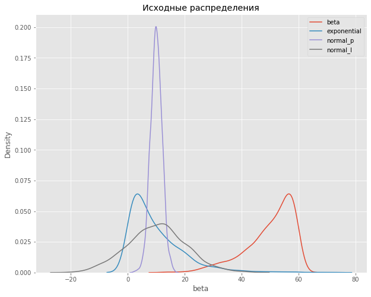
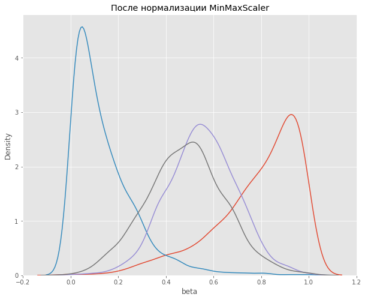
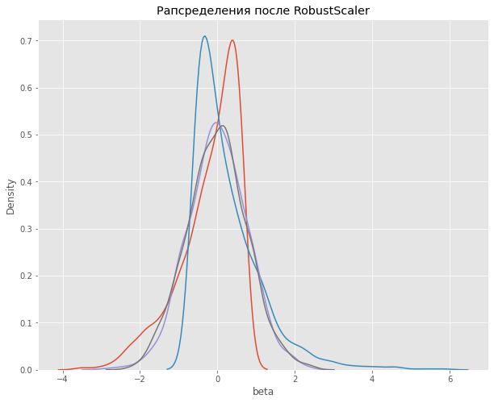
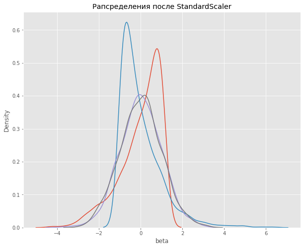

<style>
    h1, h2, h3, h4, h5, h6 { color: darkorange; }
    h1 { filter: hue-rotate(0deg); }
    h2 { filter: hue-rotate(10deg); }
    h3 { filter: hue-rotate(20deg); }
    h4 { filter: hue-rotate(30deg); font-weight: 700; }
    h5 { filter: hue-rotate(40deg); font-weight: 700; }

    strong {
        border-bottom: 2px dotted #ccc;
        filter: hue-rotate(40deg);
    }

    em {
        border-bottom: 2px dotted #ccc;
    }

    a, a:hover {
        text-decoration: underline;
    }

    @media (prefers-color-scheme: dark) {
        body { color: #ccc; }
        strong { border-color: #ccc; }
        em { border-color: #ccc; }
        img { background-color: rgba(255, 255, 255, 0.5) }
        a, a:hover { color: Violet; }
    }
    
    @media (prefers-color-scheme: light) {
        body { color: #333; }
        strong { border-color: #333; }
        em { border-color: #333; }
        /* img { background-color: rgba(0, 0, 0, 0.1) } */
        a, a:hover { color: DodgerBlue; }
    }

</style>

# EDA

## Алгоритмы и методы EDA

### Что такое EDA и какова его роль

EDA stands for **exploratory data analysis** (разведывательный анализ данных). Это этап построения модели который проводят перед обучением модели. Цель — понять как признаки связаны между собой. Это знание позволит создать новые более сильные признаки (и в конечном итоге улучшить качество модели).

### Жизненный цикл модели

0. Постановка задачи
1. Сбор данных
2. Очистка данных
3. **EDA**
4. Обучение модели
5. Запуск в продакшн

### Составляющие EDA
❗️*Могут выполняться в любой последовательности*
- Проектирование признаков (Feature engineering)
- Отбор признаков (Feature selection)
- Кодирование признаков

### EDA одной строкой
- pandas-profiling
- sweetviz
- d-tale

#### Pands profiling
```python
# ! pip install pandas-profiling
import pandas as pd
from pandas_profiling import ProfileReport

df = pd.read_csv('wine.csv')
profile = ProfileReport(df, title="Wine Pandas Profiling Report")

profile
```

#### Sweetviz
```python
# ! pip install sweetviz
import pandas as pd
import sweetviz as sv

df = pd.read_csv('wine.csv')
report = sv.analyze(my_dataframe)

report.show_html()
```

#### D-tale
Хороший инструмент 👍\
https://www.youtube.com/watch?v=jYlwwNycVh8
```python
# ! pip install dtale

import pandas as pd
import dtale

df = pd.read_csv('wine.csv')
d = dtale.show(df)

d
```

## Мат. статистика в контексте EDA

**Математическая статистика** — раздел математики, который занимается обработкой данных для получения выводов.

**Одномерный анализ** — рассмотрение одного признака.

**Многомерный анализ** — рассмотрение двух и более признаков. Цель — нахождение связей между признаками

### Мера центральной тенденции

**Мера центральной тенденции** — это ~~метод по которому вычисляется среднее~~ число, которое описывает среднее значение признака.

В зависимости от типа признака и его распределения используются различные методы (реализованные на python в библиотеке [statistics](https://docs.python.org/3/library/statistics.html)):

- Среднее арифметическое
- Медиана
- Мода
- Среднее геометрическое
- Среднее гармоническое
- Средневзвешенное etc.

### Корреляция

**Корреляция** это числовая взаимосвязь двух и более признаков.

**Коэфициент корреляции** — число от `-1` до `+1` выражающее степень и характер корреляции.

**Мультиколлинеарность** — сильная корреляция (`±0.7` и выше) мешающая построению модели. При ее наличии один из двух признаков удаляют (менее важный).

**Ложная корреляция** — это когда имеются два признака с сильной связью, и кажется что один является причиной другого, тогда как причиной может быть третий (скрытый) признак.1

#### Корреляция Пирсона

Показывает корреляцию *непрерывных числовых*xx§ признаков с *нормальным* распределением. (Если ваши признаки не распределены нормально, то их нужно или нормализовать, или воспользоваться другими методами.)

```python
corr_data = df.corr()
```

#### Q-q plot

Позволяет визуально оценить нормальность распределения признака.

```python
import matplotlib.pyplot as plt # библиотека визуализации
from scipy import stats # библиотека для расчетов

stats.probplot(df['price'], plot=plt)

plt.show()
```

В идеальном случае график нарисует диагональ.



#### Ранговые корреляции

Показывают взаимосвязь между *категориальными* признаками. Есть два метода для рассчета ранговых корреляций, **Спирмена** и **Кендалла**

#### Корреляция Спирмена

```python
corr_data = df.corr(method='spearman')
```

#### Корреляция Кендалла

Выдает меньшие коэфициенты по сравнение с корреляцией Спирмана. Устойчива к ошибкам и выбросам, поэтому ее *можно использовать до очистки данных*.

```python
corr_data = df.corr(method='kendall')
```

#### Корреляция Мэтьюса

Метод для вычисления корреляций между бинарными признаками. (Категориальные методы тоже годятся для бинарных признаков).

Данный метод предназначен скорее для таблиц из одних только бинарных признаков.

```python
from sklearn.metrics import matthews_corrcoef

corr_data = matthews_corrcoef(X, y)
```

### Визуализация корреляций

**Матрица корреляции** — тепловая диаграмма для анализа корреляции между признаками

#### Тепловая карта

```python
sns.heatmap(corr_data, annot=annot)
```

#### Точечная диаграмма рассеивания

```python
sns.scatterplot(data, x=<feature>, y=<target>)
```
Позволяет оценить характер корреляции (положительная, отрицательная, нулевая) и силу (сильная, слабая, отсутствует)




Есть онлайн-игра ❤️❤️❤️ для тренировки навыка определения корреляции по точечной диаграмме\
http://guessthecorrelation.com

#### Диаграмма попарных отношений
```python
sns.pairplot(data)
```
Данный код построит примерно такую таблицу


## Проектирование признаков

### Создание признаков (Feature creation)
Новые признаки могут быть созданы из существующих данных или из внешних источников. При создании новых признаков из существующих данных выполняют:
- разбор даты и времени
- кодирование категориальных признаков
- анализ числовых и текстовых признаков

#### Внешние источники данных
разделяют на
- открытые (public)
- закрытые (data as a service)

Внешняя информация бывает
- общая
- профильная

Если источник представляет собой csv (или другой) файл, то из него получают DataFrame и присоединяют к основным данным с помощью [join](https://pandas.pydata.org/docs/reference/api/pandas.DataFrame.join.html)
```python
data.join(additional_data, on=<column>)
```

### Кодирование признаков (Feature encoding)

Эта схема предназначена только для *категориальных* признаков.


Для кодирования категориальных признаков мы будем использовать библиотеку [category_encoders](https://contrib.scikit-learn.org/category_encoders/).

#### Порядковое кодирование (Ordinal encoding)
Пример ниже взят из учебника. (Не очень понятно, как кодировщик определит порядок следования, нужно почитать документацию.)
```python
import category_encoders as ce

ord_encoder = ce.OrdinalEncoder()
data_bin = ord_encoder.fit_transform(clothing[['size', 'type']])
clothing = pd.concat([clothing, data_bin], axis=1)

clothing
```

#### Однократное кодирование (One-hot encoding)

Пример для кодирования одного признака.
```python
import category_encoders as ce

feature_encoder = ce.OneHotEncoder()
encoded_feature = feature_encoder.transform(data[feature])
data.loc[:, encoded_feature.columns] = encoded_feature
```

Также можно воспользоваться методом [get_dummies](https://pandas.pydata.org/pandas-docs/stable/reference/api/pandas.get_dummies.html) из Pandas (не пользовался).
```python
import Pandas as pd

encoded_data = pd.get_dummies(data, columns=<columns>)
```

#### Двоичное кодирование (Binary encoding)

```python
import category_encoders as ce

feature_encoder = ce.BinaryEncoder()
encoded_feature = feature_encoder.transform(data[feature])
data.loc[:, encoded_feature.columns] = encoded_feature
```

### Преобразование признаков (Feature transformation)

В EDA данные часто подвергают преобразованиям, чтобы сделать обучение модели более эффективным. Самые частые виды преобразований это **нормализация** и **стандартизация** (их также называют *шкалированием*).

#### Нормализация
Н. приводит данные к заданному диапазону (обычно `[0...1]` или `[-1...+1]`)

Часто для нормализации пользуются методами **MinMaxScaler** и **RobustScaler** из библиотеки [sklearn.preprocessing](https://scikit-learn.org/stable/modules/classes.html#module-sklearn.preprocessing)

Предположим что у нас есть такие данные и посмотрим как они будут преобразованы этим двумя методами.



##### MinMaxScaler
Алгоритм:
1. Из каждого значения признака `x` вычитается минимальное значение\
`x - x_min`
2. Результат делится на разницу между максимумом и минимумом признака\
`(x - x_min) / (x_max - x_min)`



```python
# create scaler once and fit it to some initial data
scaler = preprocessing.MinMaxScaler().fit(data[columns_to_scale])
# use the scaler for data (once or many times)
ndarr = scaler.transform(data[columns_to_scale])
# create a DataFrame out of ndarr
norm_df = pd.DataFrame(ndarr, columns=[columns_to_scale]).set_index(data.index)
# update the transformed columns data
data.loc[:, columns_to_scale] = norm_df[columns_to_scale]
```

##### RobustScaler
Алгоритм:
1. Из каждого значения признака `x` вычитается медианное значение\
`x - x_median`
2. Результат делится на межквартильный размах (interquartile range)\
`(x - x_median) / IQR`

Данный метод не подвержен выбросам 👍



```python
# create scaler once and fit it to some initial data
scaler = preprocessing.RobusScaler().fit(data[columns_to_scale])

# the rest is the same as in the MinMaxScaler example above
```

#### Стандартизация
Это центрирование с масштабированием. Его цель получить распределение значений в пределах от `[0...1]` со стандартным отклонением `1`.

❗️ Стандартизация применяется *для признаков с нормальным распределением*

Алгоритм:
1. Из каждого значения признака `x` вычитается среднее значение\
`x - x_mean`
2. Результат делится на стандартное отклонение\
`(x - x_mean) / x_std`



```python
# create scaler once and fit it to some initial data
scaler = preprocessing.StandardScaler().fit(data[columns_to_scale])

# the rest is the same as in the MinMaxScaler example above
```

#### Нормализация или стандартизация, что выбрать?

1. Если данные признака распределены нормально, то лучше использовать стандартизацию
2. Если данные не распределены нормально, то лучше использовать нормализацию
3. Если разброс данных не очень большой, то можно не делать трансформацию.

### Отбор признаков (Feature selection)

Для чего необходимо отбирать признаки?
- чтобы увеличить скорость обучения
- чтобы повысить качество предсказаний

Какие есть способы отбора признаков?
- удаление сильно скоррелированных признаков (одного из каждой пары)
- использование наиболее значимых признаков

Как выбрать признак для удаления из пары сильно скоррелированных признаков? Есть несколько советов, которыми можно воспользоваться. Можно удалить тот, который:
- имеет меньшую значимость
- сильно скоррелирован более чем с одним признаком
- легче будет использовать вдальнейшем (не нужно округлять, нормализовать и пр.)

## Статистические тесты

### Понятие статистической гипотезы

**Статистическая гипотеза** это предположение о наличии связи между двумя признаками.

#### Нулевая и альтернативная гипотезы
Чтобы подтвердить гипотезу нужно ее сформулировать в виде двух гипотез, противоречащих друг-другу:
- **нулевая гипотеза** (H₀) должна предполагать отсутствие взаимосвязи
- **альтернативная гиптоеза** (H₁) должна предполагать наличие взаимосвязи

Затем нужно попытаться опровергнуть H₀. Если это удастся, значит наша гипотеза H₁ верна.

#### Ошибки I и II рода

Чтобы определить верна или нет H₀ нам потребуется проанализировать имеющиеся данные. Поскольку мы будем рассматривать только часть данных, а не все (поскольку это невозможно), то мы можем допустить одну из двух ошибок:
1. Отвергнуть H₀ когда она верна (**ошибка I рода**)
2. Принять H₀ когда она не верна (**ошибка II рода**)

Если мы совершим ошибку I рода, то придем к ошибочному заключению, что наша H₁ верна (*ложноположительный результат*)

Если же мы совершим ошибку II рода, то придем к ошибочному заключение, что наша H₁ не верна (*ложноотрицательный результат*)

#### Статистическая значимость
Обозначается **P-value**. Это вероятность обнаружения данных, подтверждающих H₀

#### Уровень значимости
Обозначается **ɑ (альфа)**. Это вероятность ошибки I рода.

Они друг-друга дополняют: `P-value + ɑ = 1`

