<style>
    h1, h2, h3, h4, h5, h6 { color: darkorange;  font-weight: 700; }
    h1 { filter: hue-rotate(0deg); }
    h2 { filter: hue-rotate(10deg); }
    h3 { filter: hue-rotate(20deg); }
    h4 { filter: hue-rotate(30deg); }
    h5 { filter: hue-rotate(40deg); }

    strong {
        border: 1px solid #ccc;
        border-radius: 5px;
        padding-left: 0.2rem;
        padding-right: 0.2rem;
        filter: hue-rotate(40deg);
    }

    em {
        border-bottom: 2px dotted #ccc;
    }

    a, a:hover {
        text-decoration: underline;
    }

    @media (prefers-color-scheme: dark) {
        body { color: #ccc; }
        strong { border-color: #ccc; }
        em { border-color: #ccc; }
        img { background-color: rgba(255, 255, 255, 0.75) }
        a, a:hover { color: Violet; }
    }
    
    @media (prefers-color-scheme: light) {
        body { color: #333; }
        strong { border-color: #333; }
        em { border-color: #333; }
        /* img { background-color: rgba(0, 0, 0, 0.1) } */
        a, a:hover { color: DodgerBlue; }
    }
</style>

# Математика в ML (part 1)

## Линейная алгебра

Это раздел математики, который изучает объекты линейно природы:
- векторы
- матрицы
- системы линейных уравнений

### Кванторы и символы

- `∀` квантор всеобщности — любой, всякий, для любого
- `∃` квантор существования — существует, найдется
- `∃!` квантор существования и единственности — существует единственный
- `∄` квантор отсутствия — не существует, отсутствует
- `=>` знак импликации — следует, влечет, вытекает
- `<=>` знак равносильности — если и только если
- `:` — такой что
- `|` — при условии что
- `∈` — принадлежит
- `ℕ` — множество натуральных чисел
- `ℤ` — множество целых чисел
- `ℚ` — множество рациональных чисел `p/q, p ∈ ℤ, q ∈ ℕ`
- `ℝ` — множество действительных чисел (включая иррациональные)
- `∅` — пусторе множество
- `⨂` — тензорное произведение векторов

### Векторы

#### Геометрическая интерпретация

Векторы принято начинать из точки `O`.

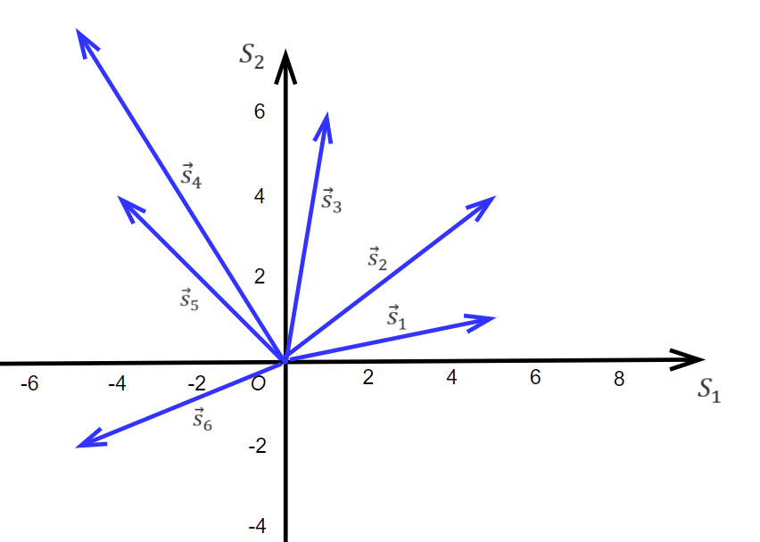

Множество всех возможных векторов `S` называют *векторным пространством*. Говорят: вектор `s` принадлежит пространству `S`. Записывают: `s ∈ S`.

**Нулевым вектором** называют вектор, у которого все координаты равны нулю: `w = (0, 0, ..., 0)`

#### Базовые операции с векторами

##### Сложежние

```python
a = np.array([10, 8, 5, 1])
b = np.array([5, 15, 9, 7])
a + b
### array([15, 23, 14,  8])
a - b
### array([ 5, -7, -4, -6])
```

##### Умножение на скаляр

```python
a = np.array([120, 45, 68])
omega = 0.2
c = a * omega
c
### array([24. ,  9. , 13.6])
```

##### Линейная комбинация

Это сумма векторов, каждый из которых умножен на некий коэфициент (скаляр)

```python
a = np.array([1, 5, 0])
b = np.array([2, 3, 5])
c = np.array([4, 2, 2])

w1, w2, w3 = 3, -1, 0
y = a*w1 + b*w2 + c*w3 # [ 1, 12, -5]
```

#### Нулевая линейная комбинация

— это такая, которая дает в результате нулевой вектор. Это особый случай, и он представляет для нас интерес. Нам будет важно дать ответ на вопрос, можно ли подобрать такие коэфициенты `w`, чтобы получить нулевую комбинацию из векторов `s`?

Один из способов этого добиться — сделать все коэфициенты нулями. Но это тривиальный случай, и нам он не интересен.

#### Линейная (не)зависимость

Допустим мы нашли такие коэфицианты `w` при которых наши векторы `s` дают нулевую линейную комбинацию. Тогда наши векторы будут называться **линейно зависимыми** и будут лежать *в одной (гипер)плоскости*.

В противном случае наши векторы будут называться **линейно независимыми** и будут лежать *в разных (гипер)плоскостях*.

Понятие линейной зависимости векторов является *одним из главных* в линейной алгебре.

#### Скалярное произведение

Это число, равное сумме координат векторов, умноженных друг на друга. Есть две формы математической записи: `(a, b)` или `a・b`

(Геометрически — это площадь, полученная умножением одного вектора на проекцию другого. Но при этом СП *может быть отрицательным числом*.)

```python
a = np.array([3, 15, 10, 20])
b = np.array([2, 12, 85, 0.6])

# Скалярное произведение векторов `a` и `b`
# 3*2 + 15*12 + 10*85 + 20*0.6 = 1048
# вычисляется с помощью метода `np.dot`
print(np.dot(a, b)) # 1048.0

# сокращенная запись этой команды
print(a@b) # 1048.0
```

#### Свойства скалярного произведения

##### Линейность (дистрибутивность)
`(a + b)・(c + d) = a・(c + d) + b・(c + d) = a・c + a・d + b・c + b・d`

##### Связь с углом между векторами
`a・b = |a||b|cos α`\
`cos α = a・b / |a||b|`

##### Определение ортогональности векторов
Поскольку `cos 90° = 0`, то скалярное произведение ортогональных векторов будет равно нулю.

`|a||b|cos 90° = 0`

##### Определение длины вектора
Длину вектора можно определить через его скалярное произведение. Если умножить вектор на себя то косинус можно не учитывать поскольку `cos 0° = 1`

`a・a = |a||a| => |a| = √(a・a)`

#### Норма вектора и нормирование

**Нормой вектора** `v` является такой вектор `n`, который имеет длину `1` и то же направление, что и `v`.

Для получения нормы производят деление вектора на его длину. Эта операция есть **нормирование** вектора.

```python
a = np.array([1, 3, 10])

# длина вектора вычисляется с помощью `np.linalg.norm`
a_len = np.linalg.norm(a)
print(a_len) # 10.488088481701515

# нормирование
a_norm = a / a_len
print(a_norm) # [0.09534626 0.28603878 0.95346259]

# длина нормы
a_norm_len = np.linalg.norm(a_norm)
print(a_norm_len) # 1.0
```

#### Векторная запись линейной регрессии


### Матрицы

**Матрица** — это структура, состоящая из чисел, записанных по строкам и столбцам. Или просто *таблица чисел*. В линейной алгебре матрицы обозначаются большими латинскими буквами.

```python
A = np.array([
    [1, 2, 3],
    [4, 5, 6],
    [7, 8, 9],
])
print(A, type(A))
# [[1 2 3]
#  [4 5 6]
#  [7 8 9]] <class 'numpy.ndarray'>

B = np.matrix([
    [1, 2, 3],
    [4, 5, 6],
    [7, 8, 9],
])
print(B, type(B))
# [[1 2 3]
#  [4 5 6]
#  [7 8 9]] <class 'numpy.matrix'>
```

#### Классификация матриц

##### По форме

- прямоугольные (высокие и длинные)
- квардатные
- вектор столбец
- вектор строка

##### По содержанию

- нулевая матрица (обозначается `Null`)
- матрица единиц (все элементы — единицы)
- едничная матрица (обозначается `E`)
- треугольная (нижне/верхне)
- симметричная
- диагональная (все элементы кроме главной диагонали — нули, обозначается `diag(α₁, ..., αₙ)`)
- скалярная или шаровая (диагональная М. у которой все элементы на главной диагонали равны, обозначается `diag(α, ..., α)`)

#### Создание матриц на Python

```python
np.zeros((2,3))
# array([[0., 0., 0.],
#        [0., 0., 0.]])

np.ones((2,3))
# array([[1., 1., 1.],
#        [1., 1., 1.]])

np.eye(3)
# array([[1., 0., 0.],
#        [0., 1., 0.],
#        [0., 0., 1.]])

np.diag([3, 5, 6])
# array([[3, 0, 0],
#        [0, 5, 0],
#        [0, 0, 6]])

np.random.randint(0, 10, (3, 3)) # from, to, size
# array([[7, 8, 6],
#        [5, 6, 2],
#        [2, 0, 8]])

np.random.random((2,2))
# array([[0.38304886, 0.90856077],
#        [0.75508134, 0.11381542]])
```

#### Базовые действия над матрицами

##### Сложение

Матрицы складываются поэлементно, так же как векторы. Они должны быть одной размерности.

##### Умножение на скаляр

Матрицы умножаются на скаляр так же как векторы.

##### Поэлементное умножение

Матрицы одного размера можно умножить поэлементно:\
`C = A ⊙ B`

```python
A = np.array([
    [1, 2, 3],
    [4, 5, 6],
])

B = np.array([
    [3, 0, 1],
    [1, -2, 0],
])

print(A * B)
# [[  3   0   3]
#  [  4 -10   0]]
```

##### Транспонирование

— это переворачивание матрицы: столбцы становятся строками, а строки — столбцами. Транспонированная матрица обозначается буквой `ᵀ`. Двойное транспонирование дает исходную матрицу:

`(Aᵀ)ᵀ = A`

```python
A = np.array([
    [1, 2, 3],
    [4, 5, 6],
])

print(A.T)
# [[1 4]
#  [2 5]
#  [3 6]]

print(A.T.T)
# [[1 2 3]
#  [4 5 6]]
```

#### Продвинутые действия над матрицами

##### Умножение матриц

Произведение матриц не коммутативно: `A・B ≠ B・A`

Нельзя перемножить две произвольные матрицы `A` и `B`. Нужно чтобы кол-во столбцов `A` было равно кол-ву строк `B`.

```python
A = np.matrix([[1, 2], [3, 4]])
# [[1 2]
#  [3 4]]

B = np.matrix([[100], [200]])
# [[100]
#  [200]]

np.dot(A, B)
# [[ 500] — (1, 2)・(100, 200) = 100 + 400
#  [1100]] — (3, 4)・(100, 200) = 300 + 800
```

##### Деление матриц

Об этом — в разделе "Обратная матрица"

##### Тензорное произведение векторов

Берут два вектора одинаковой размерности `n` и перемножают их как две матрицы размерами `(n, 1)` и `(1, n)`. В результате получается квадратная матрица порядка `n`.

У тензорного произведения есть специальное обозначение — `⨂`

#### Умножение специальных матриц

##### Умножение на нулевую матрицу

Дает нулевую матрицу:\
`A・Null = Null`

##### Умножение на единичную матрицу

Дает исходную матрицу:\
`A・E = A, E・A = A`

##### Умножение на шаровую (скалярную) матрицу

Дает исходную матрицу, умноженную на скаляр:\
`A・diag(α, ..., a) = αA`

##### Умножение на диагональную матрицу

При умножении `A` на диагональную матрицу `diag(α₁, ..., αₙ)`, каждый столбец `A` умножается на соответствующий коэфициент `α₁, ..., αₙ`.

При умножении д. матрицы на `A` каждая строка умножается на соответствующий коэфициент.

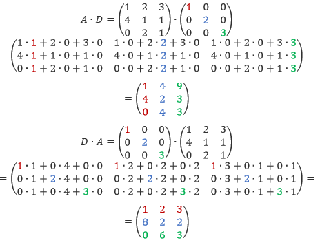

#### Умножение транспонированных матриц

`(A・B)ᵀ = Bᵀ・Aᵀ`

`(A・B・C)ᵀ = (A・(B・C))ᵀ = (B・C)ᵀ・Aᵀ  = Cᵀ・Bᵀ・Aᵀ`

#### Матрица Грама

**Матрицей Грама** называют матрицу, умноженную на транспонированную себя.

`G = X・Xᵀ`

или

`G = Xᵀ・X`

❗️Матрица Грама всегда *квадратная* и *симметричная*.

#### Деление матриц или обратная матрица

##### Обратное число

Можно ли делть матрицы? Чтобы ответить на этот вопрос нужно вспомнить про *обратное число* — это такое число, которое дает единицу при умножении на исходное.

`a * 1/a = a * a⁻¹ = 1`

С помощью `a⁻¹` можно разделить на `a` без использования деления.

`b / a = b * a⁻¹`

*Обратные числа есть у всех чисел, кроме нуля.*

##### Обратная матрица

**Обратной матрицей** для `A` будет такая матрица `A⁻¹`, которая при умножении на `A` даст единичную матрицу.

`A・A⁻¹ = E`

или

`A⁻¹・A = E`

❗️И исходная и обратная матрицы могут быть только квадратными.

❗️Обратная матрица может быть только одна.

```python
A = np.matrix([
    [1, 2],
    [3, 5]])

A_inv = np.linalg.inv(A)

print(A_inv)
# [[-5.  2.]
#  [ 3. -1.]]

print(np.round(A @ A_inv))
# [[1. 0.]
#  [0. 1.]]
```

#### Определитель матрицы

Это числовая характеристика *квадратных* матриц, которая показывает степень *вырожденности* матрицы — чем ближе к нулю, тем больше вырожденность. Обозначается `det(A)` или `|A|`

##### Вычисление

Для матрицы порядка 2 это разность произведений главной и побочной диагоналей.


Но мы не будем считать его вручную.

```python
A = np.array([
    [1,2,3],
    [4,5,6],
    [7,8,0]])

np.linalg.det(A)
# 27.0
```

##### Свойстваа

- Определитель единичной матрицы равен `1`.
- Определитель диагональной матрицы равен произведению элементов главной диагонали.
- Определитель не меняется при транспонировании: `det(A) = det(Aᵀ)`
- Определитель произведения матриц: `det(A・B) = det(A)・det(B)`
- Определитель обратной матрицы является обратным числом определителя исходной: `det(A⁻¹) = det(A)⁻¹`
- **Вырожденная матрица** это та, у которой определитель равен `0`

### СЛАУ

**Системой линейных алгебраических уравнений** (СЛАУ) называется совокупность уравнений первой степени, где все переменные и коэфиценты являются вещественными числами.

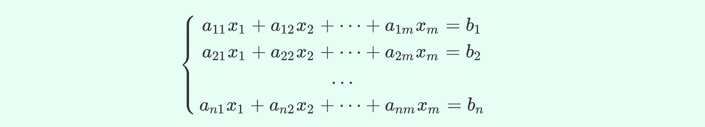

СЛАУ бывают *однородными* (`∀bᵢ = 0`) и *неоднородными* (`∃bᵢ ≠ 0`).

Система называется *определенной* если она имеет только одно решение, и *неопределенной*, если больше одного.

Решения их бывают *тривиальными* (`aᵢⱼ = 0 ∀ i, j`) и *нетрвивиальными*.

Однородные СЛАУ могут иметь или одно тривиальное решение, или бесконечное множество решений.

#### Запись в виде матрицы

Любую СЛАУ можно записать в виде произведения матрицы и вектора. Такая запись называется **матричным уравнением**.


#### Ранг и базис

**Ранг матрицы** — это кол-во *независимых векторов* в системе. Это число не может быть больше кол-ва столбцов высокой матрицы (или строк длинной). Обозначается `rk` или `rank`.

**Ранг системы векторов** — это ее разметрность.

Если ранг является *максимальным* (или *полным*), то значит все вектора в системе являются независимыми. Иначе вектора являются зависимыми — `∃wᵢ ≠ 0` приводящие всю систему к нулевому вектору.

```python
A = np.array([
    [1,2,3],
    [4,5,6],
    [7,8,9]])

np.linalg.matrix_rank(A) # 2
```

**Базис** — это минимальный набор независимых векторов. В задаче регрессии это набор признаков, через который можно выразить все остальные признаки.

#### Решение неоднородных СЛАУ

**Расширенная матрица** — такая где свободные члены `bᵢ` записаны в дополнительном столбце и отделяются от столбцов с коэфициентами `aᵢⱼ` вертикальной чертой.

Существуют три случая при решении неоднородных СЛАУ

- только одно решение — `1`
- бесконечное кол-во решений — `∞`
- решение отсутствует — `0`

##### Только одно решение

*Теорема Кронекера — Капелли* говорит, что единственное решение возможно тогда и только тогда, когда ранг матрицы системы `A` равен рангу расширенной матрицы системы `A|b` и равен кол-ву неизвестных коэфициентов `m`:

`rk(A) = rk(A|b) = m <=> ∃!w = (w₁, w₂, ..., wₘ)ᵀ`

Причем решение будет равно:

`w = A⁻¹b`

##### Бесконечное кол-во решений

Согласно первому следствию из вышеупомянутой теоремы:

`rk(A) = rk(A|b) < m <=> ∞ решений`

##### Решение отсутствует

Согласно второму следствию из той же теоремы:

`rk(A) < rk(A|b) <=> ∄ решений`

##### Приближенное решение

Для последнего случая можно найти приближенное решение, то есть такой вектор коэфициентов `w’`, который позволит вычислить такой вектор решений `b’`, который будет *минимально* оличаться от вектора `b` (ниже `e` — это векторо ошибки, мы хотим минимизировать его длину).

`A・w’ = b’, e = b’ - b, |e| -> min`

Как его найти? Это можно сделать математически.

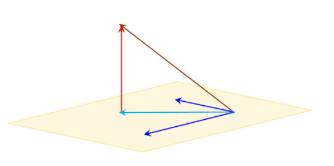

Голубой вектор `b’` который мы хотим получить должен быть *проекцией* коричневого вектора `b` на плоскость векторов матрицы `A`. А это значит, что скалярное произведение голубого вектора на `A` будет равно скалярному произведению коричневого вектора на `A`:

`Aᵀ・b’ = Aᵀ・b`, где

`b’ = A・w’`, поэтому

`Aᵀ・A・w’ = Aᵀ・b`

Здесь `Aᵀ・A` есть матрица Грама `G`.

`G・w’ = Aᵀ・b`

Далее мы предполагаем, что для `G` существует `G⁻¹`.

`G⁻¹・G・w’ = G⁻¹・Aᵀ・b`

`w’ = G⁻¹・Aᵀ・b`

`w’ = (Aᵀ・A)⁻¹・Aᵀ・b`

##### Рассчет коэфициентов

На практике метод применяется следующим образом (средствами Numpy).

```python
X = data.drop(columns=['Prod']).values # X.shape = (200, 7)
A = np.column_stack((np.ones(200), X)) # A.shape = (200, 8)
y = data[['Prod']].values # y.shape = (200, 1)

w = np.linalg.inv(A.T@A) @ A.T @ y # w.shape (8, 1) 
```

##### Ограничения OLS метода

Если исходные данные **плохо обусловлены**, то матрица Грама будет вырожденной, и наша формула не сработает.

Одним из методов борьбы с этой проблемой является *устранение мультиколлинеарности*, а также *нормализация/стандартизация* данных.

Другой способ — метод под названием **сингулярное разложение** (SVD), о котором мы будем говорить позже. Он позволяет бороться с ошибками при обращении матриц. Данный метод встроен в класс `LinearRegression`, так что он сможет обработать даже плохо обусловленные данные, но при этом получение правильных коэфициентов *не гарантиравно*.

#### Матрица корреляции

##### Стандартизация векторов

В модуле `sklearn` есть несколько классов для стандартизации и нормализации. Стандартизация в линейной алгебре отличается от них всех. Она состоит из двух шагов:

1. центрирование вектора (помещение его цента в нулевую координату)
2. нормирование вектора (приведение его размера к единице)

Если после такой обработки построить матрицу Грама, то мы получим матрицу корреляции признаков❗️

В Python такую матрицу можно получить двумя способами. Один из них мы знаем, это `pd.corr`. А другой — `np.corrcoef`:

```python
v1 = np.array([1,2,3,2,1])
v2 = np.array([1,3,2,3,6])
v3 = np.array([4,2,0,2,4])

np.corrcoef(np.array([v1, v2, v3]))
# [[ 1.        , -0.31943828, -1.        ],
#  [-0.31943828,  1.        ,  0.31943828],
#  [-1.        ,  0.31943828,  1.        ]]
```

##### Корреляция векторов

Корреляцию между двумя векторами можно посчитать по формуле:

`a・b / |a||b|`

По сути это косинус угла между векторами, поэтому

|корреляция|угол|интерпретация|
|-|-|-|
|`1`|`0°`|вектора сонаправлены; факторы имеют прямую зависимость|
|`0.71`|`45°`|факторы имеют сильную зависимость|
|`0.12`|`83°`|угол почти прямой, факторы имеют очень слабую зависимость|
|`0`|`90°`|вектора ортогональны, независимы; факторы никак не влияют друг на друга|
|`-1`|`190°`|вектора противонаправлены; факторы имеют обратную зависимость|

##### Корреляция факторов

Мы должны бороться с корреляцией между факторами потому что иначе:

- мы не можем доверять найденным коэфициентам
- мы не сможем их проинтерпретировать

Если корреляция между факторами прямая, то ее легко заметить на матрице корреляций, и легко устранить.

Если же корреляция скрытая (ранг матрицы максимальный, не определитель близок к нулю) то значит имеется мультиколлинеарность, и мы скоро узнаем, как с ней можно бороться.

### Модификации линейной регрессии

#### Полиноминальная регрессия

##### Мононом

Одночлен (мононом) — это произведение из числовых множетелей и переменных в неотрицательной целой степени, например: `xy`, `⅔ab³c`, `4x²y`, `-4mn³`, `𝜋r²`. Степенью одночлена называется сумма степеней его переменных, например:

- `xy` имеет степень `2 = 1 + 1` 
- `⅔ab³c` имеет степень `5 = 1 + 3 + 1`

##### Полином

Многочлен (он же полином) — это сумма одночленов. Полином для `k` переменных это функция вида:

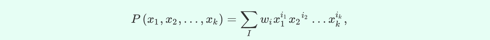

где

- `i` — *степени полинома* — целые неотрицательные числа
- `w` — *коэфициенты полинома*

**Степенью полинома** называют максимальную степень его членов. Мы будем обозначать ее литерой `d`.

Если переменная всего одна, то функция принимает такой вид:

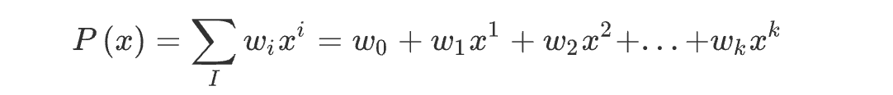

##### Коэфициенты полинома

Кол-во коэфициентов зависит от степени полинома `d` и кол-ва переменных `k`. Его можно вычислить по вот такой формуле:

`C = (k + d)! / k!d!`

Получается что для самого простого случая кол-во коэфициентов будет равно `C(1, 1) = 2`.

`y = w₀x⁰ + w₁x¹ = ax + b` — формула прямой на плоскости

Если их три, то это либо `C(2, 1)` — парабола:

`y = w₀x⁰ + w₁x¹ + w₂x² = ax² + bx + c`

либо `C(1, 2)` — плоскость в 3D пространстве:

`z = w₀ + w₁x¹ + w₂y¹ = ax + by + c`

Для случая `C(2, 2) = 6` полином принимает такую форму:

`P = w₀ + w₁x¹ + w₂x² + w₃y¹ + w₄y² + w₅xy`

##### Применение

С помощью полинома `k` степени можно описать кривую любой сложности.

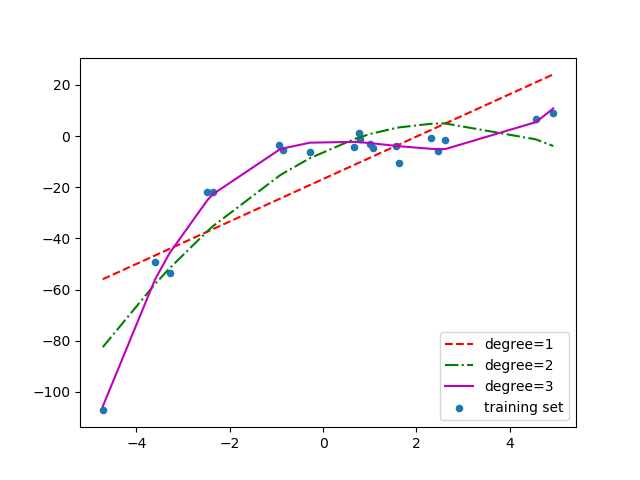

На практике для этого нужно лишь выбрать степень `k` и создать из имеющихся векторов `x` дополнительные вектора с их комбинацией в соответствующей степени.

То есть по сути мы лишь добавим данных в нашу матрицу, и затем сможем найти коэфициенты с помощью OLS.

##### Решение на Python

Мы можем воспользоваться следующей функцией для добавления комбинаций векторов `x` нужной степени `d` и вычисления коэфициентов методом OLS:

```python
# from sklearn import preprocessing

def calc_poly(X, y, d):
    poly = preprocessing.PolynomialFeatures(degree=d, include_bias=True)

    X_poly = poly.fit_transform(X)

    w = np.linalg.inv(X_poly.T@X_poly) @ X_poly.T @ y

    return X_poly, w
```

##### Side effects

Предложенное выше решение может добавить такие вектора `x` которые будут выражаться через уже существующие (зависимые). В результате ранг матрицы не будет максимальным, при вычислении коэфициентов будет происходить деление на число близкое к нулю, и они могут получиться огромными.

Данную проблему можно обойти, воспользовавшись классом `LinearRegression`, который внути использует не исходную матрицу, а ее сингулярное разложение, которое не является вырожденным.

Но самой большой проблемой является склонность таких моделей к переобучению.

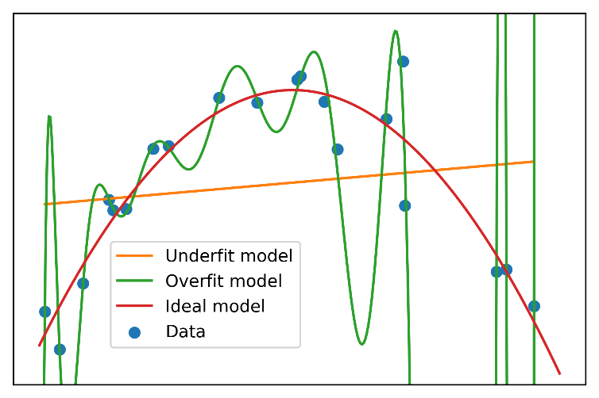

Чтобы ее решить используется *регуляризация*.

#### Регуляризация

**Регуляризация** — это способ борьбы с переобучением модели путем намеренного увеличения ее смещения с целью уменьшения ее разброса.

##### С точки зрения математики

Наша цель — избежать слишком больших коэфициентов. Для этого нам нужно решить нашу задачу OLS с условием:


Условие говорит, что норма вектора `w` порядка `p` в степени `p` не должна превышать величину `b`.

Задачи с условиями мы пока не можем решать, но благодаря методу множителей Лагранжа мы можем свести ее к безусловному виду.


##### L₂-регуляризация

Норма вектора порядка `p` определяется по формуле:


И для второго порядка это будет просто длина вектора. То есть наша формула примет такой вид:

`|y - Aw|² + α|w|² -> min`

И для нее даже есть аналитическое решение:

`w = (Aᵀ・A + α・E)⁻¹・Aᵀ・y`

Чтобы не считать вручную можно воспользоваться классом [Ridge](https://scikit-learn.org/stable/modules/generated/sklearn.linear_model.Ridge.html)

```python
# from sklearn import linear_model

ridge = linear_model.Ridge(alpha=1, fit_intercept=False)
ridge.fit(M, y)

print(ridge.coef_)
```

##### L₁-регуляризация

Как следует из названия, в данном методе применяется регуляризация Лагранжа первого порядка. 

`|y - Aw|² + α∑|wᵢ| -> min`

В таком виде задача не решается аналитически. Для ее решения используется *метод координатного спуска* (Coordinate Descent). Метод реализован в классе [Lasso](https://scikit-learn.org/stable/modules/generated/sklearn.linear_model.Lasso.html).

Поскольку метод является чиленным, то для лучшей сходимости нужно стандартизировать данные с помощью `StandardScaler`.

```python
# from sklearn import preprocessing as ce
# from sklearn import linear_model

scaler = ce.StandardScaler()
X = scaler.fit_transform(X)

lasso = linear_model.Lasso(alpha=0.1, fit_intercept=False)
lasso.fit(X, y)

print(lasso.coef_)
```

##### Elastic-Net

Это комбинация методов `L₁` и `L₂`. Она реализована в классе [ElasticNet](https://scikit-learn.org/stable/modules/generated/sklearn.linear_model.ElasticNet.html).


У него кроме `α` есть дополнительный параметр `ƛ`, который меняется от `0` до `1` и определяет в какой пропорции влияет на результат каждый из методов `L₁` и `L₂`.

Использовать данный метод с `α = 0` не имеет смысла (нужно выбрть Ridge, который даст более точный результат благодаря аналитическому решению).

```python
# from sklearn import linear_model

elasticnet = linear_model.ElasticNet(alpha=0.1, l1_ratio=0.2, fit_intercept=False)
elasticnet.fit(A, y)

print(elasticnet.coef_)
```

### Спектр матрицы

#### Термины

**Линейный оператор** — это преобразование, которое меняет векторное пространство путем умножения каждого вектора на некую квадратную матрицу. Отсюда следует, что каждая квадратная матрица *задает* линейный оператор.

**Собственный вектор** (айген-вектор) — это такой вектор, который не меняет направления под действием линейного оператора.

**Собственное число** — это такое число `ƛ` на которое собственный вектор изменяется (растягивается или сжимается) под воздействием линейного оператора.

**Айген-парой** называют айген-вектор с его собственным числом.

**Спектром матрицы** назыают набор ее собственных чисел.

**Положительно опредленная матрица** — такая квадратная матрица, у которой все ее *собственные числа положительны*.

**Отрицательно опредленная матрица** — такая квадратная матрица, у которой все ее *собственные числа отрицательны*.

#### Вычисление

##### Вывод формулы

Допустим наша матрица `A` задает линейный оператор, вектор `v` — ее собственный вектор, `ƛ` — ее собственное число.

`Av = ƛv`

`Av - ƛv = 0`

`Av - ƛEv = 0`

`(A - ƛE)v = 0`

Чтобы получить ноль, нужно чтобы матрица `(A - ƛE)` оказалась вырожденной. А значит у нее должен быть нулевой определитель, следовательно:


Далее мы получаем два собственных числа, которые и являются спектром нашей квадратной `2×2` матрицы.

##### На Python

```python
A = np.array([
    [1,1,0],
    [0,2,2],
    [0,3,3],
])

spectrum, eigvectors = np.linalg.eig(A)

print(spectrum)
# [1. 0. 5.]

print(np.round(eigvectors, 2))
# [[ 1.    0.58 -0.14]
#  [ 0.   -0.58 -0.55]
#  [ 0.    0.58 -0.82]]
```

#### Свойства

##### Для всех квардартных матриц

- Произведение собственных чисел равно определителю
- Если хоть одно собственное число равно нулю, то и определитель тоже равен нулю, и следовательно матрица является вырожденной
- Собственные векторы всегда линейно независимы

##### Для симметричных матриц

- Полный набор собственных чисел (`n` штук для матрицы `n×n`)
- Все айген-векторы ортогональны
- Если исходная матрица — это матрица Грама, то все собственные числа положительны

#### Спектральное разложение

Если у матрицы есть полный набор айген-пар, то ее можно представить в виде

`A = P・D・P⁻¹`

где `P` — матрица составленная из айген-векторов, а `D` — диагональная матрица, составленная из ее спектра.

## Математический анализ

— изучает изменение значений и характер этих изменений.

### Множества

**Множество** — это совокупность *уникальных* объектов, обладающих какими-то общими признаками.

**Мощность множества** — это кол-во объектов, содержащихся в нем.

**Пустое множество** — это такое, которое не содержит ни одного объекта. Оно обозначается символом `∅`.

**Универсальное множество** — это такое, которое содержит все воможные объекты, так что в него нельзя ничего добавить. Обозначается символом `𝕌`.

**Подмножество** — это часть множества. Само множество является подмножеством себя. Пустое множество является подмножеством любого множества.

#### Операции над множествами

- Объединение: `A ⋃ B`
- Пересичение: `A ∩ B`
- Разность: `A ∖ B`
- Симметричная разность: `A Δ B`
- Дополнение: `𝕌 \ A`

```python
A = { 0, 1, 2, 3, 4 }
B = { 0, 2, 4, 6, 8 }

print(A | B) # {0, 1, 2, 3, 4, 6, 8}
print(A & B) # {0, 2, 4}
print(A - B) # {1, 3}
print(B - A) # {6, 8}
print(A ^ B) # {1, 3, 6, 8}
```

### Функции

**Функция** — это *правило*, по которому можно сопоставить элементы двух множеств.

#### Элементарные функции

это такие, которые являются *суммой*, *произведением* или *композицией* функций следующих видов:

- степенных: `axᵇ`
- тригонометрических
- показательных: `aeᵇˣ`
- логарифмических

##### Экспоненциальная

`f(x) = exp(x)`

##### Логарифмическая

`f(x) = ln x`

###### Свойства

`ln (ab) = ln |a| + ln |b|` потому что `eᵃ eᵇ = eᵃ⁺ᵇ`

`ln (a/b) = ln |a| - ln |b|` потому что `eᵃ / eᵇ = eᵃ⁻ᵇ`

`ln aᵇ = b ln a ` потому что `(eᵃ)ᵇ = eᵃᵇ`

##### Сигмоидальная

`f(x) = 1 / (1 + e⁻ˣ)`

#### Производная

##### Вычисление

Для вычисления производной *простых функций* пользуемся таблицей.

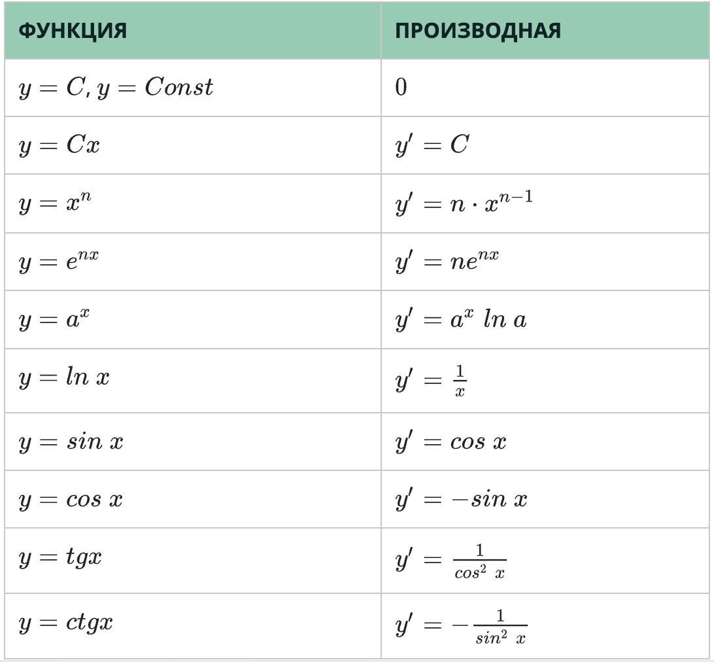

##### Производная суммы

Производная суммы равна сумме производных:

`d(f + g)(x) = df(x) + dg(x)`

##### Производная произведения

Производная произведения равна следующей сумме:

`d(f・g)(x) = df(x)・g(x) + f(x)・dg(x)`

##### Производная частного

Производная частного равна следующей дроби:

```
  f(x)    df(x)・g(x) - f(x)・dg(x)
d ———— = ——————————————————————————
  g(x)              g²(x)
```

##### Производная композиции функций

`d(f(g(x))) = d(f(u)) = df(u)・du = df(g(x))・dg(x)`

`(sin(log(x)))' = sin'(log(x)) log'(x) = cos(log(x)) 1/x`6t7y8u90-

##### Вычисление производной на Python

```python
import sympy

x = sympy.Symbol('x')
expr = x**4 + 3*x**3 + 4*x**2 + 1000

expr.diff(x) # 4x³ + 9x² + 8x

# производная второго порядка
expr.diff(x, 2) # 2(6x² + 9x + 4)
```

#### Исследование функций

##### Область определения

Это интервал значений, которые могут быть переданы в функцию, т.е. все возможные значения `x`. Обозначается буквой `D` — *domain*.

Например для

`f(x) = 1/x`

`D(f(x)): x ∈ (-∞; 0) ∪ (0; +∞)`

```python
# from sympy import Symbol, S
# from sympy.calculus.util import continuous_domain
# from sympy import log

x = Symbol('x')
f = log(x) / x

continuous_domain(f, x, S.Reals) # (0, ∞)
```

##### Область значений

Это интервал значений, которые могут получиться в результате вычисления функции, т.е. все возможные значения `y`.

Например для

`f(x) = sin(x)`

`E(f(x)): f(x) ∈ [-1; 1]`

```python
# from sympy import Symbol, S, sin
# from sympy.calculus.util import function_range

x = Symbol('x')
f = sin(x)

function_range(f, x, S.Reals) # [−1, 1]
```

##### Пересечение с осями

```python
# from sympy import solveset, Eq

f = x*x + 5*x + 4

f.subs(x, 0) # 4

solveset(Eq(f, 0), x) # {−4, −1}
```

##### Четность / нечетность

Функция является **четной** если `f(-x) = f(x)` для всех `x`.

Функция является **нечетной** если `f(-x) = -f(x)` для всех `x`.

##### Минимум, максимум, возрастание, убывание

**Локальный минимум / максимум** функции `f(x)` — это те точки, где `f'(x)` равна нулю и при этом меняет знак.

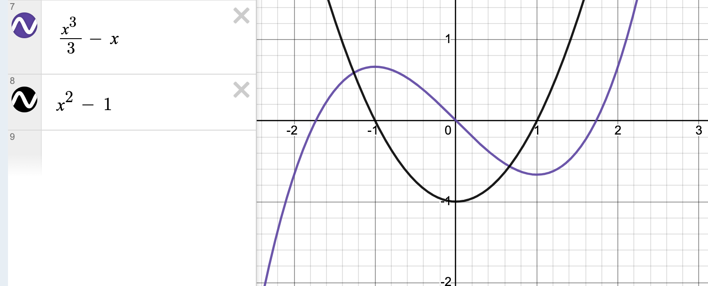

Если `f'(x)` равна нулю, но не меняет знака, то на графике ей соответствует **стационарная точка**.

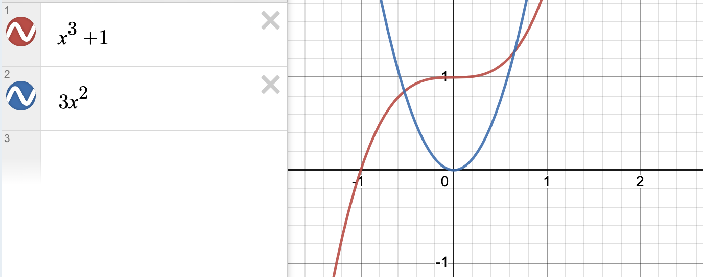

**Точка перегиба** функции `f(x)` это та, где `f"(x)` равна нулю

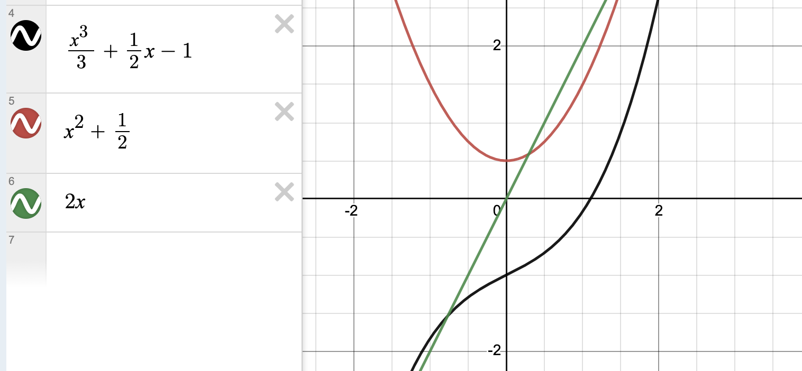

##### Выпуклость

**Выпуклые функции** это такие, у которых все точки находятся либо выше хорды, либо ниже.

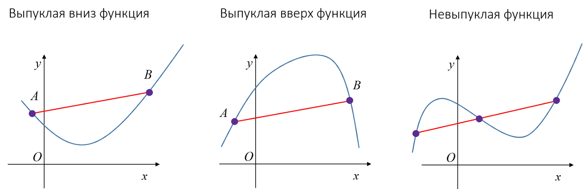

Чтобы найти это аналитически нужно посмотреть на вторую производную. Если она положительна (для всех значений `x`), то функция является **выпуклой вверх**, а если отрицательна — то **выпуклой вниз** или **вогнутой**

`f(x) = 1/12 x⁴ - x - 10`

`f'(x) = 1/3 x³ - 1`

`f"(x) = x²`

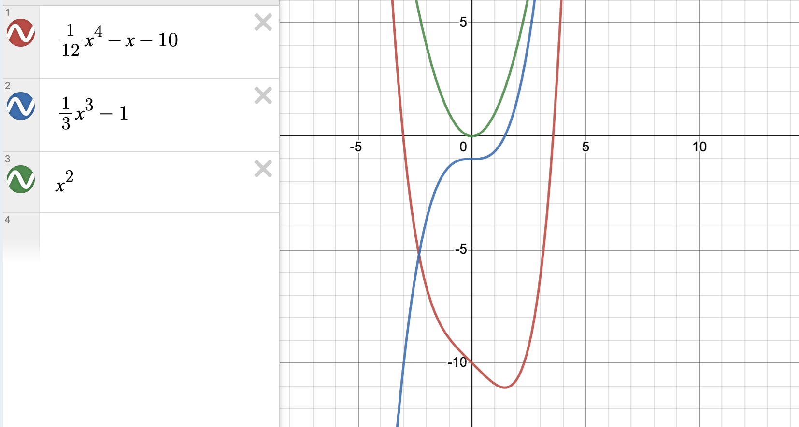

###### Свойства

- Удобно искать экстремумы (если имеет минимум или максимум, то только один)
- Сумма и композиция выпуклых в одну сторону функций выпукла в ту же сторону

##### Асимптоты

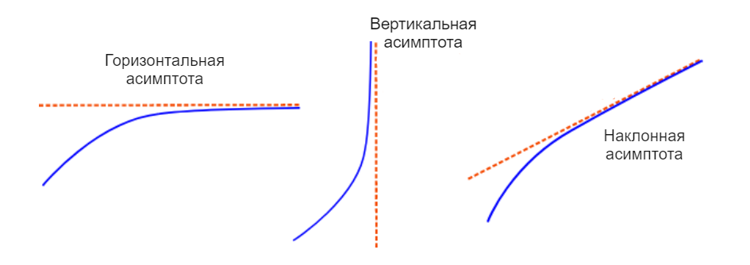

###### Горизонтальная

```python
# from sympy import Symbol, limit, oo

x = Symbol('x')
f = 1/(x - 2) + 3

limit(f, x, oo) # 3
```

###### Вертикальная

```python
# from sympy import Symbol, limit, oo

x = Symbol('x')
f = 1/(x - 2) + 3

limit(f, x, 2) # ∞
```


###### Наклонная

Ищем `y = kx + b`

```python
# from sympy import Symbol, limit, oo

x = Symbol('x')
f = 1/(x + 2) - x/3 + 4

k = limit(f/x, x, oo) # 1/3
b = limit(f - k*x, x, oo) # 4
```

### Функции нескольких переменных

Данные для обучения моделей можно представить как функции нескольких переменных. Нам важно уметь анализировать такие функции для того чтобы эффективно находить их минимумы и максимумы.

#### Частная производная

— это производная по одной переменной в функции нескольких переменных.

Для ее вычисления нужно принимать все остальные переменные за константы, например.

`f(x, y) = x² + 3xy + y³`

`f'(x) = 2x + 3y`

Для обозначения частной производной используются разные записи:

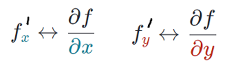

Читается *производная от функции `f` по `x`*

##### Вторая производная

может быть взята по той же или по другой переменной. Для ее обозначения используются следующие вариации записи:

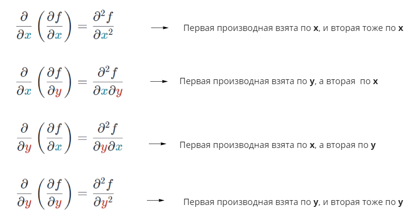

Или же такие:

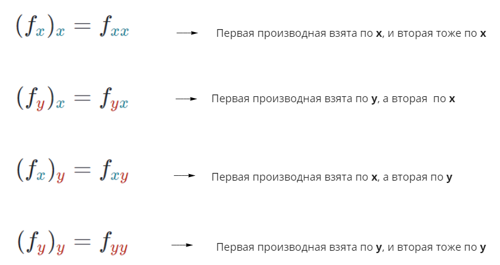

Полезное свойство второй производной:

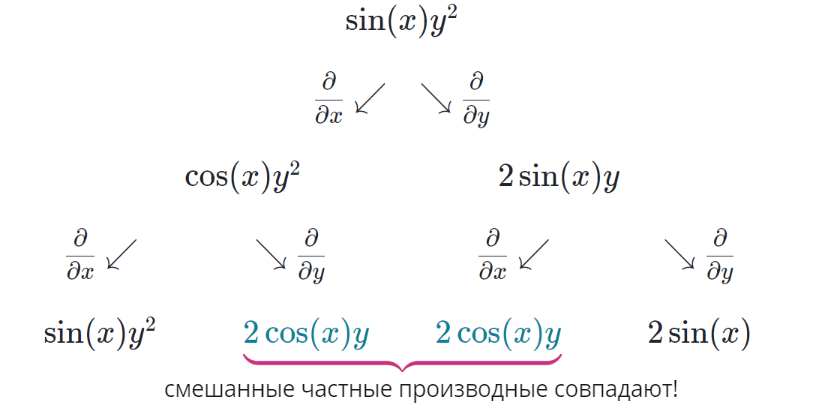

##### Вычисление на Python

```python
from sympy import symbols, cos, diff

a, b, c = symbols('a b c', real=True)
f = 5*a*b - a*cos(c) + a**2 + c**8*b

print(diff(f, a)) # 2*a + 5*b - cos(c)
print(diff(f, a, c)) # sin(c)
```

#### Безусловные экстремумы

У многомерных функций (у функций нескольких переменных) может быть несколько локальных экстремумов.

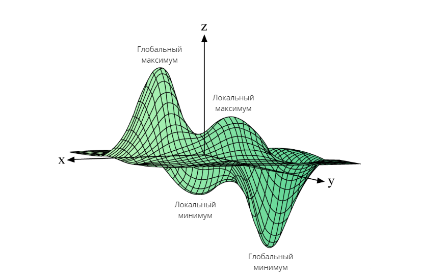

Чтобы найти их, нужно вычислить частные производные для каждой переменной и найти при каких значениях они равны нулю.

Полученные координаты будут *стационарными точками* функции. В них наша функция будет находится в одном из трех состояний:

- в локальном минимуме
- в локальном максимуме
- в седловлой точке

##### Матрица Гессе

**Матрица Гессе** или **гессиан** — это матрица вторых производных.

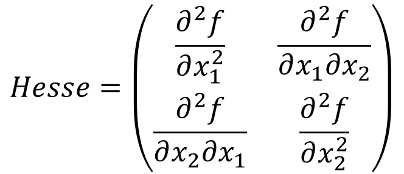

Чтобы понять в каком же из трех состояний находится функция в стационарной точке нужно найти гессиан и проанализровать его:

- если матрица *положительно определена*, то наша точка есть *минимум*;
- если матрица *отрицательно определена*, то наша точка есть *максимум*;
- иначе мы имеем дело с седловой точкой.

### Введение в оптимизацию

#### Оптимизация функций

**Оптимизация функции** — это задача нахождения таких входных аргументов, которые приводят к минимуму или максимуму.

Аргументом может быть что угодно, например вектор. Результатом будет всегда число.

Иногда на аргумент может быть наложено ограничение (условие). Например, нельзя потратить на обучение отрицательное количество часов. Также невозможно тратить на это больше 24 часов в сутки.


Задачу оптимизации характеризуют три элемента:

- целевая функция
- входные аргументы
- ограничения на входные аргументы

Задаи оптимизации бывают:

- **условные** и **безусловные**
- **гладкой** и **негладкой** оптимизации
- **локальной** и **глобальной** оптимизации

#### Метод множителей Лагранжа

Например, нам нужно минимизировать `f(x)`, чтобы `𝜙(x) = 0`.


Для решения данной задачи нужно написать функцию Лагранжа, которая объединяет целевую функцию и функцию ограничений:


Таким образом метод Лагранжа превращает задачу *условной* оптимизации в задачу *безусловной* оптимизации, которую мы можем решить с помощью частных производных.

```python
from sympy import symbols, solve, Eq

x, y, l = symbols('x y ƛ')

target_f = 4*x + 3*y
phi = x**2 + y**2 - 1

# функция Лагранжа
f = target_f + l*phi

dfdx = f.diff(x)
dfdy = f.diff(y)
dfdl = f.diff(l)

equations = (
    Eq(dfdx, 0),
    Eq(dfdy, 0),
    Eq(dfdl, 0),
)

res = solve(equations)
print(res)
# [{x: -4/5, y: -3/5, ƛ: 5/2}, {x: 4/5, y: 3/5, ƛ: -5/2}]

# минимум и максимум целевой функции
# target_f.subs(res[0]) # -5
# target_f.subs(res[1]) # 5
```

##### Частный случай: условие в виде неравенства

```python
# Фермер кормит своих коров специальной смесью. 
# Для её изготовления он использует два вида корма: 
# на 1 кг кукурузного корма приходится 100 г белка и 750 г крахмала, 
# на 1 кг пшеничного — 150 г белка и 700 г крахмала.
# Каждой корове необходимо давать не более 7 кг корма в сутки, 
# иначе у неё заболит живот и придётся тратить деньги на ветеринара. 
# При этом, чтобы давать оптимально полезное и вкусное молоко, 
# каждая корова должна ежедневно потреблять как минимум 650 г белка
#  и 4000 г крахмала.
# Известно, что кукурузный корм стоит 0.4 доллара за 1 кг,
# а пшеничный — 0.45 долларов за 1 кг.

# Какая кормовая смесь будет минимизировать затраты
# и в то же время позволит получать качественное молоко?

# в смеси для одной коровы (на сутки)
# c - масса кукурузного корма
# w - масса пшеничного корма

c, w, n, m, k, l1, l2, l3 = sympy.symbols('c w n m k l1 l2 l3')

# p - масса белка
p = 0.1*c + 0.15*w

# s - масса крахмала
s = 0.75*c + 0.7*w

# cw - масса смеси
cw = c + w

# Каждой корове необходимо давать не более 7 кг корма в сутки
phi1 = 7 - c - w + n**2

# каждая корова должна ежедневно потреблять как минимум 650 г белка 
phi2 = p - 0.65 + m**2

# и 4000 г крахмала
phi3 = s - 4 + k**2

# кукурузный корм стоит 0.4 доллара за 1 кг, а пшеничный — 0.45 долларов за 1 кг.
target_f = 0.4*c + 0.45*w

f = target_f + l1*phi1 + l2*phi2 + l3*phi3

vars_to_df = [c, w, n, m, k, l1, l2, l3]
dfs = [f.diff(v) for v in vars_to_df]
equations = [Eq(df, 0) for df in dfs]

res = solve(equations)

# выбираем только положительные решения
res = [r for r in res if r[c] > 0 and r[w] > 0]

for r in res:
    print(f'кукурузного: {r[c]:0.3f}, пшеничного: {r[w]:0.3f}')

print(f'\nмасса смеси: {cw.subs(r):0.1f}')
print(f'масса белка в смеси: {p.subs(r):0.2f}')
print(f'масса крахмалла в смеси: {s.subs(r):0.2f}')
print(f'стоимость смеси: ${target_f.subs(r):0.2f}')
```

#### Градиентный спуск

##### Проблемы

- Склонен застревать в стационарных точках
- Имеет фиксированный темп, который трудно подобрать так, чтобы ф
- Имеет фиксированный шаг (хотелось бы иметь возможность его изменять в зависимости от характера функции — ускоряться на пологих участках и замедляться на крутых)
- в некоторых измерениях координаты могут редко меняться, что приводит к плохой обобщающей способности

```python
# import sympy

def grad_descent(f, vars, step_size=0.2, num_steps=30, start_point=None, verbose=True):
    if start_point is None:
        start_point = np.random.uniform(0, 3, size = len(vars))

    w = start_point
    lst = [w]

    # производные по каждой переменной
    dfdw = [f.diff(v) for v in vars]

    # ƛ: форматирует переменные в словарь
    w_to_dict = lambda w: {wi: w[i] for i, wi in enumerate(vars)}

    # ƛ: считает градиент для полученного вектора
    grad = lambda w_dict: np.array([d.subs(w_dict) for d in dfdw])

    # градиентный спуск из num_steps шагов
    for i in range(num_steps):
        w = w - step_size * grad(w_to_dict(w))
        lst.append(w)
        fw = f.subs(w_to_dict(w))

        if verbose:
            print(f'step {i}, f(w) = {round(fw, 2)}')

    # показываем результаты
    if verbose:
        print(f'Найдена точка w: {[round(v, 2) for v in lst[-1]]}')
        fw = f.subs(w_to_dict(w))
        print(f'f(w) = {round(fw, 2)}')

    # возвращаем последний вектор и весь массив
    trace = np.array(lst)
    return trace[-1], trace

w1, w2 = sympy.symbols('w1 w2')
f = 2*w1**2 - 4*w1*w2 + w2**4 + 2

grad_descent(f, [w1, w2], 0.01, 10)

```

##### Batch Gradient Descent

— *пакетный* или *ванильный* или *классический* градиентный спуск. В каждой итерации обучения участвуют все данные. Хорошо подходит для выпуклых функций, например для логистической регрессии. Плохо подходит для обучения нейросети.

##### Stochastic Gradient Descent

В каждой итерации градиент вычисляется для одной случайной точки (стохастический значит случайный). Его часто используют в нейросетях.

##### Mini-batch Gradient Descent

Это сочетание классического и стохастического градиентного спска. Данные разбиваются на пакеты (батчи). В каждой итерации градиент считается для всех элементов одного батча.

|Batch GD|Stochastic GD|Mini-batch GD|
|-|-|-|
Рассматриваются все обучающие данные|Рассматривает только один объект|Рассматривается подвыборка
Затрачивает много времени на работу|Работает быстрее пакетного|Работает быстрее двух других
Плавное обновление параметров модели|Сильные колебания в обновлении параметров модели|Колебания зависят от размера подвыборки (увеличиваются с уменьшением её объема)

#### Метод Ньютона

Это численный метод решения уравнения `f(x) = 0`. Он сводится к тому, чтобы начиная с какой-то стартовой точки `x₀` искать место пересечения касательной к `f(x)` в этой точке с осью `X`. Это даст нам новую исходную точку `x₁`, которая будет ближе к решению нашего уравнения. И так нужно продолжать до нахождения точки с заданной точностью.

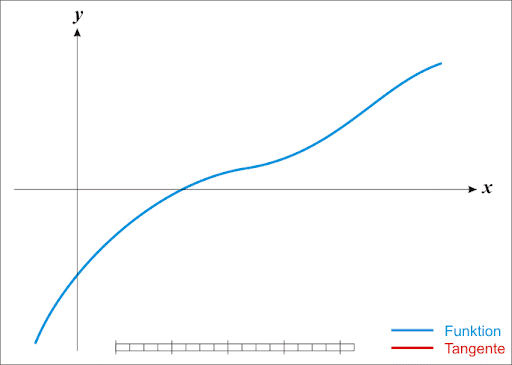

```python
import numpy as np
import sympy

def newton(f, x, x0=None, round_to=4):
    if x0 is None:
        x0 = np.random.randint(10)

    dfdx = f.diff()
    x1 = x0 - f.subs(x, x0)/dfdx.subs(x, x0)
    x1 = x1.evalf()

    if round(x0, round_to) == round(x1, round_to):
        return round(x1, round_to)
    
    return newton(f, x, x1, round_to)

x = sympy.symbols('x')
f = x**2 + 2*x - 5

newton(f, x, x0=-100) # −3.4495
```

❗️Если применить метод Ньютона к первой производной, то можно найти экстремумы функции, причем гораздо *быстрее градиентного спуска*.

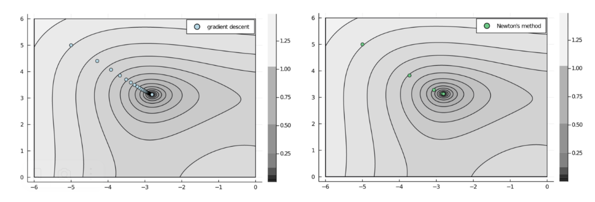

Для вычисления нового вектора координат используется формула:


Здесь `H` — матрица Гессе, то есть матрица вторых производных. Гессиан считается один раз в формульном виде, но на каждой итерации в него нужно подставлять `xₖ` и затем вычислять обратную матрицу.

|Достоинства|Недостатки|
|-|-|
|Работает быстрее градиентного спуска|Зависит от исходной точки: будет двигаться к ближайшей стационарной точке — миниму, максимуму, седловой.|
||Является затратным, поскольку требует нахождения обратной матрицы на каждой итерации.|

#### Квазиньютоновский метод

Отличается от ньютоновского метода тем, что не требует вычисления обратного гессиана на каждой итерации. Вместо него используется матрица `Hₖ`, которая строится таким образом, чтобы максимально аппроксимировать обратный гессиан. Эта матрица обновляется на каждой итерации.


Существуют различные схемы аппроксимации. Самая известная, стабильная и наиболее эффективная — **BFGS** — названная по именам ее авторов (Бройден, Флетчер, Гольдфарб, Шанно). Она используется по-умолчанию в [scipy.optimize.minimize](https://docs.scipy.org/doc/scipy/reference/generated/scipy.optimize.minimize.html)

```python
from scipy.optimize import minimize

# определяем нашу функцию
def func(v):
    x = v[0]
    y = v[1]
    return x*x - x*y + y*y + 9*x - 6*y + 20
 
#  определяем градиент функции
def grad_func(v):
    x = v[0]
    y = v[1]
    return np.array([
        2*x - y + 9,
        -x + 2*y - 6,
    ])
 
# определяем начальную точку
v0 = [-400, -400]
# выбираем метод: 'BFGS' или 'L-BFGS-B'
result = minimize(func, v0, method='L-BFGS-B', jac=grad_func)
# получаем результат
print('Статус оптимизации %s' % result['message'])
print('Количество оценок: %d' % result['nfev'])
solution = result['x']
evaluation = func(solution)
print('Решение: f(%s) = %.5f' % (solution, evaluation))
```

#### Линейное программирование

**Линейное программирование** (ЛП) — это класс задач в которых нужно оптимизировать линейную функцию в системе линейных ограничений. Цель — найти параметры которые максимизируют или минимизируют целевую функцию.

**Целочисленное линейное программирование** (ЦЛП) — это вариация ЛП в которой все переменные являются целыми числами.

##### Геометрическое решение задачи ЛП

> На текстильной фабрике есть `750` метров хлопка и `1000` метров полиэстера.
> 
> Для изготовления свитшота требуется `1` метр хлопка и `2` метра полиэстера, для изготовления рубашки — `1.5` метра хлопка и `1` метр полиэстера.
> 
> Свитшот можно продать за `30` €, а рубашку — за `24` €.
> 
> Какое суммарное количество свитшотов и рубашек максимизирует возможную прибыль?

Предположим, что для максимизации прибыли фабрика должна сшить `x` свитшотов и `y` рубашек. Тогда:

- `x + 1.5y <= 750` — ограничение по хлопку
- `2x + y <= 1000` — ограничение по полиэстеру
- `30x + 24y` — целевая функция

Согласно построению, при `x=375` и `y=250` целевая функция достигает максимального значения `17250`.

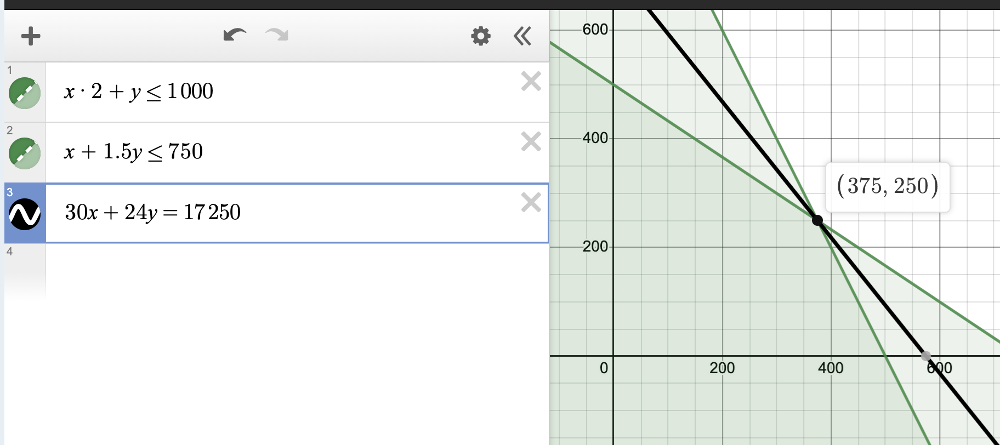

##### Математическое формуликрование задачи ЛП

Для того, чтобы решать задачи ЛП с помощью Python, нужно научиться их формулировать в матричном виде.

###### Пример 1

> Вы отвечаете за рекламу в компании.
>
> Затраты на рекламу в месяц не должны превышать `10 000` руб. Один показ рекламы в интернете стоит `1` рубль, а на телевидении — `90` рублей. При этом на телевидении нельзя купить больше `20` показов.
>
> Практика показывает, что `1` показ телерекламы приводит в среднем `300` клиентов, а `1` показ в интернете — `0.5` клиента.
>
> Вам необходимо привести как можно больше клиентов.

Пусть мы закажем `x₁` показов в интернете и `x₂` на ТВ. Тогда:

- `-(0.5x₁ + 300x₂)` — наша функция для оптимизации (минимизации)
- `1x₁ + 90x₂ <= 10000` — ограничение по деньгам
- `0x₁ + 1x₂ <= 20` — ограничение по кол-ву показов

Нам нужно представить ограничения в виде неравенства `Ax <= b`, а целевую функцию в виде вектора `c`. Тогда задача будет формулироваться следующим образом:

`min cᵀx, Ax < b`

```python
import numpy as np

c = np.array([[-0.5, -300]])

A = np.array([
    [1, 90],
    [0, 1],
])

b = np.array([[1e4, 20]]).T
```

Такую задачу можно решить с помощью [scipy.optimize.linprog](https://docs.scipy.org/doc/scipy/reference/generated/scipy.optimize.linprog.html)

```python
from scipy.optimize import linprog

linprog(c=c, A_ub=A, b_ub=b)
```

Или же с помощью [cvxpy](https://www.cvxpy.org)

```python
import cvxpy as cp

x = cp.Variable(shape=(2, 1), integer=True)

objective = cp.sum(cp.matmul(c, x))

problem = cp.Problem(cp.Minimize(objective), constraints=[
    cp.matmul(A, x) <= b
])

problem.solve()

# print(x.value)
```

###### Пример 2

> Есть `n` задач и `n` человек, которые могут их выполнить.
> 
> Каждая задача должна быть сделана одним человеком, и каждый должен сделать ровно одну задачу.
> 
> Выполнение задачи `j` человеком `i` будет стоить `cᵢⱼ`.
> 
> Вам необходимо сделать все задачи как можно дешевле.

Поскольку задача сформулирована в общем виде то и решать ее нужно в общем виде. Решением будет являться матрица `n×n`, столбцы которой будут представлять задачи, а строки людей. Ограничения будут такие:

- каждый элемент должен быть либо `0` либо `1`
- каждая строка долджна содержать только одну единицу
- каждый столбец должен содержать только одну единицу

###### Пример 3

Конкретизируем и решим предыдущую задачу:

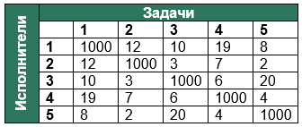

```python
import numpy as np
from scipy.optimize import linprog

price = np.array([
    [1000, 12, 10, 19, 8],
    [12, 1000, 3, 7, 2],
    [10, 3, 1000, 6, 20],
    [19, 7, 6, 1000, 4],
    [8, 2, 20, 4, 1000],
])

c = price.reshape(1, 25)

v1x5 = np.array([[1, 1, 1, 1, 1]])

A = np.array([
    # в каждой строке есть только одна единица
    (np.array([[1, 0, 0, 0, 0]]).T @ v1x5).flatten(),
    (np.array([[0, 1, 0, 0, 0]]).T @ v1x5).flatten(),
    (np.array([[0, 0, 1, 0, 0]]).T @ v1x5).flatten(),
    (np.array([[0, 0, 0, 1, 0]]).T @ v1x5).flatten(),
    (np.array([[0, 0, 0, 0, 1]]).T @ v1x5).flatten(),
    # в каждом столбце есть только одна единица
    (np.array([[1, 0, 0, 0, 0]]).T @ v1x5).T.flatten(),
    (np.array([[0, 1, 0, 0, 0]]).T @ v1x5).T.flatten(),
    (np.array([[0, 0, 1, 0, 0]]).T @ v1x5).T.flatten(),
    (np.array([[0, 0, 0, 1, 0]]).T @ v1x5).T.flatten(),
    (np.array([[0, 0, 0, 0, 1]]).T @ v1x5).T.flatten(),
])

b = np.array([[1, 1, 1, 1, 1, 1, 1, 1, 1, 1]])

res = linprog(c=c, A_eq=A, b_eq=b)

print(f'Целевая функция: {res.fun}') # 32.0
print('Искомая матрица')
print(res.x.reshape(5, 5))
# [[ 0.  0.  1.  0. -0.]
#  [ 0.  0. -0.  1.  0.]
#  [-0.  1.  0.  0.  0.]
#  [ 0.  0.  0.  0.  1.]
#  [ 1.  0.  0. -0.  0.]]
```

#### Simulated annealing

или **метод имитации отжига** применяется для «неудобных» функций, таких, для которых нельзя применить метод градиентного спуска. Суть его заключается в том, что для определения следующей точки выбирается случайная точка по соседству с текущей. Если она расположена ниже, то переход осуществляется без условий. Если же она расположена выше, то переход осуществляется «если повезет», то есть это определяется случайным образом. Шанс положительного решения выше в начале процесса оптимизации, и уменьшается до нуля к ее концу.

Благодаря встроенной случайности, метод отжига может позволить функции удалиться от минимума, и тогда мы сможем «перепрыгнуть» препятствие и достичь глобального минимума.

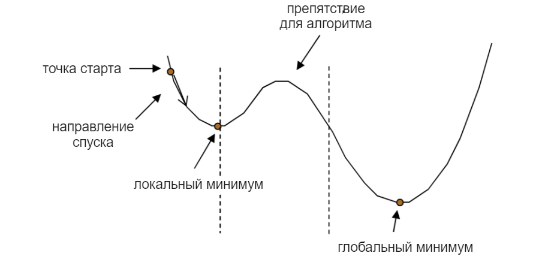

Данный метод является *эвристическим* — то есть таким, который не имеет под собой математического обоснования, но при этом показывает свою эффективность на практике.

|Плюсы|Минусы|
|-|-|
|Можно использовать для функций, которые не являются непрерывно дифференцируемыми.|Сложно настраивать под задачу из-за множества параметров.|
|Можно использовать даже для дискретных функций. Причём именно для дискретных функций метод подходит очень хорошо.|Нет гарантий сходимости.|
|Прост в реализации и использовании.|Выполнение может занимать много времени.|

#### Координатный спуск

Это вариация градиентного спуска в которой следующиая точка определяется только по одной из осей за каждую итерацию.

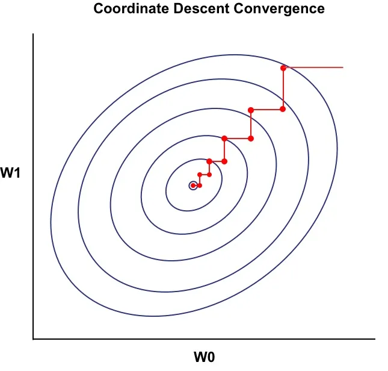


|КООРДИНАТНЫЙ СПУСК|ГРАДИЕНТНЫЙ СПУСК|
|-|-|
|При минимизации меняет одну координату, фиксируя другие.|Меняет значения сразу всех координат.|
|Используется для сильно выпуклой функции. Применимо для функций, у которых нет решений в замкнутой форме (например, Lasso-регрессия).|Применяется для функций, у которых есть решение в замкнутой форме (например, метод наименьших квадратов).|
|Не требует настройки гиперпараметра, определяющего темп обучения.|Требует настройки гиперпараметра, определяющего темп обучения.|
