<style>
    h1, h2, h3, h4, h5, h6 { color: darkorange;  font-weight: 700; }
    h1 { filter: hue-rotate(0deg); }
    h2 { filter: hue-rotate(10deg); }
    h3 { filter: hue-rotate(20deg); }
    h4 { filter: hue-rotate(30deg); }
    h5 { filter: hue-rotate(40deg); }

    strong {
        border: 1px solid #ccc;
        border-radius: 5px;
        padding-left: 0.2rem;
        padding-right: 0.2rem;
        filter: hue-rotate(40deg);
    }

    em {
        border-bottom: 2px dotted #ccc;
    }

    a, a:hover {
        text-decoration: underline;
    }

    @media (prefers-color-scheme: dark) {
        body { color: #ccc; }
        strong { border-color: #ccc; }
        em { border-color: #ccc; }
        img { background-color: rgba(255, 255, 255, 0.75) }
        a, a:hover { color: Violet; }
    }
    
    @media (prefers-color-scheme: light) {
        body { color: #333; }
        strong { border-color: #333; }
        em { border-color: #333; }
        /* img { background-color: rgba(0, 0, 0, 0.1) } */
        a, a:hover { color: DodgerBlue; }
    }
</style>

# Математика в ML (part 2)

## Теория вероятности

### Термины

**Детерминированность** — это ситуация когда одно и то же действие приводит к одному и тому же результату.

**Случайны эксперимент** — это действие, результат которого не детерминирован.

**Элементарный исход** — это один (любой) из всех возможных результатов случайного эксперимента.

**Пространство элементарных исходов** — это множество всех элементарных исходов какого-то одного случайного эксперимента. Оно обычно обозначается буквой `Ω` (омега).

**Вероятностью** события `A` называют отношение элементарных исходов `n` благоприятствующих событию `A` к пространству элементарных исходов `N`:

`P(A) = n / N`

**Достоверное событие** — это то, которое точно произойдет (вероятность `1`)

**Невозможное событие** — это то, которое точно не произойдет (вероятность `0`)

**Дополнением** события `A` называют множество исходов, не благоприятствующих событию `A`. Обозначают `Ā`.

**Несовместимые события** — это события, которые не могут пересечься. Например, дождь пойдет и дождь не пойдет.

**Априорные вероятности** — это вероятности таких событий, которые не зависят от наступления других, иначе говоря это *вероятности безусловных событий*.

**Апостериорные вероятности** — это вероятности событий, которые зависят от других, иначе говоря это *вероятности условных событий*.

`P(A) + P(Ā) = 1`

### Правила

#### Правило суммы

Для двух взаимоисключающих событий `A` и `B` вероятность наступления любого из них равна сумме вероятностей каждого из них.

`P(A ∪ B) = P(A) + P(B)`

Формулу этого правила легко вывести:


#### Правило умножения

Для двух событий `A` и `B` вероятность наступления обоих равна произведению вероятностей каждого из них.

`P(A ∩ B) = P(A) × P(B)`

#### Обобщенное правило суммы

Для двух невзаимоисключающих событий `A` и `B` вероятность наступления любого из них равна сумме вероятностей каждого из них за вычетом их произведения.

`P(A ∪ B) = P(A) + P(B) - P(A ∩ B)`


Это правило работает и для взаимоисключающих событий тоже, поскольку для них `P(A ∩ B) = 0`.

### Условная вероятность

Обозначается `P(B|A)`. Читается: вероятность наступления события `B` при условии `A`.

Для ее вычисления нужно знать `P(A ∩ B)` и `P(A)`:

`P(B|A) = P(B ∩ A) / P(A)`

#### Пример

В конференции участвуют 1000 человек: 300 мужчин и 700 женщин. Известно, что 240 мужчин и 280 женщин пьют кофе. Необходимо найти, с какой вероятностью случайно взятый человек с конференции пьёт кофе, если это женщина.

```
F — женщина
D - пьет кофе
P(F) = 700/1000 = 0.7
P(D ∩ F) = 280 / 1000 = 0.28
P(D|F) = P(D ∩ F) / P(F) = 0.28 / 0.7 = 0.4
```


### Независимые события

События `A` и `B` называются **независимыми** если 
- ~~наступление одного не влияет на наступление другого~~.
- они могут пересечься (наступить одновременно) `A ∩ B`
- вероятность их пересечения равна произведению их вероятностей\
  `P(A ∩ B) = P(A)・P(B)`

#### Пример


##### A

```
A = {2, 4, 6}, P(A) = 0.5
B = {1, 3, 5}, P(B) = 0.5
	P(A)・P(B) = 0.25

A u B = ∅
	P(A ∪ B) = 0

P(A)・P(B) ≠ P(A ∪ B) — события зависимы
```

##### B

```
A = {2, 4, 6}, P(A) = 0.5
B = {1, 2}, P(B) = 1/3
	P(A)・P(B) = 1/6

A ∪ B = {2}
	P(A ∪ B) = 1/6

P(A)・P(B) = P(A ∪ B) — события независимы
```

##### C
```
A = {2, 4, 6}, P(A) = 0.5
B = {3, 4, 5, 6}, P(B) = 2/3
	P(A)・P(B) = 1/3

A ∪ B = {4, 6}
	P(A ∪ B) = 1/3

P(A)・P(B) = P(A ∪ B) — события независимы
```

##### D
```
A = {2, 4, 6}, P(A) = 0.5
B = {2, 3, 4, 5, 6}, P(B) = 5/6
	P(A)・P(B) = 5/12

A ∪ B = {2, 4, 6}
	P(A ∪ B) = 1/2

P(A)・P(B) ≠ P(A ∪ B) — события зависимы
```

### Разбиение вероятностного пространства

Это совокупность несовместимых (взаимоисключающих) событий, которые взаимно дополняют друг друга и полностью описывают все возможные исходы.

### Полная вероятность

Формула ее такова

`P(B) = ∑P(B|Aᵢ)・P(Aᵢ)`

где `P(B)` — вероятность наступления события; `P(Aᵢ)` — вероятность наступления события , которое является условием для события `B`;
`P(B|Aᵢ)` — условная вероятность наступления события `B`, если известно, что произошло событие `Aᵢ`.

Не очень понятно, почему это называется полной вероятностью 🤔

#### Пример

1 % клиентов постоянно жалуются на сервис — из них 60 % уйдут. Ещё 10 % клиентов периодически жалуются на сервис — из них 10 % уйдут. Оставшиеся 89 % клиентов никогда не жалуются на сервис — из них 3 % уйдут.

Найдите:

- долю уходящих клиентов каждого типа от всех клиентов;
- долю уходящих клиентов от всех клиентов;
- долю каждого типа клиентов среди уходящих клиентов.

##### A
```
0.01 * 0.6 = 0.006

0.1 * 0.1 = 0.01

0.89 * 0.03 = 0.0267
```

##### B
```
Доля уходящих клиентов\
0.006 + 0.01 + 0.0267 = 0.0427
```
##### C
```
Доля 1-го типа среди уходящих
0.006 / 0.0427 ≈ 0.14

Доля 2-го типа среди уходящих
0.01 / 0.0427 ≈ 0.23

Доля 3-го типа среди уходящих
0.0267 / 0.0427 ≈ 0.63
```
### Формула Байеса

Формула позволяет найти `P(A|B)` если известны `P(B|A)`, `P(A)` и `P(B)`:

`P(A|B) = P(B|A) ・ P(A) / P(B)`

#### Пример

Ваш друг работает в сервисе, который ремонтирует колёсные диски производителей Seagull и Tosha (диски других производителей сервис в ремонт не принимает). Друг утверждает, что примерно 60 % дисков в ремонте — диски Seagull и лишь 40 % — диски Tosha. На основе этой статистики он не рекомендует вам покупать Seagull. Вы провели небольшое исследование и сделали вывод, что доля Seagull на рынке составляет 40 %, а доля Tosha — 23 %.

Какие диски действительно чаще ломаются?

```
P(S) = 0.4
P(B|S) = 0.6
P(T) = 0.23
P(B|T) = 0.4

P(S|B) = P(B|S)・P(B) / P(S) = 0.6p / 0.4 = 1.5p
P(T|B) = P(B|T)・P(B) / P(T) = 0.4p / 0.23 ≈ 1.74p

Видим, что вероятность поломки диска Seagull ниже

P(S|B) / P(T|B) = 1.5 / 1.74 = 0.8625

Проверим на графическом построении

Изобразим все диски на рынке

Версия A
S S S S S S S S S S
S S S S S S S S S S
S S S S S S S S S S
S S S S S`S`S`S`S`S`
T T T T T T T`T`T`T`
T T T T T T T T T T
T T T U U U U U U U
U U U U U U U U U U
U U U U U U U U U U
U U U U U U U U U U

P(S|B) = 6/40
P(T|B) = 4/23

P(S|B) / P(T|B) = 0.8625

Версия B
S S S S S S S S S S
S S S S S S S S S S
S S S S S`S`S`S`S`S`
S S S S S`S`S`S`S`S`
T T T T T T T`T`T`T`
T T T T T T T`T`T`T`
T T T U U U U U U U
U U U U U U U U U U
U U U U U U U U U U
U U U U U U U U U U

P(S|B) = 12/40
P(T|B) = 8/23

P(S|B) / P(T|B) = 0.8625
```

#### Байесовская и частотная статистики

|Частотная статистика|Байесовская статистика|
|-|-|
|В классическом подходе вероятность получить орёл при подбрасывании «нечестной» монеты — долгосрочная относительная частота появления орла при повторных подбрасываниях монеты. Таким образом, чем больше мы подбрасываем монету, тем больше число выпавших орлов в процентах от общего количества подбрасываний стремится к «истинной» вероятности того, что на монете выпадет орёл.|Философия байесовской статистики такова, что до первого подбрасывания мы считаем, что монета «честная», то есть по умолчанию используем априорную вероятность. Допустим, после нескольких бросков монета постоянно выпадает орлом. Тогда мы модифицируем исходную вероятность: добавляем информацию о том, что у нас выпало несколько орлов подряд, и постепенно наши оценки «честности» монеты меняются. Таким образом, предыдущее убеждение о «честности» монеты модифицируется. Апостериорное убеждение в итоге будет сильно изменено по сравнению с априорным убеждением о «честной» монете.|

### Наивный Байес

**Наивный байесовский классификатор** (НБК) — Naive Bayes Classifier, NBC — это модель классификации, которая основана на вероятностях признаков и считает их независимыми друг от друга. Идейная и алгоритмическая простота алгоритма являются его главным преимуществом.

Для решения является ли сообщение спамом или нет, формула классификации выглядит следующим образом:


#### Плюсы

- Алгоритм не только прост для понимания и реализации, но также даёт достаточно точные оценки и быстро работает.
- Наивный Байес имеет низкую вычислительную сложность.
- Он может эффективно работать с большим набором данных.
- Его можно использовать с задачами прогнозирования нескольких классов, то есть в задачах *мультиклассовой* классификации.
- Если выполнено предположение о независимости признаков, то НБК даёт более высокое качество, чем логистическая регрессия и многие другие модели.

#### Минусы

- Предположение о независимых признаках не выполняется на практике практически никогда.
- Если нет обучающего набора данных для какого-то из классов, это приводит к нулевой апостериорной вероятности и модель не может сделать прогноза.

#### Реализация в scikit

- [GaussianNB](https://scikit-learn.org/stable/modules/generated/sklearn.naive_bayes.GaussianNB.html) — самый простой вариант, работает с непрерывными признаками;
- [MultinomialNB](https://scikit-learn.org/stable/modules/generated/sklearn.naive_bayes.MultinomialNB.html)  — работает с категориальными признаками, текстами и несбалансированными выборками;
- [ComplementNB](https://scikit-learn.org/stable/modules/generated/sklearn.naive_bayes.ComplementNB.html) — улучшенная версия MultinomialNB, стабильно показывает более высокое качество в задачах классификации текстов;
- [BernoulliNB](https://scikit-learn.org/stable/modules/generated/sklearn.naive_bayes.BernoulliNB.html) — версия для работы с бинарными признаками;
- [CategoricalNB](https://scikit-learn.org/stable/modules/generated/sklearn.naive_bayes.CategoricalNB.html#sklearn.naive_bayes.CategoricalNB) — работает с категориальными признаками, предполагает кодировку данных через OrdinalEncoder.

#### СountVectorizer

CountVectorizer — это утилита для векторизации текстов.

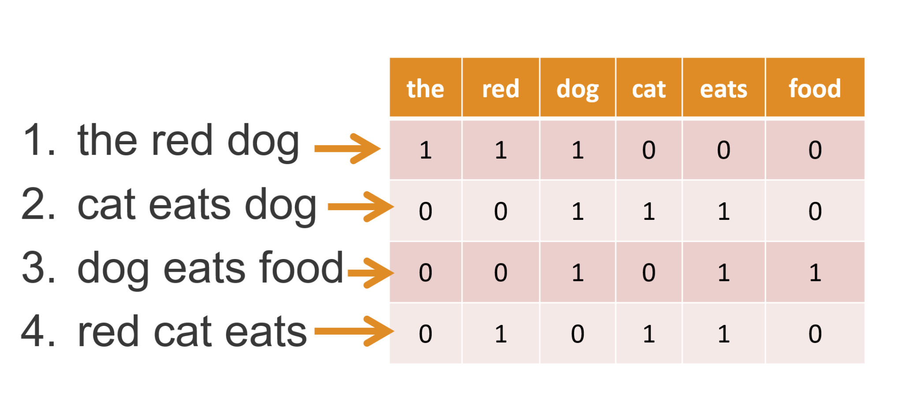

```python
from sklearn.feature_extraction.text import CountVectorizer

vectorizer = CountVectorizer()
X = vectorizer.fit_transform(spam_data['email'])
```

Результатом его работы будет *sparse matrix* — разряженная матрица.

### Математическое ожидание случайной величины

Это взвешенное среднее значение случайной величины с учетом вероятностей. Обозначают буквой `E` или `μ`. Она считается по формуле:

`E(X) = ∑xᵢ・P(X = xᵢ)`

Здесь `xᵢ` — это одно из значений, которые может принимать случайная величина, а `P(X = xᵢ)` — его вероятность.

#### Пример

Случайная величина задана таблицей

| X |-1 | 0 | 1 | 2 |
|---|---|---|---|---|
| P |0.5|0.2|0.2|0.1|

Нужно найти `E(X)` и `E(X²)`

```
E(X) = -1*0.5 + 0*0.2 + 1*0.2 + 2*0.1 = -0.1
E(X²) = 1*0.5 + 0*0.2 + 1*0.2 + 4*0.1 = 1.1
```

❗️ Математическое ожидание очень чувствительно к выбросам.

### Дисперсия и стандартное отклонение

Иметь только математическое ожидание недостаточно. Нужно понимать, каков разброс случайной величины вокруг ожидания. Для этого используют стандартное отклонение и дисперсию.

**Дисперсия** обозначается `V(X)` или `D(X)` или еще `σ²x` и вычисляется по формуле:

`D(X) = E(X²) - E(X)²`

Такую величину трудно интерпретировать, потому что она превращает рубли в квадртатные рубли, а квадратные метры в метры четвертой степени. Поэтому для интерпретации используют **стандартное отклонение**, которое является корнем из дисперсии и обозначается `σx`.

`σx = √D(X)`

❗️ Дисперсия и стандартное отклонение очень чувствительны к выбросам.

### Распределение дискретной случайной величины

Случайные величины бывают **дискретные** и **непрерывные**. Их название говорит само за себя.

В математике существует огромное кол-во распределений дискретной случайной величины, но в теории вероятностей чаще всего встречаются следующие четыре **стандартные распределения**:

- равномерное распределение;
- распределение Бернулли;
- биномиальное распределение;
- распределение Пуассона.

#### Равномерное распределение

> игральная кость

Значения — числа от `1` до `N`. Вероятности одинаковы.

#### Распределение Бернулли

> фальшивая монета

Значения `0` и `1`, вероятности `p` и `1 - p`

#### Биноминальное распределение

> мишени в биатлоне

Для того чтобы оценить вероятность, что среди `n` испытаний будет  `k` успехов, используют следующую формулу:


Здесь `(n k)` — это биноминальный коэфициент, который равен

```
    n!
——————————
k!(n - k)!
```

##### Пример

Производитель гаджетов знает, что `20 %` производимых им товаров — бракованные. Если он производит десять изделий в день, какова вероятность того, что не более двух из них бракованные?

```python
# P(X=8) = (10 8) * (0.8)**8 * (0.2)**2
# P(X=9) = (10 9) * (0.8)**9 * (0.2)**1
# P(X=10) = (10 10) * (0.8)**10 * (0.2)**0

# P(X={8,9,10}) = P(X=8) + P(X=9) + P(X=10)

from scipy.stats import binom

p = binom.pmf(8,10,0.8) + binom.pmf(9,10,0.8) + binom.pmf(10,10,0.8)
print(p) # 0.6777995264000004
```

#### Распределение Пуассона

> колл-центр

Это вероятность числа событий в период времени с учетом среднего кол-ва событий происходящих за этот период времени.

##### Пример

В течение `5` минут колл-центр получает в среднем `4.5` звонка. Сколько нужно операторов, чтобы клиенты висели на холде не более `10%` времени?

```python
from scipy.stats.distributions import poisson

operators_num = 1

while True:
    calls_gt_than_operators = operators_num + 1
    calls_gt_than_operators_p = poisson.pmf(calls_gt_than_operators, 4.5)

    if calls_gt_than_operators_p <= 0.1:
        break
    else:
        operators_num += 1

print(operators_num) # 6
```

### Распределение непрерывной случайной величины

Таких распределений тоже очень много. Мы рассмотрим основные:

- равномерное
- нормальное
- экспоненциальное

#### Равномерное распределение

Полезно для прогнозирования спроса на товар в первые недели и для генерации случайных чисел.

Для равномерного распределения от `a` до `b` используются формулы:

`EX = (a + b) / 2`

`σx = (b - a) / √12`

#### Нормальное распределение

Его еще называют **распределение Гаусса** описывает распределение многих явлений, например рост и вес.

Если отобразить разницу между `y` и `y_pred`, на столбчатой диаграмме, то мы тоже получим нормальное распределение.

##### Стандартное нормальное распределение

— это такое, у которого `EX = 0` а `DX = 1`

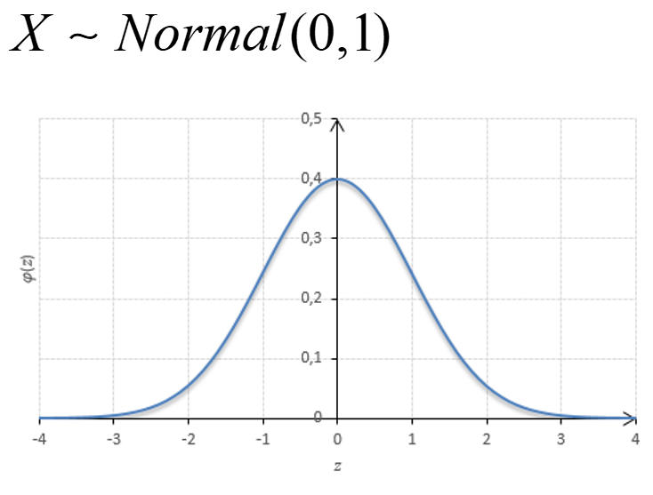

#### Экспоненциальное распределение

— это распределение интервалов времени между событиями в процессе Пуассона. (Например, между звонками в колл-центр — промежутки времени между соседними звонками строятся на графике, и получается, что коротких интервалов много, а длинных — мало.)

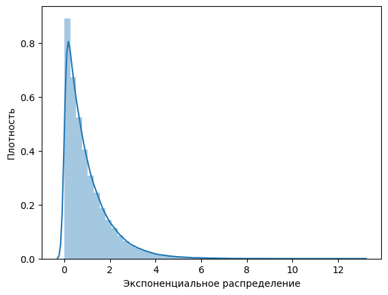

Формулы такие:

`EX = 1 / ƛ`

`σx = 1 / ƛ`

`P(X <= x) = 1 - e^-ƛx` — вероятность, что случайная величина будет `<= x`

`P(X > x) = e^-ƛx` — вероятность, что случайная величина будет `> x`

Здесь `ƛ` — среднее кол-во событий за единицу времени

##### Пример

В среднем новый холодильник служит 10 лет. Предположим, что продолжительность времени службы распределена экспоненциально.

1. Какова вероятность того, что холодильник прослужит более 7 лет?
2. Какова вероятность того, что устройство прослужит от 9 до 11 лет?

```python
l = 1/10

p_gt_7 = np.exp(-1 * l * 7)
print(f'P(прослужит > 7 лет) = {round(p_gt_7, 3)}') # 0.497

p_lt_9 = 1 - np.exp(-1 * l * 9)
p_lt_11 = 1 - np.exp(-1 * l * 11)
p_btw_9_and_11 = round(p_lt_11 - p_lt_9, 3)
print(f'P(прослужит > 9 и < 11 лет) = {p_btw_9_and_11}') # 0.074
```

## Ансамбли моделей

### Бутстреппинг. Бэггинг

**Бутстреп** (bootstrap) — это генерация любого нужного кол-ва выборок размером `n` из имеющегося датасета размером `N >= n` путем случайного выбора элементов с *возвратом* (возможнотью повторения).


#### Bias и variance

**Смещение** — это разница между математическим ожиданием модели и реальным значением. Чем оно меньше, тем точнее предсказания. Если смещение большое значит модель сильно упрощена.

**Разброс** — это величина разницы предсказаний модели, если обучать ее на немного измененных данных. Если разброс маленький, значит модель устойчива к изменениям в выборке.

Среднеквадратическую ошибку модели можно выразить через bias и variance:

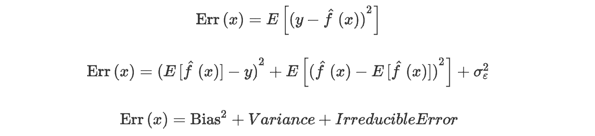

Возможны следующие ситуации:

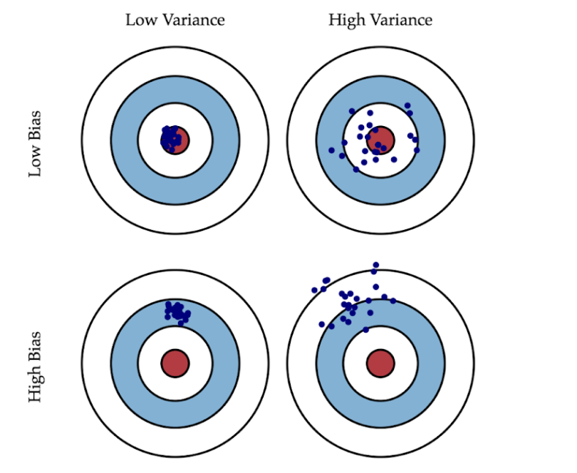

- Если модель очень простая, с маленьким количеством параметров, у нее будет маленький разброс, и большое смещение.
- Если модель очень сложная, со множеством параметров, у нее будет большой разброс и маленькое смещение.

Чтобы минимизировать ошибку нужно стремиться к балансу.

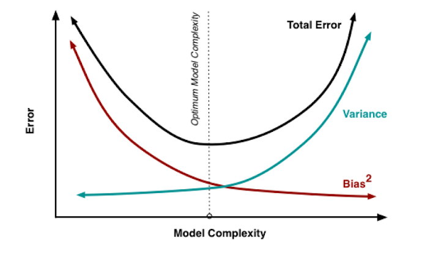

#### Бэггинг (bagging)

В беггинге мы тренируем много одинаковых моделей на разных бутстрапах, затем усредняем их результаты на конечной модели. Смысл в том, чтобы избежать разброса.

Математически можно вывести, что если мы натренируем `К` моделей, то мы уменьшим среднеквадратическую ошибку в `К` раз. (Это в теории. На практике этот эффект будет менее выражен.)


- Бэггинг даёт уменьшение ошибки в `К` раз по сравнению с одиночной моделью.
- Бэггинг не уменьшает смещение по сравнению с одиночной моделью.
- Бэггинг уменьшает разброс в `К` раз по сравнению с одиночной моделью.

Важно отметить, что эти утверждения будут выполняться на практике только в том случае, если между ошибками *нулевая корреляция*.

#### Random forest

Это разновидность бэггинга в которой в качестве базовой модели используеются решающее дерево.

Для тренировки деревьев в случайном лесу готовят бутсрэпы максимального размера по количеству обучающих примеров — так же как в беггинге.

Что касается признаков, то берут не все имеющиеся `M`, а только часть `L`:

- `L = 1/3 M` для задачи регрессии
- `L = √M` для задачи классификации

##### Out-of-Bag

— эта такая метрика, которая позволяет оценить качество итоговой модели без использования тестовой выборки.

Чтобы это сделать нужно протестировать каждое дерево на примерах, которые не попали в обучающую выборку модели. (По теории вероятности в обучающую выборку каждого дерева попадает лишь `63.2%` уникальных наблюдений, а `36.8%` составляют out-of-bag выборку.) Это своего рода k-folding.

##### Плюсы

- Один из самых эффективных алгоритмов
- Не требует особенной настройки
- Не требует приведения данных (нормализации, стандартизации)
- Эффективно справляется с пропусками и выбросами
- Эффективно работает с несбалансированными классами
- Не склонен к переобучению
- Позволяет оценить значимость отдельных признаков

##### Минусы

- Трудно интерпретировать результаты
- Плохо работает с разряженными данными (не подходит для анализа текстов)

### Бустинг

В бустинге следующая модель фокусируется на наблюдениях, в которых предыдущая модель допустила ошибку.

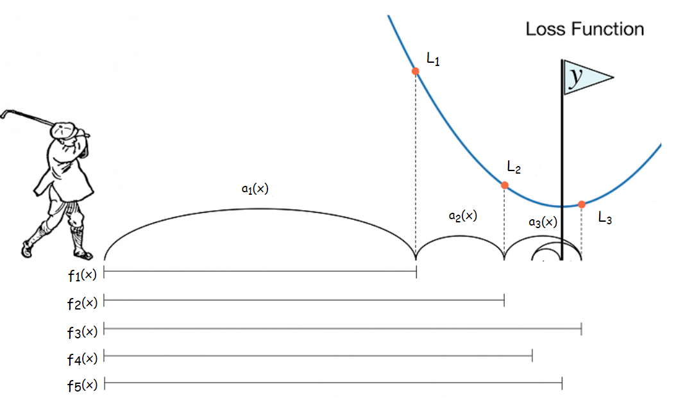

#### AdaBost (Adaptive Boosting)

Использует простые модели. Алгоритм работает следующим образом. Первая модель делает прогноз и классифицирует результаты насколько может хорошо. На данном этапе веса всех наблюдений одинаковы:

`wⱼ = 1/N`

где `N` — кол-во наблюдений.

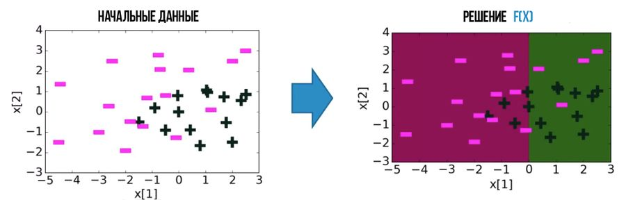

Те наблюдения, которые невено классифицированы, получают больший вес, и вторая модель делает свой прогноз.

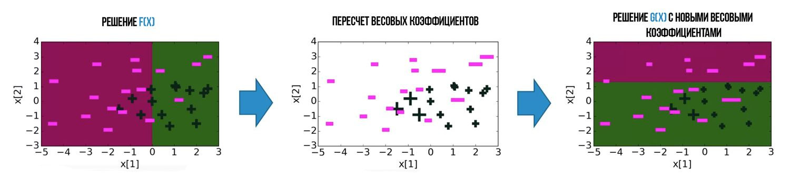

Далее прогнозы объединяют.

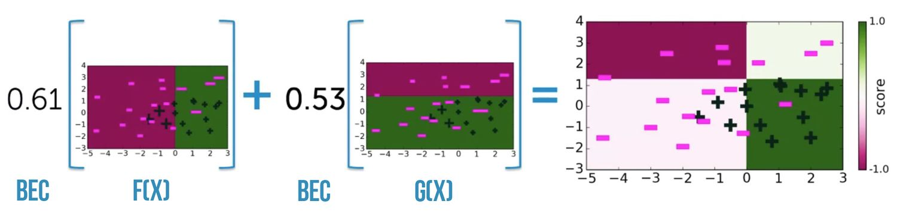

Цикл повторяется нужное кол-во раз.

```python
from sklearn import ensemble
from sklearn import tree

estimator = tree.DecisionTreeClassifier(
    random_state=26,
)

ada = ensemble.AdaBoostClassifier(
    learning_rate=0.1,
    base_estimator=estimator,
    random_state=26,
)

ada.fit(X_train, y_train)
```

#### Градиентный бустинг

Математика была слишком сложной, я ее пропустил. Ниже примеры использования различных моделей:

- [XGBoost](https://xgboost.readthedocs.io/en/stable/)
- [CatBoost](https://catboost.ai/en/docs/)

```python
import xgboost

xgb = xgboost.XGBClassifier(random_state=26)

xgb.fit(X_train, y_train)
```

```python
from catboost import CatBoostClassifier
from catboost.utils import get_confusion_matrix

cb = CatBoostClassifier()
cb.fit(X_train, y_train)

# Матрица TN TP / FN FP в процентах
mtrx = get_confusion_matrix(cb, catboost.Pool(X_train, y_train)) / len(y_train) * 100
```

### Блендинг и стекинг

Позволяет использовать базовые модели *различных типов* (bagging и boosting используют работают с базовой моделью только одного типа, параметр `estimator`). Их результаты попадают в **метамодель**, которая принимает решение.

❗️ Важно использовать базовые модели *разной природы*. Это проиллюстрировано на примере ниже.

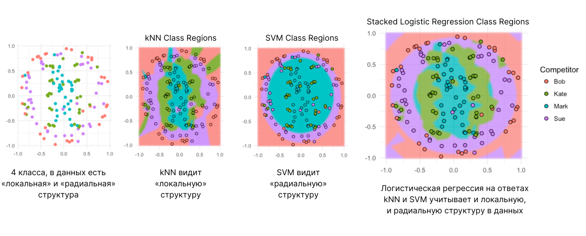

В метамодель попадают не только вердикты базовых моделей, но и исходные данные. Это значит, что метамодель должна уметь их интерпретировать. Следовательно, она должна быть на них обучена.

❗️ Важно, чтобы обучение метамодели происходила не на тех данных, которые использовались для обучения базовых моделей. В противном случае метамодель будет выбирать вердикты самой переобученной базовой модели.

#### Blending

Это простейшая реализация стэкинга. Обучающие данные делятся на две части. Базовые модели обучаются на одной, метамодель обучается на другой.

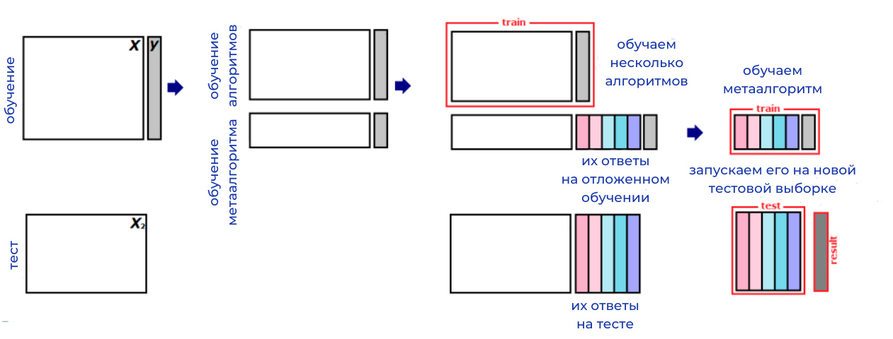

#### Stacking

Это улучшенная версия блендинга. Она позволяет обучить базовые модели на всех данных. Чтобы избежать переобучения, используется кросс-валидация.

#### Многоуровневый стекинг

Позволяет получить незначительное улучшение качества. Требует значительных вычислительных затрат.

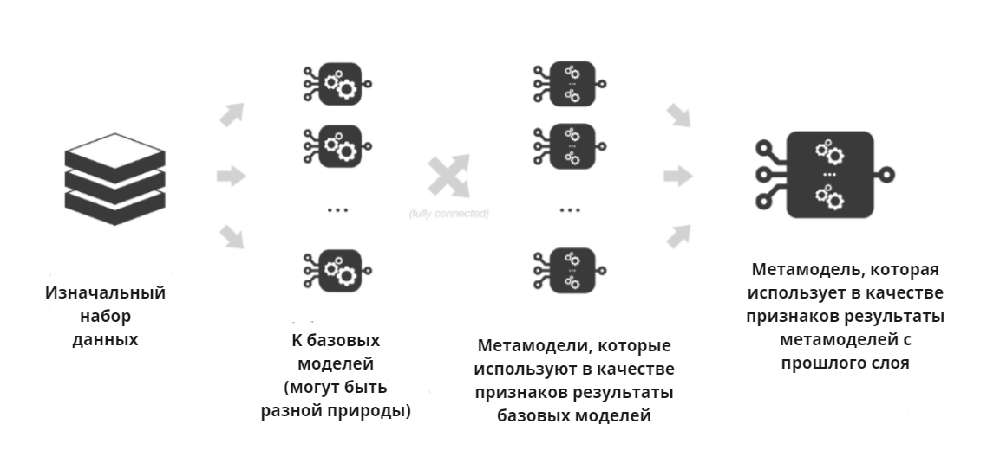

#### Плюсы

- хорошо параллелится
- хорош для использования разных по природе базовых моделей

#### Минусы

- результаты плохо интерпретируются
- качество предсказаний зависит от качества базовых моделей

## Кластеризация

### K-means

Совсем примитивный алгоритм, про него даже рассказывать ненитересно.

### EM-algorithm

Применяется в тех случаях, *когда объекты распределены нормально*.

Ему нужно лишь задать кол-во кластеров. После чего алгоритм сделает предположение для каждого кластера о его:

- весе `w` (`0 < w < 1` — сумма весов всех кластеров равна `1`)
- мат. ожидании `μ`
- стандартном отклонении `σ`

И далее будет улучшать эти три значения, пока не сойдется (или пока не закончатся итерации).


Каждая итерация состоит из двух шагов:

1. E-шаг (expectation): для каждого объекта вычисляется вероятность его принадлежности к каждому кластеру.
2. М-шаг (maximisation): для каждого кластера вычисляются его параметры `w`, `μ`, `σ`.

❗️ Как можно догадаться, эти два шага и дают алгоритму его название.

#### Плюсы

- Устойчив к шумам и пропущенным значениям в данных.
- Кластеры, которые находит этот алгоритм, могут принимать форму эллипса, а не ограничиваться окружностями. *K-Means* является частным случаем GMM.
- Если объект находится в середине двух перекрывающихся кластеров, то, в отличие от k-means, не нужно решать, к какому кластеру он принадлежит — объект может принадлежать к двум разным кластерам с разной вероятностью.

#### Минусы

- При неудачной инициализации сходимость может оказаться медленной.
- Нужно задавать количество кластеров.
- Иногда останавливается в локальном минимуме и не достигает глобального.

### DBSCAN

Это алгоритм кластеризации на основе плотности. Он позволяет решать некоторые задачи, с которыми K-means и EM не справляются.

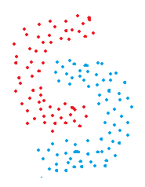

Данный алгоритм оперирует с двумя основными параметрами:

1. `min_samples` — минимальное кол-во соседей
2. `eps` — максимальное расстояние до соседа

Алгорим возьмет один объект и будет присоединять к нему соседние объекты, если они в пределах `eps`. И так будет для всех объектов, у которых `min_eps` или больше соседей. Такие объекты будут считаться *центральными*.

Если же объект близко, но не имеет нужного кол-ва соседей, то он считается *граничным*. Объекты, которые не были присоединены ни к одному кластеру будут считаться *шумовыми*.

#### Плюсы

- работает с любыми геометрическими формами
- толерантен к выбросам и пропускам
- не нужно задавать кол-во кластеров

#### Минусы

- плохо работает с кластерами разной плотности
- трудно подобрать `eps`

### Иерархическая кластеризация

Бывает двух видов, *агломеративная* и *дивизионная*.

#### Агломеративная

Это когда все объекты сначала являются собственными кластерами, затем ближайшие объединяются в один кластер и так далее, пока не получим нужное число кластеров.

#### Дивизионная

Это наоборот — все объекты объединяются в один кластер, затем на каждом шаге один кластер делится на два. И так далее, пока не получим нужное число кластеров.

#### Дендрдаграмма

При ее построении горизонталь проводится на том уровне, который показывает расстояние между ними до объединения. (На рисунке ниже можно увидеть, что расстояние между кластерами `1` и `2` примерно `4.5`)

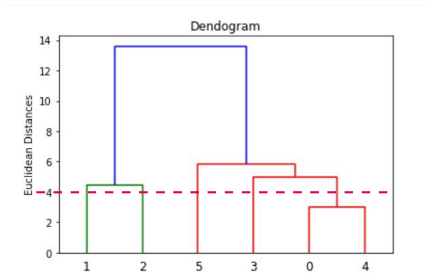

Также дендрограмма позволяет оценить кол-во кластеров для расстояния между ними.

#### Расстояние между точками

Можно считать разными способами.

##### Евклидово

`d = √(a² + b²)`

##### Манхэттенское расстояние

`d = |a₁ - a₂| + |b₁ - b₂|`

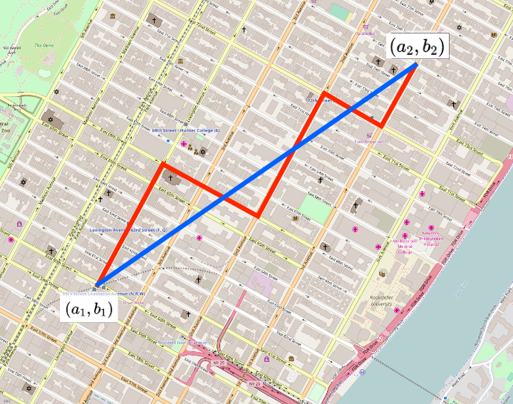

##### Косинусная мера близости


#### Расстояние между кластерами

##### Single linkage

Выбирается расстояние между самыми близкими объектами кластеров.

##### Complete linkage

Выбирается расстояние между самыми удаленными объектами кластеров.

##### Average linkage

Среднее арифметическое расстояний между всеми объектами в кластерах.

##### Centroid linkage

Сначала вычисляются центроиды каждого кластера, затем считается расстояние между ними. Данный метод является чуть более затратным.

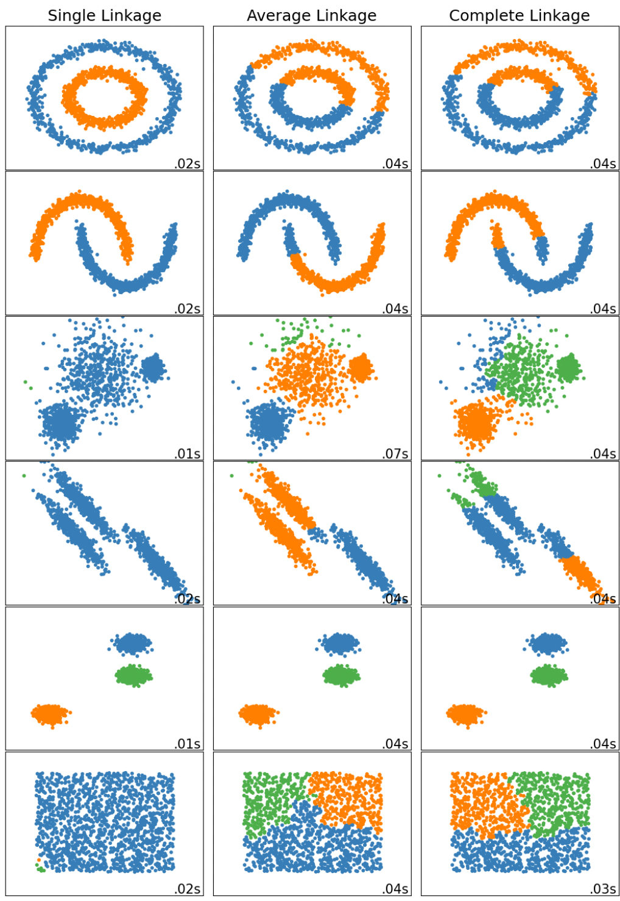

#### Реализация на Python

```python
from sklearn.cluster import AgglomerativeClustering

n_clusters = 3
linkage = 'ward' # or 'complete', 'average', 'single'
affinity = 'euclidean' # or 'l1', 'cosine'

# Create the AgglomerativeClustering object
clustering = AgglomerativeClustering(
    n_clusters=n_clusters,
    linkage=linkage,
    affinity=affinity,
)

clustering.fit(data)

print(clustering.labels_)
```

## Метрики кластеризации

Для оценки качества кластеризации выделяют две большие группы метдодов: **внутренние меры** и **внешние меры**.

### Внутренние меры

Это такие, которые основываются только на имеющихся данных. В библиотеке sklearn реализованы три наиболее популярные метрики:

- [коэффициент силуэта](https://scikit-learn.org/stable/modules/generated/sklearn.metrics.silhouette_score.html);
- [индекс Калински — Харабаса](https://scikit-learn.org/stable/modules/generated/sklearn.metrics.calinski_harabasz_score.html);
- [индекс Дэвиса — Болдина](https://scikit-learn.org/stable/modules/generated/sklearn.metrics.davies_bouldin_score.html#sklearn.metrics.davies_bouldin_score).

Мы также рассмотрим внутренние меры, которые не реализованы в sklearn:

- внутрикластерное расстояние
- межкластерное расстояние
- отношение расстояний

#### Коэфициент силуэта

Алгоритм расчета следующий.

Для каждого объекта `xᵢ` в кластере `A` вычислается среднее расстояние `aᵢ` от него до всех объектов в его кластере. Затем вычисляется среднее расстояние `bᵢ` от него до всех объектов соседнего кластера `B`. Далее для коэфициент силуеэта для данной точки вычисляется по формуле:

`sᵢ = (bᵢ - aᵢ) / max(aᵢ, bᵢ)`

После подсчета коэфициентов для всех точек, конечный коэфициент вычисляется как среднее арифметическое.

`S = 1/n ∑ (bᵢ-aᵢ)/max(aᵢ, bᵢ)`

Значение `S` может изменяться в пределах `[-1; 1]`. Чем ближе к единице, тем лучше.

##### Реализация на python

```python
#определяем алгоритм кластеризации
km = KMeans(n_clusters=3, random_state=42)
#обучаем его на наших данных
km.fit_predict(X)
#вычисляем значение коэффициента силуэта
score = silhouette_score(X, km.labels_, metric='euclidean')
```

#### Индекс Калински — Харабаса

Вычисляется по следующей формуле.

```
SSʙ   N-K
——— × ———
SS𝘄   K-1

SSʙ - взвешенная межкластерная сумма квадратов расстояний
SS𝘄 - внутрикластерная сумма квадратов расстояний
N — общее количество объектов;
K — количество кластеров;

SSʙ = ∑ nₖ |Cₖ - C|²

nₖ — количество наблюдений в кластере
Cₖ — центроид кластера
C — центроид всего набора данных

SS𝘄 = ∑ |Xᵢₖ - Cₖ|²

Xᵢₖ — i-ое наблюдение в кластере k;
Cₖ — центроид кластера k.
```

У данного индекса нет диапазона возможных значений. Нужно принимать решение сравнивая индексы, посчитанные для различного кол-ва кластеров.


##### Реализация на python

```python
#определяем алгоритм кластеризации
km = KMeans(n_clusters=3, random_state=42)
#обучаем его на наших данных
km.fit_predict(X)
#вычисляем значение коэффициента Калински — Харабаса
score = calinski_harabasz_score(X, km.labels_)
```

#### Индекс Дэвиса — Болдина

Считается очень замороченно...

Чем он ниже — тем лучше. Минимальное значение — ноль.

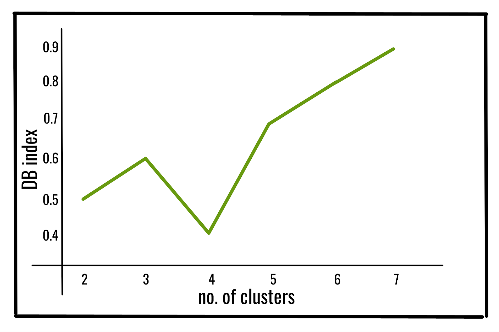

##### Реализация на python

```python
#определяем алгоритм кластеризации
km = KMeans(n_clusters=3, random_state=42)
#обучаем его на наших данных
km.fit_predict(X)
#вычисляем значение коэффициента Дэвиса — Болдина
score = davies_bouldin_score(X, km.labels_)
```

#### Внутрикластерное расстояние

— это сумма расстояний всех объектов до центроидов их кластеров. Обозначается `F₀`. Показывает, насколько плотно расположены объекты в кластерах. Чем оно меньше, тем лучше.

#### Межкластерное расстояние

— это сумма расстояний между всеми объектами из разных кластеров. Обозначается `F₁`. Показывает, насколько далеки друг от друга элементы из разных кластеров. Чем оно больше, тем лучше.

#### Отношение расстояний

— это отношение `F₀/F₁`

### Внешние меры

Их можно применить, если у нас есть для некоторых наблюдений у нас имеются точные метки кластеров.

#### Индекс Рэнда (IR)

Предположим у нас есть `N` объектов с реальными метками. Тогда `IR` вычисляется следующим образом:

`RI = (a + b) / ½N(N - 1)`

- `a` — кол-во пар, попавших в свои кластеры согласно реальным меткам и оцениваему разбиению
- `b` — кол-во пар, поппавших в разные кластеры согласно реальным меткам и оцениваему разбиению.

Таким образом в числителе дроби находятся все пары, сохранившые свои места в оцениваемом разбиении, а в знаменателе — все возможные пары. Получается, что `RI` меняется в интервале от `0` до `1`, и чем он ближе к единице — тем лучше.

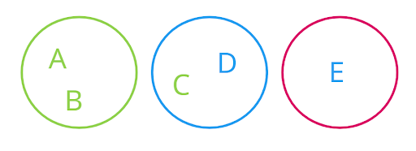

Посчитаем `IR` для примера на картинке (цвета объектов соответствуют реальным меткам).

```
a = 1 (AB)
b = 5 (AD, AE, BD, BE, CE)
N = 5

IR = (1 + 5) / ½5(5-1) = 6 / ½20 = 0.6
```

##### Реализация на python

```python
from sklearn.metrics import rand_score

labels_true = [1, 1, 1, 2, 2]
labels_pred = [1, 1, 2, 2, 3]

score = rand_score(labels_true=labels_true, labels_pred=labels_pred)

print(score) # 0.6
```

#### Нормализация бла-бла

#### Однородность

Для ее вычисления тоже применяется энтропия Шенона.

```
                 H(Ytrue|Ypred)
homogenity = 1 - ——————————————
                   H(Ytrue)
```

Значение изменяется от `0` до `1`. Чем он ближе к единице — тем лучше. На картинке ниже однороодность максимальна.

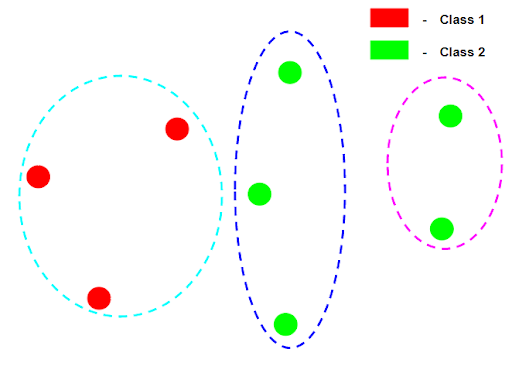

##### Резализаци на python

```python
from sklearn.metrics.cluster import homogeneity_score

labels_true = [1, 1, 1, 2, 2]
labels_pred = [2, 2, 0, 0, 1]

score = homogeneity_score(labels_true=labels_true, labels_pred=labels_pred)

print(score) # 0.5880325916843804
```

#### Полнота

Для ее вычисления тоже применяется энтропия Шенона.

```
                   H(Ytrue|Ypred)
completeness = 1 - ——————————————
                     H(Ypred)

```

Значение изменяется от `0` до `1`. Чем он ближе к единице — тем лучше. На картинке ниже полнота максимальна.

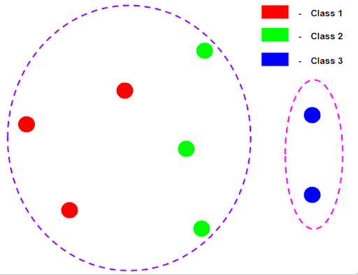

##### Резализаци на python

```python
from sklearn.metrics.cluster import completeness_score

labels_true = [1, 1, 1, 2, 2]
labels_pred = [2, 2, 0, 0, 1]

score = completeness_score(labels_true=labels_true, labels_pred=labels_pred)

print(score) # 0.37514952012034736
```

#### V-мера

По отдельности полнота и однородность применяются редко, потому что могут давать ложное представление об эффективности кластеризации. **V-мера** является их комбинацией.

```
    (1 + β) × homogenity × completness
v = ——————————————————————————————————
       β × homogenity + completness
```

Варьируя `β` можно увеличивать влияние одной из характеристик. Если однородность важнее, то следует взять `β < 1`, если полнота, то следует взять `β > 1`. (По-умолчанию `β = 1`.)

Значение метрики изменяется от `0` до `1`. Чем оно ближе к единице — тем лучше.

##### Резализаци на python

```python
from sklearn.metrics import v_measure_score

labels_true = [1, 1, 1, 2, 2]
labels_pred = [2, 2, 0, 0, 1]

score = v_measure_score(labels_true=labels_true, labels_pred=labels_pred)

print(score)
```

## Алгоритмы понижение размерности

### Проблема

Какую проблему мы пытаемся решить? Если данных очень много, то с ними становится трудно работать. Нам нужно уменьшить кол-во данных, но при этом не потерять важной информации, нужной для обучения моделей ML.

Есть два способа уменьшения кол-ва признаков:
- фильтрация
- создание новых признаков (взамен старых)

#### Фильтрация

Под фильтрацией понимается удаление части признаков. Признак может быть удален если он:
- содержит некорректные данные (такое тоже бывает?)
- содержит слишком много пропусков
- имеет слишком малую корреляцию с целевым признаком

При фильтрации *часть информации теряется*.

#### Создание новых признаков

Идея состоит в том, чтобы на основе имеющихся признаков создать новые независимые признаки, и далее взять только те из них, которые позволят эффективно решить поставленную задачу.

При этом подходе *информация не теряется*, она трансформируется.

### Метод главных компонент

или **PCA** (Principal Component Analysis).

#### Идея метода
Например у нас даны размеры разных рыб — две характеристики, ширина и высота. Поскольку большинство рыб имеет одинаковые пропорции, то мы можем одним новым признаком `x₁` описать это большинство. А также с помощью дополнительного признака `x₂`, который перпендикулярен первому, мы опишем и нестандартные пропорции.

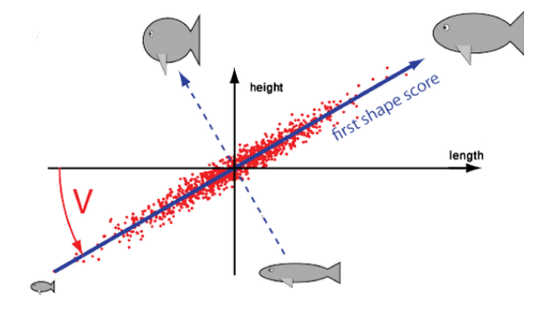

Мы можем сделать следующие выводы:

- два новых признака `x₁` и `x₂` полностью заменяют два старых признака, информация не теряется
- `x₁` сводит к минимуму потерю данных (максимизирует вариацию)
- `x₁` может быть использован как самостоятельный признак, он имеет большую важность по сравнению с `x₂` (старые признаки имеют одинаковую важность)

Найденный новый признак `x₁` является *главной компонентой*.

#### Алгоритм

1. нормализовать данные
2. построить ковариационную матрицу признаков\
(шаги 1 и 2 по сути строят корреляционную матрицу)
3. найти собственные значения и векторы
4. отсортировать их по убыванию
5. взять `k` собственных векторов и сформировать новую матрицу
6. умножить исходную матрицу на матрицу из собственных векторов

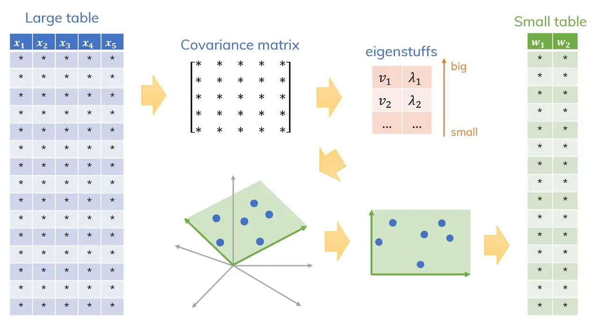

##### Реализация на python

```python
from sklearn.decomposition import PCA

pca = PCA(
    n_components=2, # сколько признаков хотим получить
    random_state=42)

# важно чтобы в X были нормализованные данные
X_pca = pca.fit_transform(X)
```

### Сингулярное разложение

или **SVD** (singular value decomposition) основывается на теореме, утверждающей, что любую прямоугольную матрицу `A(n,m)` можно представить в виде произведения трёх матриц:


Матрица `U` содержит нормированные собственные векторы матрицы `A・Aᵀ`

Матрица `D` содержит сингулярные числа на главной диагонали, а все остальные значения — нули. Сингулярные числа это корни из собственных чисел двух матриц: `A・Aᵀ` и `Aᵀ・A`

Матрица `V` — то же что и `U`, но для матрицы `Aᵀ・A`.

#### Рализация на python

```python
import numpy as np
from sklearn.decomposition import TruncatedSVD

A = np.array([[8, 7, 2, 9],
              [1, 3, 6, 3],
              [7, 2, 0, 3],
              [10, 3, 1, 1],
              [8, 1, 3, 4]])

# Создаем объект TruncatedSVD и указываем количество компонент, которые хотим получить
svd = TruncatedSVD(n_components=3)

svd.fit(A)
svd.transform(A)
```

### Стохастическое вложение соседей с t-распределением

или **t-SNE** (t-distributed Stochastic Neighbor Embedding)

Этот метод в основном используется для визуализации данных. Он редуцирует n-мерное пространство наблюдений до двух или трех. Также он позволяет реализовывать разделение данных, которые являются линейно неразделимыми.

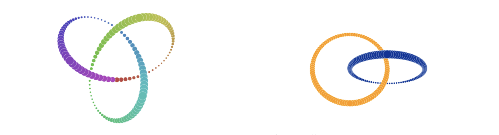

Алгоритм t-SNE является итеративным, и его оптимизация может занимать время. В результате работы алгоритма точки, которые в исходном пространстве имеют близкое положение, будут расположены близко друг к другу в пространстве меньшей размерности, что делает его очень удобным для визуализации сложных данных, так как сохраняются глобальные и локальные структуры данных.