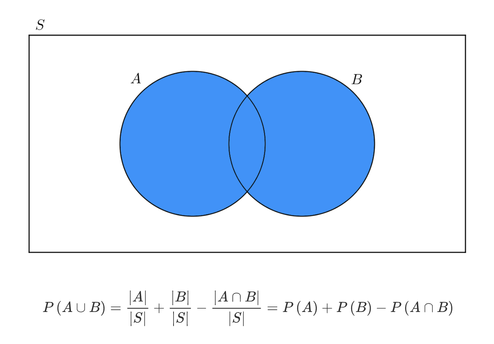

<style>
    h1, h2, h3, h4, h5, h6 { color: darkorange;  font-weight: 700; }
    h1 { filter: hue-rotate(0deg); }
    h2 { filter: hue-rotate(10deg); }
    h3 { filter: hue-rotate(20deg); }
    h4 { filter: hue-rotate(30deg); }
    h5 { filter: hue-rotate(40deg); }

    strong {
        border: 1px solid #ccc;
        border-radius: 5px;
        padding-left: 0.2rem;
        padding-right: 0.2rem;
        filter: hue-rotate(40deg);
    }

    em {
        border-bottom: 2px dotted #ccc;
    }

    a, a:hover {
        text-decoration: underline;
    }

    @media (prefers-color-scheme: dark) {
        body { color: #ccc; }
        strong { border-color: #ccc; }
        em { border-color: #ccc; }
        img { background-color: rgba(255, 255, 255, 0.75) }
        a, a:hover { color: Violet; }
    }
    
    @media (prefers-color-scheme: light) {
        body { color: #333; }
        strong { border-color: #333; }
        em { border-color: #333; }
        /* img { background-color: rgba(0, 0, 0, 0.1) } */
        a, a:hover { color: DodgerBlue; }
    }
</style>

# Математика в ML (part 2)

## Теория вероятности

### Термины

**Детерминированность** — это ситуация когда одно и то же действие приводит к одному и тому же результату.

**Случайны эксперимент** — это действие, результат которого не детерминирован.

**Элементарный исход** — это один (любой) из всех возможных результатов случайного эксперимента.

**Пространство элементарных исходов** — это множество всех элементарных исходов какого-то одного случайного эксперимента. Оно обычно обозначается буквой `Ω` (омега).

**Вероятностью** события `A` называют отношение элементарных исходов `n` благоприятствующих событию `A` к пространству элементарных исходов `N`:

`P(A) = n / N`

**Достоверное событие** — это то, которое точно произойдет (вероятность `1`)

**Невозможное событие** — это то, которое точно не произойдет (вероятность `0`)

**Дополнением** события `A` называют множество исходов, не благоприятствующих событию `A`. Обозначают `Ā`.

**Несовместимые события** — это события, которые не могут пересечься. Например, дождь пойдет и дождь не пойдет.

**Априорные вероятности** — это вероятности таких событий, которые не зависят от наступления других, иначе говоря это *вероятности безусловных событий*.

**Апостериорные вероятности** — это вероятности событий, которые зависят от других, иначе говоря это *вероятности условных событий*.

`P(A) + P(Ā) = 1`

### Правила

#### Правило суммы

Для двух взаимоисключающих событий `A` и `B` вероятность наступления любого из них равна сумме вероятностей каждого из них.

`P(A ∪ B) = P(A) + P(B)`

Формулу этого правила легко вывести:


#### Правило умножения

Для двух событий `A` и `B` вероятность наступления обоих равна произведению вероятностей каждого из них.

`P(A ∩ B) = P(A) × P(B)`

#### Обобщенное правило суммы

Для двух невзаимоисключающих событий `A` и `B` вероятность наступления любого из них равна сумме вероятностей каждого из них за вычетом их произведения.

`P(A ∪ B) = P(A) + P(B) - P(A ∩ B)`



Это правило работает и для взаимоисключающих событий тоже, поскольку для них `P(A ∩ B) = 0`.

### Условная вероятность

Обозначается `P(B|A)`. Читается: вероятность наступления события `B` при условии `A`.

Для ее вычисления нужно знать `P(A ∩ B)` и `P(A)`:

`P(B|A) = P(B ∩ A) / P(A)`

#### Пример

В конференции участвуют 1000 человек: 300 мужчин и 700 женщин. Известно, что 240 мужчин и 280 женщин пьют кофе. Необходимо найти, с какой вероятностью случайно взятый человек с конференции пьёт кофе, если это женщина.

```
F — женщина
D - пьет кофе
P(F) = 700/1000 = 0.7
P(D ∩ F) = 280 / 1000 = 0.28
P(D|F) = P(D ∩ F) / P(F) = 0.28 / 0.7 = 0.4
```


### Независимые события

События `A` и `B` называются **независимыми** если 
- ~~наступление одного не влияет на наступление другого~~.
- они могут пересечься (наступить одновременно) `A ∩ B`
- вероятность их пересечения равна произведению их вероятностей\
  `P(A ∩ B) = P(A)・P(B)`

#### Пример


##### A

```
A = {2, 4, 6}, P(A) = 0.5
B = {1, 3, 5}, P(B) = 0.5
	P(A)・P(B) = 0.25

A u B = ∅
	P(A ∪ B) = 0

P(A)・P(B) ≠ P(A ∪ B) — события зависимы
```

##### B

```
A = {2, 4, 6}, P(A) = 0.5
B = {1, 2}, P(B) = 1/3
	P(A)・P(B) = 1/6

A ∪ B = {2}
	P(A ∪ B) = 1/6

P(A)・P(B) = P(A ∪ B) — события независимы
```

##### C
```
A = {2, 4, 6}, P(A) = 0.5
B = {3, 4, 5, 6}, P(B) = 2/3
	P(A)・P(B) = 1/3

A ∪ B = {4, 6}
	P(A ∪ B) = 1/3

P(A)・P(B) = P(A ∪ B) — события независимы
```

##### D
```
A = {2, 4, 6}, P(A) = 0.5
B = {2, 3, 4, 5, 6}, P(B) = 5/6
	P(A)・P(B) = 5/12

A ∪ B = {2, 4, 6}
	P(A ∪ B) = 1/2

P(A)・P(B) ≠ P(A ∪ B) — события зависимы
```

### Разбиение вероятностного пространства

Это совокупность несовместимых (взаимоисключающих) событий, которые взаимно дополняют друг друга и полностью описывают все возможные исходы.

### Полная вероятность

Формула ее такова

`P(B) = ∑P(B|Aᵢ)・P(Aᵢ)`

где `P(B)` — вероятность наступления события; `P(Aᵢ)` — вероятность наступления события , которое является условием для события `B`;
`P(B|Aᵢ)` — условная вероятность наступления события `B`, если известно, что произошло событие `Aᵢ`.

Не очень понятно, почему это называется полной вероятностью 🤔

#### Пример

1 % клиентов постоянно жалуются на сервис — из них 60 % уйдут. Ещё 10 % клиентов периодически жалуются на сервис — из них 10 % уйдут. Оставшиеся 89 % клиентов никогда не жалуются на сервис — из них 3 % уйдут.

Найдите:

- долю уходящих клиентов каждого типа от всех клиентов;
- долю уходящих клиентов от всех клиентов;
- долю каждого типа клиентов среди уходящих клиентов.

##### A
```
0.01 * 0.6 = 0.006

0.1 * 0.1 = 0.01

0.89 * 0.03 = 0.0267
```

##### B
```
Доля уходящих клиентов\
0.006 + 0.01 + 0.0267 = 0.0427
```
##### C
```
Доля 1-го типа среди уходящих
0.006 / 0.0427 ≈ 0.14

Доля 2-го типа среди уходящих
0.01 / 0.0427 ≈ 0.23

Доля 3-го типа среди уходящих
0.0267 / 0.0427 ≈ 0.63
```
### Формула Байеса

Формула позволяет найти `P(A|B)` если известны `P(B|A)`, `P(A)` и `P(B)`:

`P(A|B) = P(B|A) ・ P(A) / P(B)`

#### Пример

Ваш друг работает в сервисе, который ремонтирует колёсные диски производителей Seagull и Tosha (диски других производителей сервис в ремонт не принимает). Друг утверждает, что примерно 60 % дисков в ремонте — диски Seagull и лишь 40 % — диски Tosha. На основе этой статистики он не рекомендует вам покупать Seagull. Вы провели небольшое исследование и сделали вывод, что доля Seagull на рынке составляет 40 %, а доля Tosha — 23 %.

Какие диски действительно чаще ломаются?

```
P(S) = 0.4
P(B|S) = 0.6
P(T) = 0.23
P(B|T) = 0.4

P(S|B) = P(B|S)・P(B) / P(S) = 0.6p / 0.4 = 1.5p
P(T|B) = P(B|T)・P(B) / P(T) = 0.4p / 0.23 ≈ 1.74p

Видим, что вероятность поломки диска Seagull ниже

P(S|B) / P(T|B) = 1.5 / 1.74 = 0.8625

Проверим на графическом построении

Изобразим все диски на рынке

Версия A
S S S S S S S S S S
S S S S S S S S S S
S S S S S S S S S S
S S S S S`S`S`S`S`S`
T T T T T T T`T`T`T`
T T T T T T T T T T
T T T U U U U U U U
U U U U U U U U U U
U U U U U U U U U U
U U U U U U U U U U

P(S|B) = 6/40
P(T|B) = 4/23

P(S|B) / P(T|B) = 0.8625

Версия B
S S S S S S S S S S
S S S S S S S S S S
S S S S S`S`S`S`S`S`
S S S S S`S`S`S`S`S`
T T T T T T T`T`T`T`
T T T T T T T`T`T`T`
T T T U U U U U U U
U U U U U U U U U U
U U U U U U U U U U
U U U U U U U U U U

P(S|B) = 12/40
P(T|B) = 8/23

P(S|B) / P(T|B) = 0.8625
```

### Байесовская и частотная статистики

|Частотная статистика|Байесовская статистика|
|-|-|
|В классическом подходе вероятность получить орёл при подбрасывании «нечестной» монеты — долгосрочная относительная частота появления орла при повторных подбрасываниях монеты. Таким образом, чем больше мы подбрасываем монету, тем больше число выпавших орлов в процентах от общего количества подбрасываний стремится к «истинной» вероятности того, что на монете выпадет орёл.|Философия байесовской статистики такова, что до первого подбрасывания мы считаем, что монета «честная», то есть по умолчанию используем априорную вероятность. Допустим, после нескольких бросков монета постоянно выпадает орлом. Тогда мы модифицируем исходную вероятность: добавляем информацию о том, что у нас выпало несколько орлов подряд, и постепенно наши оценки «честности» монеты меняются. Таким образом, предыдущее убеждение о «честности» монеты модифицируется. Апостериорное убеждение в итоге будет сильно изменено по сравнению с априорным убеждением о «честной» монете.|
