<style>
    h1, h2, h3, h4, h5, h6 { color: darkorange;  font-weight: 700; }
    h1 { filter: hue-rotate(0deg); }
    h2 { filter: hue-rotate(10deg); }
    h3 { filter: hue-rotate(20deg); }
    h4 { filter: hue-rotate(30deg); }
    h5 { filter: hue-rotate(40deg); }

    strong {
        border: 1px solid #ccc;
        border-radius: 5px;
        padding-left: 0.2rem;
        padding-right: 0.2rem;
        filter: hue-rotate(40deg);
    }

    em {
        border-bottom: 2px dotted #ccc;
    }

    a, a:hover {
        text-decoration: underline;
    }

    @media (prefers-color-scheme: dark) {
        body { color: #ccc; }
        strong { border-color: #ccc; }
        em { border-color: #ccc; }
        img { background-color: rgba(255, 255, 255, 0.5) }
        a, a:hover { color: Violet; }
    }
    
    @media (prefers-color-scheme: light) {
        body { color: #333; }
        strong { border-color: #333; }
        em { border-color: #333; }
        /* img { background-color: rgba(0, 0, 0, 0.1) } */
        a, a:hover { color: DodgerBlue; }
    }
</style>

# Machine Learning

- Intro
    - Основные понятия
        - Искуственный интеллект (Artificial Intelligence)
            - Слабый ИИ (Weak AI) 
            - Сильный ИИ (Strong AI)
        - Машинное обучение (Machine learning)
        - Глубокое обучение (Deep Learning)
    - Виды обучения модели
        - Обучение с учителем (supervised learning)
            - Регрессия (regression)
            - Прогнозирование (forecasting)
            - Классификация
        - Обучение без учителя (unsupervised learning)
            - Кластеризация (clustering)
            - Понижение размерности (dimensionality reduction)
            - Ассоциация (association)
        - Обучение с подкреплением (reinforcement learing)
    - Обзор методологий разработки ПО
        - Waterfall
        - Agile
        - CRISP-DM
- Supervised learning / Regression 👈
    - Линейная регрессия (Linear regression)
        - Вычисление целевого признака
            - 2D (один фактор)
            - 3D (два фактора)
            - nD (m факторов)
        - Вычисление параметров линейной функции
            - Функция ошибки
            - MAE
            - MSE
    - Метрики регрессии
        - Основные метрики регрессии
            - Mean Absolute Error (MAE)
            - Mean Absolute Percent Error (MAPE)
            - Mean Squared Error (MSE)
            - Root Mean Squared Error (RMSE)
            - R² (coefficient of determination)
        - Вычисление метрик на python
    - Аналитическое решение задачи регрессии
        - МНК на python
        - Недостатки аналитического решения
    - Gradient descent
        - Недостатки градиентного спуска
        - Stochastic Gradient Descent, SGD
            - Реализация на python
    - Смещение и разброс
    - Train & Test sets
        - Реализация на python
    - Полиноминальные признаки
        - Полиноминальные признаки второй степени
        - Генерация полиноминальных признаков на python
    - Регуляризация
        - L1-регуляризация (Lasso)
            - L1 на python
        - L2-регуляризация (Ridge)
            - L2 на python
        - Коэфициент регуляризации
        - Эластичная сетка
- Supervised learning / Classification
    - Logistic regression
        - Задача классификации
        - Решение задачи (intuition)
        - Сигмоида
        - Логистическая регрессия
        - Поиск параметров логистической регрессии
    - Метрики клссификации
    - Мультиклассовая классификация

## Intro

### Основные понятия

#### Искуственный интеллект (Artificial Intelligence)

это комлпексная наука (математика + логика + биология + психология + ...). Её цель — научиться имитировать работу человеческого мозга.

(А еще ИИ называют компьютерную систему, позволяющую имитировать работу мозга человека и решать какую-нибудь прикладную задачу.)

Разделяют cильный и слабый ИИ.

##### Слабый ИИ (Weak AI) 
способен решать определенную задачу не хуже человека, а иногда даже превосходя его.

##### Сильный ИИ (Strong AI)
способен решать множество задач, умеет учиться, осознает себя — это пока что только мечта.

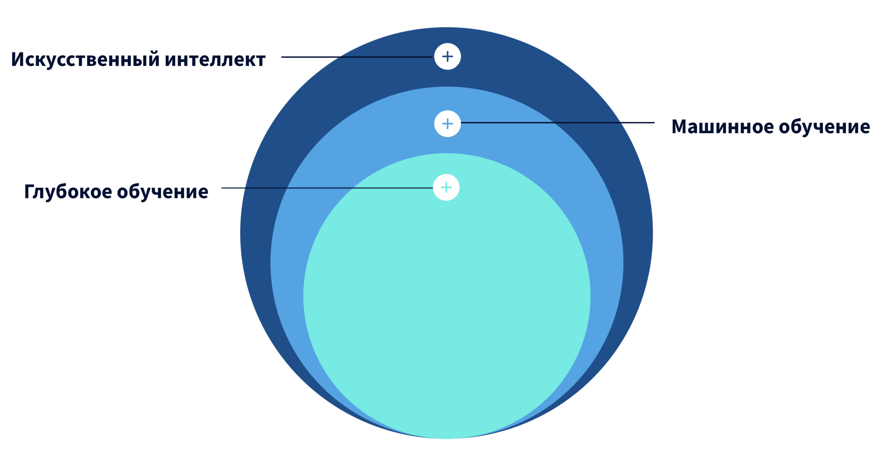

#### Машинное обучение (Machine learning)

это набор технологий про самообучающиеся алгоритмы; оно является подразделом науки об ИИ.

Также это одна из трех составляющих Data Science (две другие — *Data analytics* и *Data engineering*)

А также это *главнй навык дата-сайентиста*, поскольку в прикладном смысле Data Science это про использование обученных моделей для бизнес задач.

ML держится на трех столпах:
- набор данных (dataset)
- признаки (features)
- модель (ML model)


Признаки по которым обучается модель, иногда называются **факторами** (factors).

Признак, который модель должна предсказать, называется **целевой признак** (target feature). 

#### Глубокое обучение (Deep Learning)

подраздел машинного обучения; в его основе лежит использование искусственных нейронных сетей, имитирующих работу мозга.

### Виды обучения модели

Обучение модели разделяется на три вида

- С учителем (supervised learning)
- Без учителя (unsupervised learning)
- С подкреплением (reinforcement learing)

#### Обучение с учителем (supervised learning)

призводится на размеченных данных (с известеными значениями целевого признака). Такой тип обучения позволяет решать задачу *регрессии*, *прогнозирования* и *классификации*.

##### Регрессия (regression)

это предсказание значения целевого признака (некоего вещественного числа).

Регрессия бывает **линейная (Linear)** и **полиномиальная (Polinomial)**. Последняя позволяет более гибко определять подстраиваться под данные, но при этом есть риск переобучения.

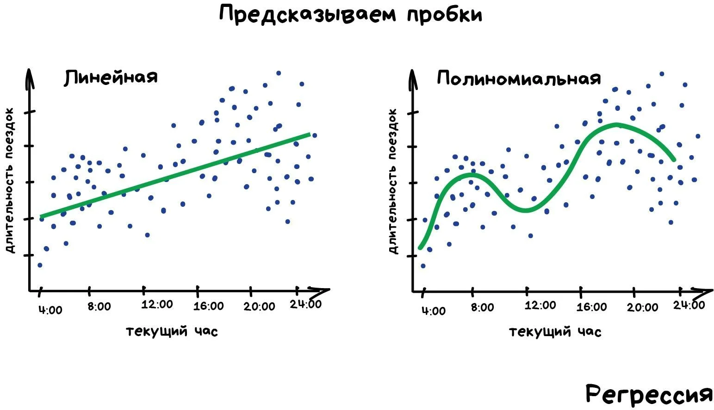

##### Прогнозирование (forecasting)

Можно сказать, что это частный случай регрессии, в котором целевая переменная непрерывна и зависит от времени, причем для каждого момента времени существует только одно значение целевой переменной.

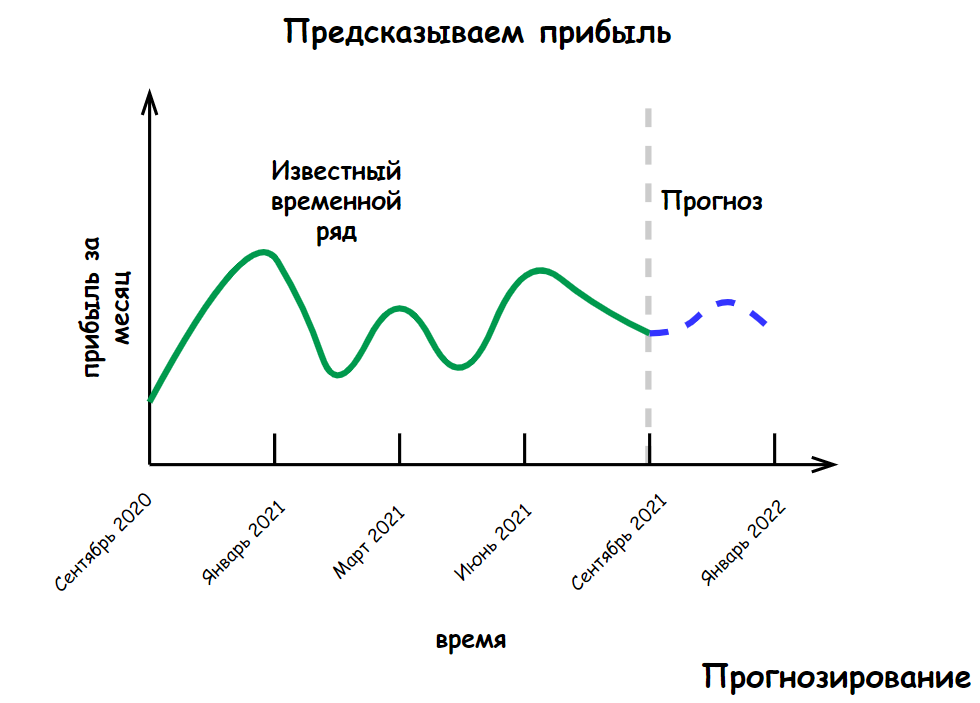

##### Классификация

это предсказание принадлежности объекта к одному из нескольких (обычно двух) классов. Если возможных результатов всего два, то это **бинарная классификация**, если более то **многоклассовая классификация**

#### Обучение без учителя (unsupervised learning)

производится на данных без разметки.

##### Кластеризация (clustering)

Разбивает данные по функции `p(x`<sub>i</sub>`, x`<sub>j</sub>`)` наименьшего расстояния (различия) между ними. Количество кластеров можно задать самостоятельно или не задавать.

##### Понижение размерности (dimensionality reduction)

Применяется к исходным данным со слишком большим количеством признаков. Цель — получить обобщенные данные без лишних деталей.

Метод позволяет:
- абстрагироваться от лишних деталей;
- ускорить обучение модели на редуцированных данных;
- избавиться от мультиколлинеарности (поскольку в первую очередь объединяет наиболее схожие признаки).

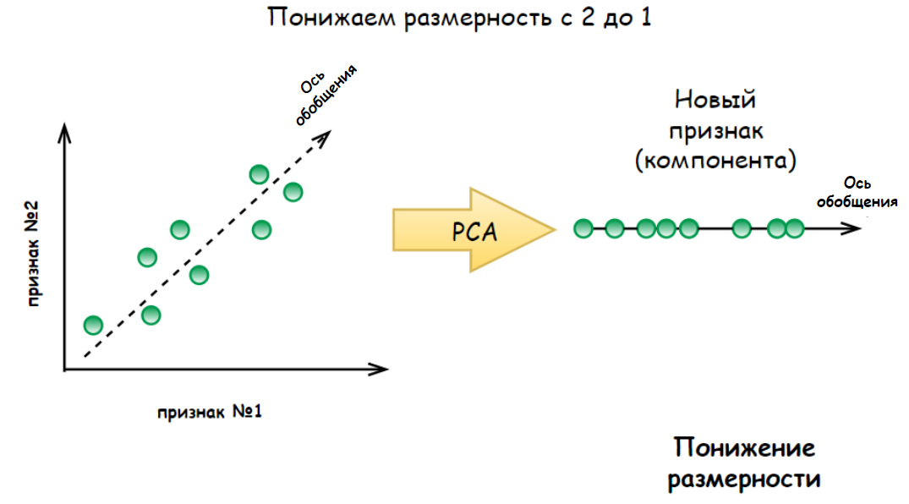

С помощью данного метода была создана модель для определения тематики текстов. Также можно получить рекомендательную систему.

##### Ассоциация (association)

Позволяет находить паттерны поведения:
- пользователей на веб-сайте,
- покупателей в магазине,
- владельцев акций на бирже, и т.д.

#### Обучение с подкреплением (reinforcement learing)

Модели обученные таким методом позволяют решать задачи "выживания" некоторого субъекта в некотором мире. Мир этот может быть виртуальный (персонаж в компьютерной игре) или реальный (автопилот на дороге).

Субъект в таких задачах называют "агентом" (**agent**), а мир — "средой" (**environment**). Во время обучения  агент может наблюдать за средой, совершать дейтсвия и получать от среды обратную реакцию (поощрение или наказание).

Агент не может собрать всю информацию о среде и просчитать все варианты. Задача обучения — найти наилучшую стратегию выживания.

Существуют различные алгоритмы для решения данного класса задач:
- Q-learning
- SARSA
- DQN (Depp Q-Network) 
- Genetic algorithms и др.

Генетические алгоритмы основаны на создании случайных моделей, выборе лучших из них, синтезировании улучшенных моделей на их основе и повторении этого цикла. Они применяются все реже, поскольку сильно уступают алгоритмам на основе Q-learning.

### Обзор методологий разработки ПО

#### Waterfall

Предполагает поэтапное создание конечного продукта. Каждый этап выполняется один раз, после чего команда приступает к следующему этапу. Возможность вернуться к одному из предыдущих этапов отсутствует. У команды есть только один шанс отдать результат своей работы заказчику. Это значит, что все возможные ошибки к этому моменту должны быть найдены и устранены.

Данную методологию можно применять тогда, когда у команды есть опыт решения аналогичных задач. Именно в этом случае проект можно разбить на этапы, создать для каждого этапа документацию и выполнить все этапа последовдательно без откплонений от ТЗ.

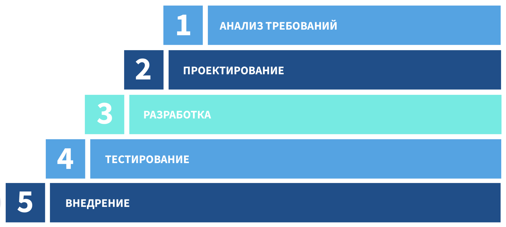

#### Agile

Данная методология предполагает бесконечный цикл итераций по улучшению продукта, его эволюцию. Подходит для проектов, не имеющих четких очертаний. Позволяет вернуться к этапу проектирования после неудачной разработки или тестирования.

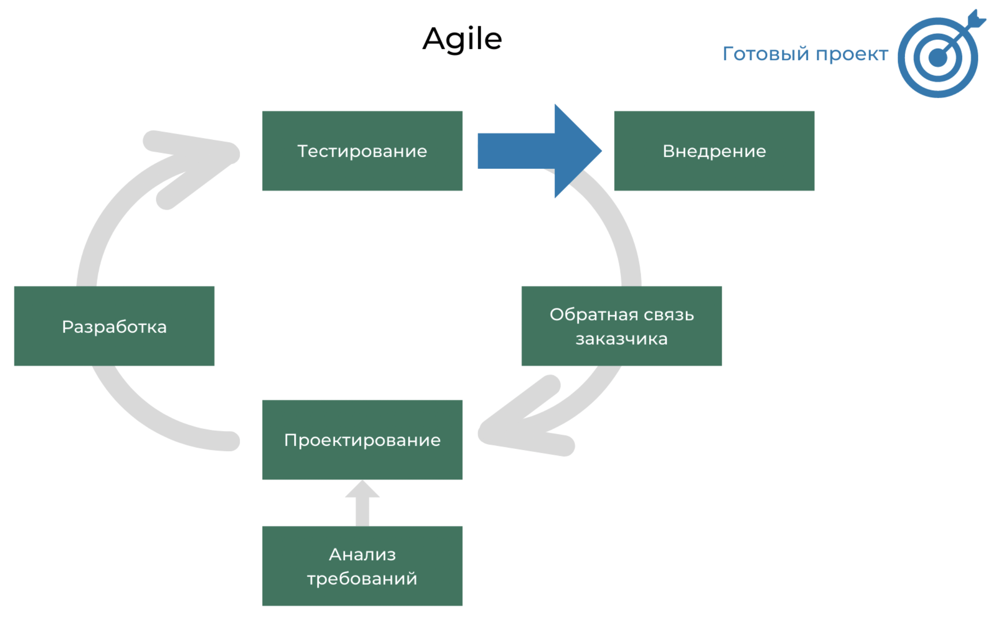

Минусы данной методологии вытекают из ее основных принципов.

1. Каждый разработчик несет ответственность за конечный результат. Но если все отвечают, значит никто конкретно не отвечает, и крайнего не найти.
2. Каждый цикл имеет жестко заданный временной интервал (обычно 2 недели), и нужно в него уложиться. Но в этой спешке не всегда остается время на качественное тестирование.

#### CRISP-DM

Данную методологию придумали специально для задач с данными (*Cross-Industry Standard Process for Data Mining*). Она похожа на Agile тем, что имеет цикл итераций. Она отличается от Agile тем, что у нее другие этапы, лучше подходящие для задач по ML, и их последовательность не опредлена строго (возможен возврат на предыдущий этап, изменение последовательности этапов, а также параллельное выполнение нескольких этапов).

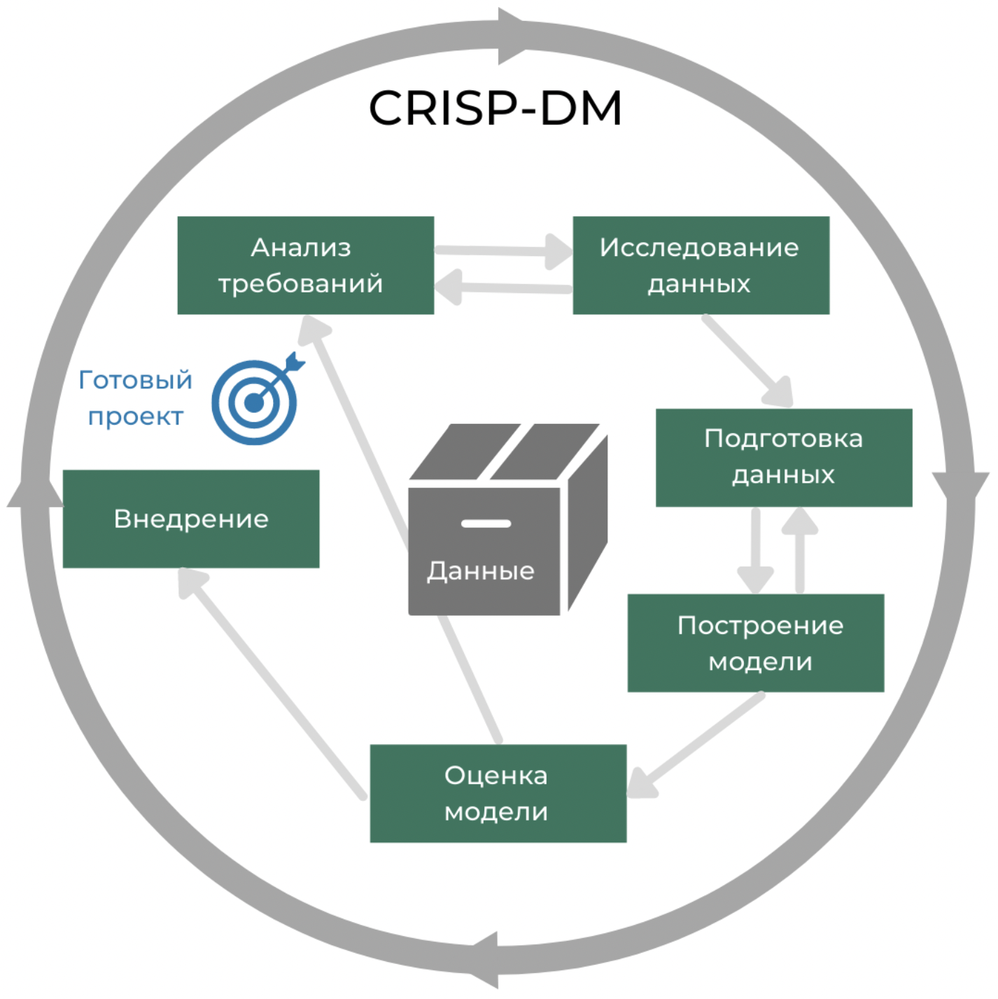

## Supervised learning / Regression

Задача — научить модель по совокупности **факторов** предсказывать **целевой признак**. (И факторы, и целевой признак — это обычные числа.)

То есть в процессе обучения модель должна найти зависимость между входными данными (много чисел) и результатом (одно число).

### Линейная регрессия (Linear regression)

Если, *согласно нашей гипотезе*, описанная выше зависимость имеет линейный характер, то для обучение мы будем использовать алгоритм линейной регрессии.

#### Вычисление целевого признака

Для вычисления целевого признака модель внутри себя использует такую формулу:

`ŷ = w₀ + w₁x₁ + ... + wₘxₘ`

При обучении модели происходит подборка коэфициентов `w` таким обраом, чтобы на выходе получилась функция, правильно предсказывающая целевой . Эти коэфициенты называются **параметрами линейной регрессии**.

##### 2D (один фактор)

Если входной фактор только один, то формула принимает такой вид:

`ŷ = w₀ + w₁x₁`

Такая же формула используется для описания линейной функции на плоскости:

`y = ax + b`

Когда параметры линейной регрессии `w₀` и `w₁` известны, можно построить график такой функции. Как видно он является линией на плоскости.

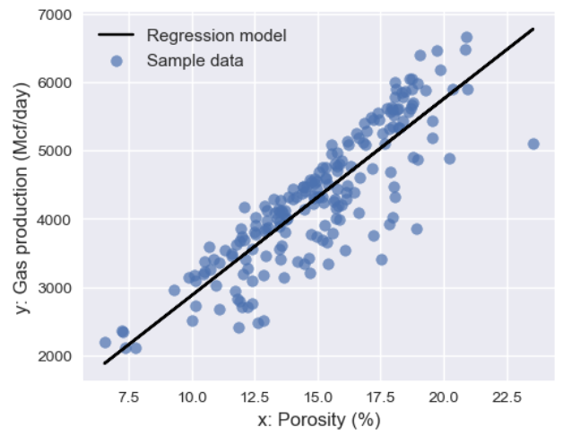

##### 3D (два фактора)

Если факторов два, то в формулу добавляется новая пара `wx`

`ŷ = w₀ + w₁x₁ + w₂x₂`

При известных значениях параметров линейной регрессии график конечной функции будет выглядеть как плоскость в трехмерном пространстве.

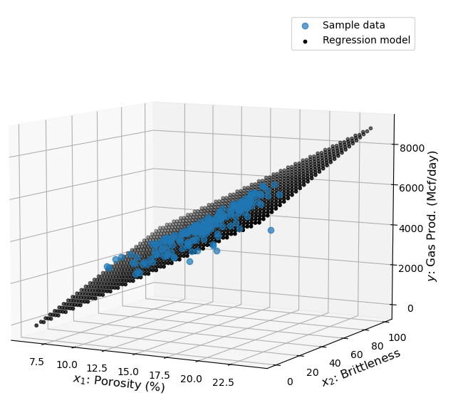

##### nD (m факторов)

Количество факторов может быть любым. Если факторов M, то модель будет вычислять параметры для линейной функции в N-мерном пространстве (N = M + 1)

Конечное уравнение `ŷ = w₀ + w₁x₁ + ... + wₘxₘ`\
будет описывать *гиперплоскость* (hyperplane) в N-мерном пространстве.

#### Вычисление параметров линейной функции

Вычисление параметров `w` осуществляется в процессе обучения модели. В самом начале параметры неизвестны, им присваиваются случайные значения, и модель вычисляет целевой признак наугад.
 
В процессе обучения (которое по сути итеративный процесс) на каждой итерации происходит улучшение параметров, и модель вычисляет целевой признак все лучше.

Как это происходит?

На каждой итерации параметры меняются таким образом, чтобы **функция ошибки** давала наименьший результат.

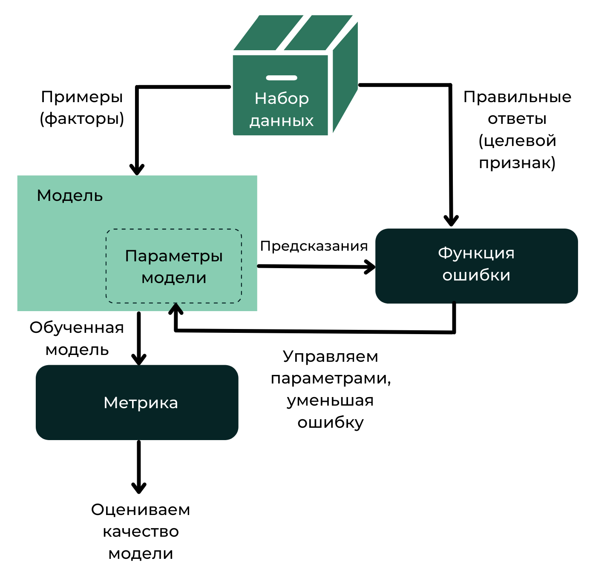

##### Функция ошибки

Что есть ошибка? Это расхождение между предсказанием и реальностью. 

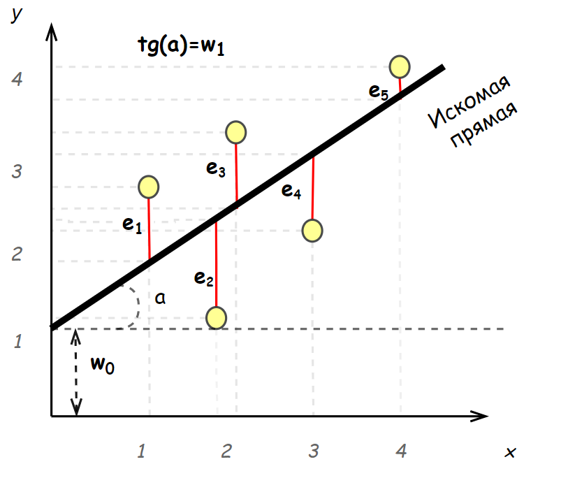

Мы можем посчитать расхождение для каждой точки и затем просуммировать все расхождения. Или же можно полученную сумму разделить на кол-во точек и получить среднее.

Данная функция имеет второе название — **функция потерь**.

##### MAE

MAE — это **средняя абсолютная ошибка** (mean absolute error).

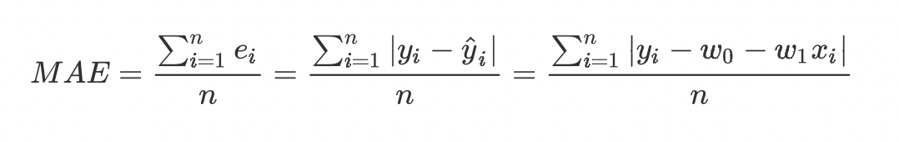

К несчастью математики еще не научились оптимизировать подобные функции, так как они не дифференциируемы (не имеют производной).

##### MSE

MSE — это **среднеквадратическая ошибка** (mean square error).

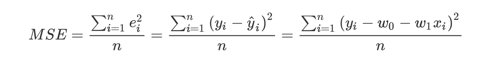

По сути данная функция делает то же самое, что MAE, но она дифференциируема, а математики знают, как оптимизировать подобные фунции. 

### Метрики регрессии

**Метрика** — это оценка качества модели, выраженная числом.

Существует [много различных метрик](https://scikit-learn.ru/3-3-metrics-and-scoring-quantifying-the-quality-of-predictions/#regression-metrics) для задач регрессии. Мы рассмотрим самые основные:
- MAE
- MAPE
- MSE
- RMSE
- R²

#### Основные метрики регрессии

##### Mean Absolute Error (MAE)

Это **средняя абсолютная ошибка** — сумма `|y - ȳ|` деленая на кол-во.


Суть метрики проста и понятна. Минус ее в том, что полученное число мало о чем говорит (если вы не специалист в коркретной области).

##### Mean Absolute Percent Error (MAPE)

Это **средняя абсолютная ошибка в процентах**


##### Mean Squared Error (MSE)

**Среднеквадратическая ошибка** имеет ту же формулу что и средняя абсолютная ошибка, но вместо модуля берется квадрат ошибки


Суть ее ясна дата-сайентисту, но не специалисту такая метрика не будет понятна.

Польза этой метрики в том, что при ее использовании для обучения модели, она будет оберегает от очень больших ошибок. Но если в данных имеются выборосы, то такая метрика (точнее модель построенная на ней) будет необъективной.

##### Root Mean Squared Error (RMSE)

**Корень среднеквадратической ошибки** применяется для приведения размерности ошибки с размерностью целевого признака.


Недостатки у этой метрики такие же как и у MSE. К преимуществам добавляется ее лучшая интерпретируемость.

##### R² (coefficient of determination)

Или **коэффициент детерминации** возвращает число от -∞ до 1. Удовлетворительным считается результат больше 0.5, чем ближе к единице, тем лучше. Если метрика отрицательная, то модель настолько плоха, что лучше было бы присвоить всвем ответам среднее значение.

В формуле метрики используется **MSE<sub>mean</sub>**


где ȳ — средний правильный ответ. Сама формула выглядит так:


#### Вычисление метрик на python

```python
from sklearn import metrics

# MAE
metrics.metrics.mean_absolute_error(y, y_pred)

# MAPE
metrics.mean_absolute_percentage_error(y, y_pred)

# MSE
metrics.mean_squared_error(y, y_pred)

# RMSE
metrics.mean_squared_error(y, y_pred) ** 0.5

# R²
metrics.r2_score(y, y_pred)
```

### Аналитическое решение задачи регрессии

Делается с помощью **метода наименьших квадратов, МНК** (Ordinary least squares, OLS). Он позволяет посчитать параметры линейной регрессии математически (по сути решить систему уравнений). Данный метод придумал Гаусс в 1975 году.

Для решения задачи испльзуется формула

`w = Q·Xᵀ·y`, где\
`Q = (Xᵀ·X)⁻¹`

#### МНК на python

Можно написать функцию для вычисления параметров с помощью `Numpy`, а можно воспользоваться готовым методом `sklearn`

```python
from sklearn import linear_model

lr_model = linear_model.LinearRegression()

lr_model.fit(X, y)

print('w0: {}'.format(lr_model.intercept_))
print('w1: {}'.format(lr_model.coef_)) 
```

#### Недостатки аналитического решения

1. Требуется много ресурсов\
Они нужны для вычисления обратной матрицы. (Для матрицы m×m потребуется m³ операций)
2. Невозможность обучения в реальном времени\
*Обучение в реальном времени* (или *инкрементальное обучение*) нужно для корректировки входных данных. При аналитическом решении придется останавливать вычисления и начинать из заново.
3. Результат не гарантирован\
Не все матрицы обратимы. (Это связано с мультиколлинеарностью.)

### Gradient descent

Или **градиентный спуск** — алгоритм, используемый в функции потерь, альтернатива аналитическому решению. Позволяет вычислять параметры функции регрессии инкрементным способом (инкрементное обучение).

По сути данный метод шаг за шагом меняет параметры функции регресии, приближая их к значениям, которые минимизируют функцию потерь.

Вот так вычисляют параметры линейной регрессии на каждом шаге:


Здесь `∇L` это градиент функции потерь, а `ŋ` **темп обучения** (learning rate).

#### Недостатки градиентного спуска

У n-мерного пространства параметров может быть много **локальных минимумов** — точек, где функция потерь минимальна по сравнению с соседними областями. И только в одной из этих точек функция потерь будет иметь наименьший результат. Такая точка называется **глобальный минимум**.

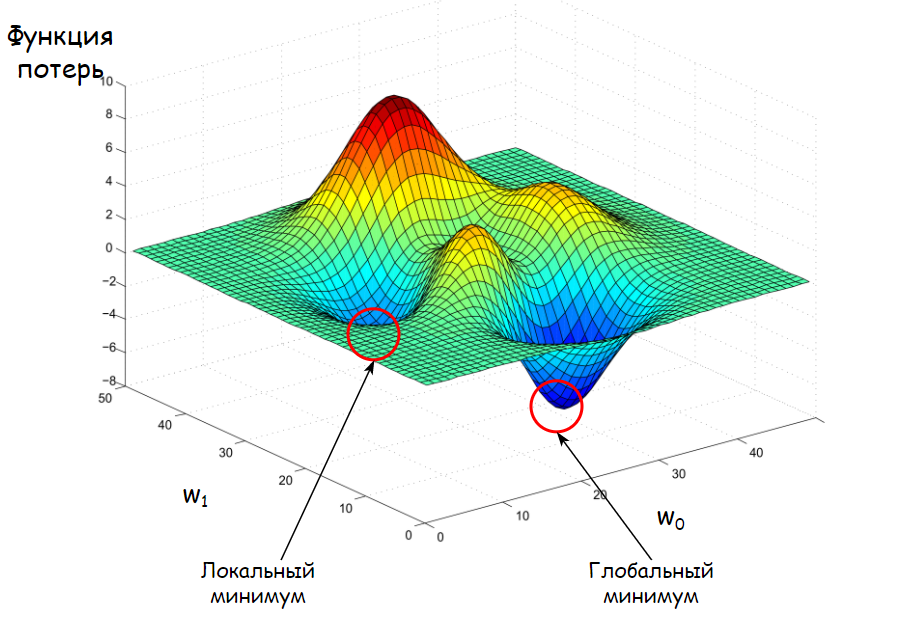

Существуют различные модификации градиентного спуска, позволяющие бороться с данной проблемой. Одна из них —

#### Stochastic Gradient Descent, SGD

Его особенность в том, что для вычисления градиента берутся не все имеющиеся данные для обучения, а какая-то случайная выборка. В результате алгоритм движется не прямо к минимуму, а "закоулками". Благодаря этому у алгоритма есть шанс "проскочить" небольшой локальный минимум и найти глобальный.

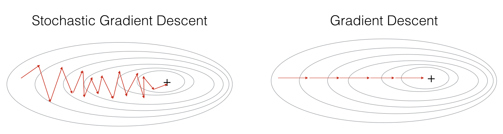

##### Реализация на python

```python
from sklearn import linear_model

#Создаём объект класса линейной регрессии с SGD
sgd_lr_lstat = linear_model.SGDRegressor(random_state=42)
#Обучаем модель — ищем параметры по методу SGD
sgd_lr_lstat.fit(X, y)
```

У данного метода [множество параметров](https://scikit-learn.org/stable/modules/generated/sklearn.linear_model.SGDRegressor.html), например:
- `loss` — функция потерь
- `max_iter` - кол-во итераций
- `learning_rate` - темп обучения
- `eta0` - начальное значение темпа обучения, и т.д.

### Смещение и разброс

**Математическое ожидание** — это рациональное число которое показывает среднее значение всех элементов генеральной совокупности.

**Смещение** (bias) — это мат. ожидание ошибки предсказания.

**Разброс** (variance) — это разброс (дисперсия) ответов модели, обученной на разных частях исходного датасета. (Делим датасет на части 40%-40%-20%; обучаем две модели на первых двух частях; тестируем модели на последней части и сравниваем их ответы друг с другом — настоящие ответы нам не важны.)

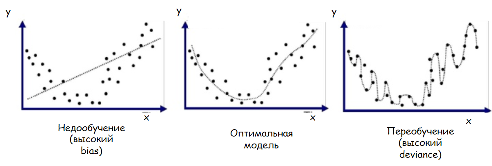

Если модель *недообучена*, то у нее будет большое смещение (hi bias). Если модель *переобучена*, то у нее будет высокий разбрс (hi variance).

**Дилемма смещения-разброса** заключается в поиске такой модели, которая будет достаточно сложной, чтобы уловить и обобщить закономерности, но при этом не подстроиться под ответы датасета.

### Train & Test sets

Чтобы решить дилемму смещения-разброса используется следующий подход. Датасет разделяют на части в соотношении `4 : 1` чтобы получить, **тренировочный набор данных** (`X_train`) и **тестовый набор данных** (`X_test`).

Модель обучают на тренировочном наборе и проверяют качество на тестовом.

#### Реализация на python

Для этого используется [`train_test_split`](https://scikit-learn.org/stable/modules/generated/sklearn.model_selection.train_test_split.html) из `sklearn.model_selection`.

```python
from sklearn.model_selection import train_test_split

X_train, X_test, y_train, y_test = train_test_split(X, y, test_size=0.2, random_state=42, stratify=y)
```

Параметр `stratify` позволяет сохранить пропорции признака в обоих сетах. Такое разбиение называется **стратифицированным**.

### Полиноминальные признаки

Зависимость в данных редко бывает линейной. На рисунке ниже мы видим, что линия хуже обобщает зависимость, чем парабола.

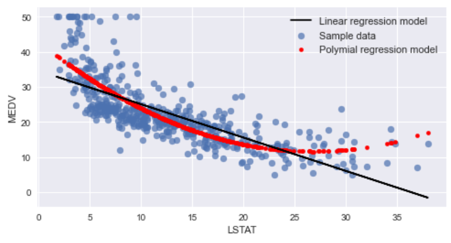

Чтобы усложнить модель в нее добавляют искуственные параметры, созданные на основе настоящих **полиномиальные признаки**. Это один из самых распространённых методов *Feature Engineering*..

Для обучения модели будет использоваться та же линейная регрессия, просто с новыми признаками.

#### Полиноминальные признаки второй степени

Чтобы усложнить модель до второй степени, все исходные параметры возводятся в квадрат и перемножаются между собой.

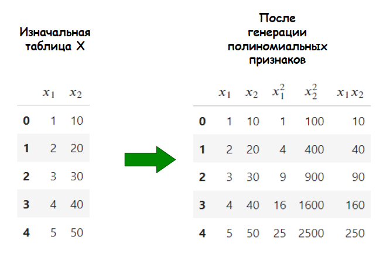

#### Генерация полиноминальных признаков на python

Делается с помощью класса [PolynomialFeatures](https://scikit-learn.org/stable/modules/generated/sklearn.preprocessing.PolynomialFeatures.html)

```python
# Создаём генератор полиномиальных признаков
# `include_bias` добавит столбец из единиц, x⁰, что не нужно для МНК
poly = preprocessing.PolynomialFeatures(degree=2, include_bias=False)
poly.fit(X_train)

#Генерируем полиномиальные признаки
X_train_poly = poly.transform(X_train)
X_test_poly = poly.transform(X_test)
```

### Регуляризация

Это метод, используемый для защиты модели от переобучения. Суть ее в том, чтобы не разрешать кэфициентам `w` быть слишком большими. Ведь чем больше эти коэфициенты, тем сильнее модель будет реагировать на малейшие изменения входных данных.

Для реализации этой идеи в функцию потерь вносятся дополнительные слагаемые — **штрафы**. Чем больше коэфициенты `w`, тем больше штрафы, тем больше (и соответственно хуже) результат функции. Таким образом в процессе оптимизации удастся избежать слишком больших коэфициентов.

#### L1-регуляризация (Lasso)

Данная Р. добаляет в функцию потерь сумму всех `w` взятых по модулю. Она работает быстрее *L2* за счет игнорирования ненужных (с точки зрения модели) признаков.


##### L1 на python

```python
from sklearn import linear_model

lasso_lr_poly = linear_model.Lasso(alpha=0.1)
lasso_lr_poly.fit(X_train_scaled_poly, y_train)
```

#### L2-регуляризация (Ridge)

Данная Р. добавляет сумму всех `w`, возведенных в квадрат.


##### L2 на python

```python
from sklearn import linear_model

ridge_lr_poly = linear_model.Ridge(alpha=10)
ridge_lr_poly.fit(X_train_scaled_poly, y_train)
```

#### Коэфициент регуляризации

При внесении штрафов в функцию потерь мы принуждаем алгоритм оптимизации искать не истинный минимум, а *псевдоминимум* нашей изначальной функции. Геометрически он будет находиться на неком расстоянии от истинного, на пересечении MSE с ромбом (L1) или элипсом (L2).

В уравнениях выше `α` — это **коэфициент регуляризации**. Он задает *смещение* — расстояние, на которое отодвинут псевдоминимум.

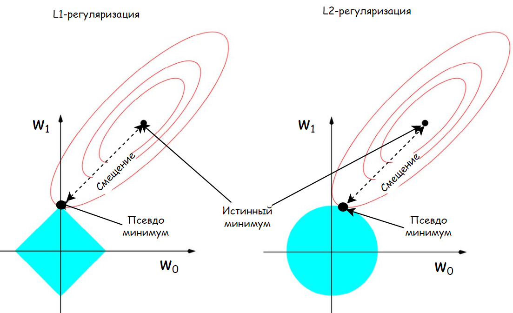

Заранее нельзя сказать, какой коэфициент `α` и метод (L1 или L2) дадут лучший результат.

#### Эластичная сетка

Это регуляризация, комбинирующая Lasso и Ridge.


Она использует два коэфициента регуляризации — `α` и `ƛ`. На практике его используют редко, поскольку трудно подобрать их оптимальную комбинацию.

## Supervised learning / Classification

### Logistic regression

#### Задача классификации

**Классификация** это определение *типа* объекта по его признакам. Если в задаче регрессии целевым признаком было число, то в задаче классификации целевым признаком является категория объекта.

В задаче классификации список возможных категорий всегда известен заранее. Если таких категорий две, то это **бинарная классификация** (binary classification), а если больше то **мультиклассовая классификация** (multiclass classification).

#### Решение задачи (intuition)

Решение задачи бинарной классификации (в геометрическом смысле) сводится к нахождению такой гиперплоскости, которая разделит объекты разных типов по разные стороны себя. Такая гиперплоскость — она называется **разделяющиая гиперплоскость** — будет проходить в простренстве с размером на `1` большем кол-ва параметров объектов. (Если параметров два, то сами объекты можно отобразить на двухмерной плоскости, а разделяющая их гиперплоскость будет проходить в 3D пространстве. На рисунках ниже зеленым цветом показана линия по которой гиперплоскость пересекает плоскость с объектами.)

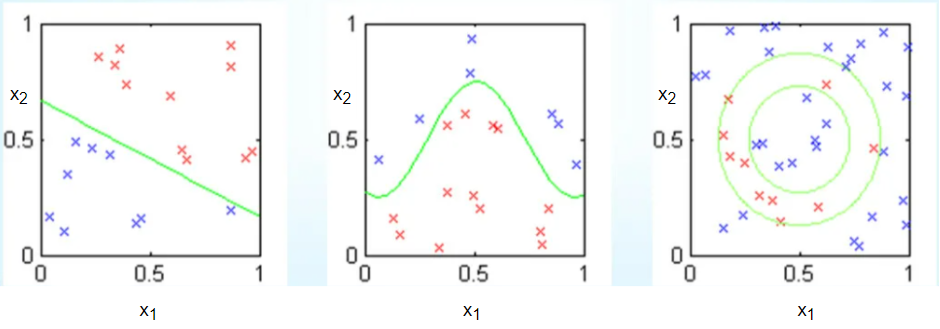

Видно что зеленая линия разграничивает объекты разных типов. Чем дальше объект от границы, тем выше вероятность принадлежности его к своему типу. Объекты вблизи границы будут иметь примерно одинаковые шансы принадлежать к любой из категорий.

Эти шансы можно будет посчитать математически, построив перпендикуляр от объекта на гиперплоскость. Точка пересечения будет иметь числовое значение (по оси Z для случая на рисунках выше). Если оно положительное, то объект относится к одной категории, а если отрицательное, то к другой.

Со знаком понятно, но как оценить величину этого числа? Есть ли способ превратить его в вероятность принадлежности объекта к своей категории?

#### Сигмоида

Это позволяет сделать **логистическая функция** — она получает число от `-∞` до `+∞` и превращает его в вероятность, число от `0` до `1`. Она также известна под названием **сигмоида**.


График функции выглядит так.

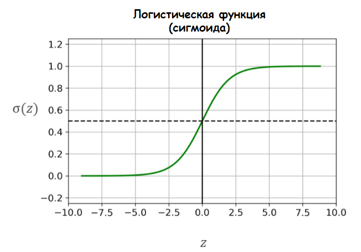

Далее вероятность преобразовавают к ответу о принадлжености к одной категории или к другой с помощью **индикаторной функции**


#### Логистическая регрессия

Поскольку для решения задачи классификации нам нужно найти гиперплоскость, то значит мы можем превратить ее в задачу регрессии. **Логистическая регрессия** (logistic regression) — это модель, которая решает данную задачу: получает признаки объекта и вычисляет веорятность его принадлжености к одной категории. (Свое название она получила от называния используемой в ней логистической функции.)

Для обучения логистической регрессии нужна будет такая функция потерь, которая обеспечит наилучшую вероятность `P`. Она называется **индикаторная функция**.

#### Поиск параметров логистической регрессии

При поиске параметров линейной регрессии наша функция ошибки базировалась на MSE. В данном случае мы должны использовать другой подход: MLE — **Метод максимального правдоподобия** (Maximum Likelihood Estimation).

Цель метода — подобрать такие параметры `w`, при которых оценка вероятности для `x` будет наиболее близка к `y` (к нулю или к единице).

Чтобы добиться максимального правдоподобия нужно найти максимум **функции правдоподобия**

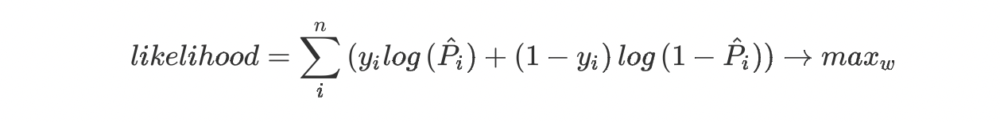

Чтобы использовать данную функцию для обучения модели, ее нужно преобразовать в функцию ошибки, которую нужно минимизировать. Для этого нужно просто умножить ее на `-1`.

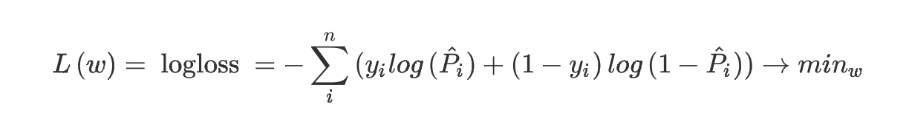

Таким образом мы получили **функцию логистических потерь** (logless).

### Метрики клссификации

В классификации возможны четыре исхода. Они отображены в **матрице ошибок** (confusion matrix) ниже.

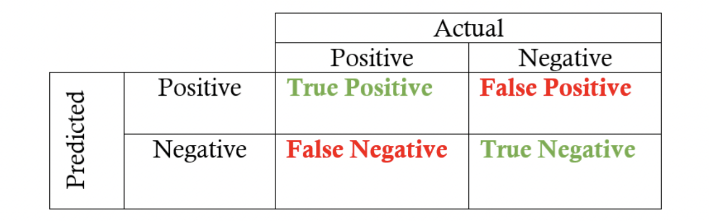

Иначе их можно отобразить так.

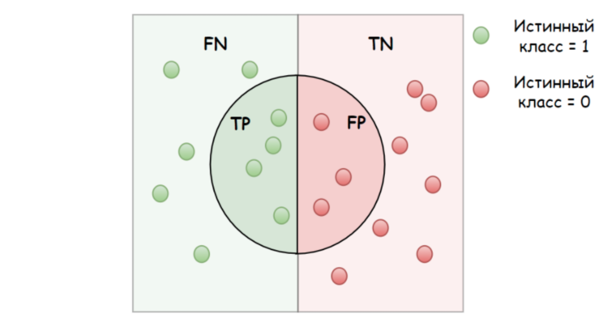

Все левой половине реальные положительные исходы, в правой реальные отрицательные; модель предсказывает, что положительные исходы в центарльном круге, а отрицательные — за его пределами.

#### Accuracy

**Достоверность** (accuracy) показывает долю правильных предсказаний модели. Но(!) ее не имеет смысл применять если есть сильный дисбаланс в категориях (объектов одной категории значительно меньше, чем объектов другой).


#### Precision

**Точность** (precision) или **PPV** (Positive Predictive Value) показывает насколько точно модель определяет положительные исходы.


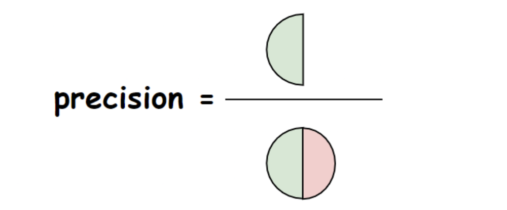

Эта метрика ценна тогда, когда важно минимизировать ложно-положительные результаты, потому что их цена высока. (Например определить драку по картинке с камеры видеонаблюдения, чтобы отправить наряд полиции.)

#### Recall

**Полнота** (recall) показывает какую долю положительных исходов модель способна определить.


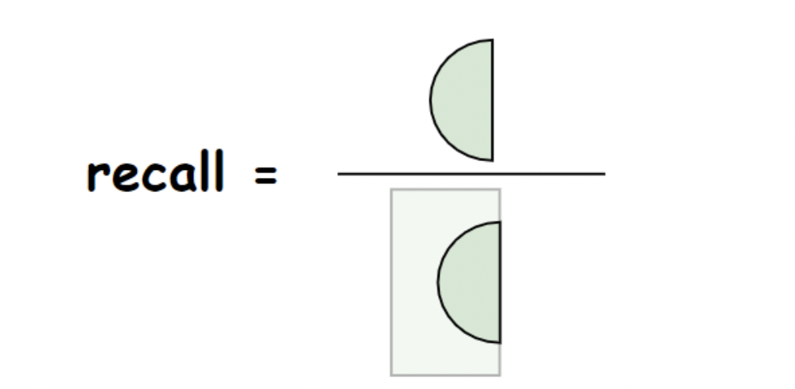

Данная метрика важна тогда, когда важно не пропустить положительный исход. (Например найти всех больных вирусной инфекцией, чтобы предотвратить ее распростанение.)

#### F-score

Precision и recall работают друг против друга. Чтобы их сбалансировать, применется **F-мера** (F-score)


`β` определяет важность precision в данной формуле и может принимать значения `1` и `2`.


Данная метрика хороша тем, что будет близка к нулю, если хотя бы одна из составляющих ее метрик близка к нулю.

#### Вычисление метрик на python

```python
from sklearn import metrics
import seaborn as sns

confusion_matrix = metrics.confusion_matrix(y, y_pred)
sns.heatmap(confusion_matrix, annot=True)

print(f'Accuracy: {metrics.accuracy_score(y, y_pred)}')
print(f'Precision: {metrics.precision_score(y, y_pred)}')
print(f'Recall: {metrics.recall_score(y, y_pred)}')
print(f'F₁ score: {metrics.f1_score(y, y_pred)}')

print(metrics.classification_report(y, y_pred))
```

### Мультиклассовая классификация

Если классов больше двух, то для каждого класса строят бинарную классификацию, в которой все другие классы объединены в "другой класс". Такой подход называется **один против всех** (one-vs-over). Побеждает тот класс, чей классификатор оценивает вероятность выше других.

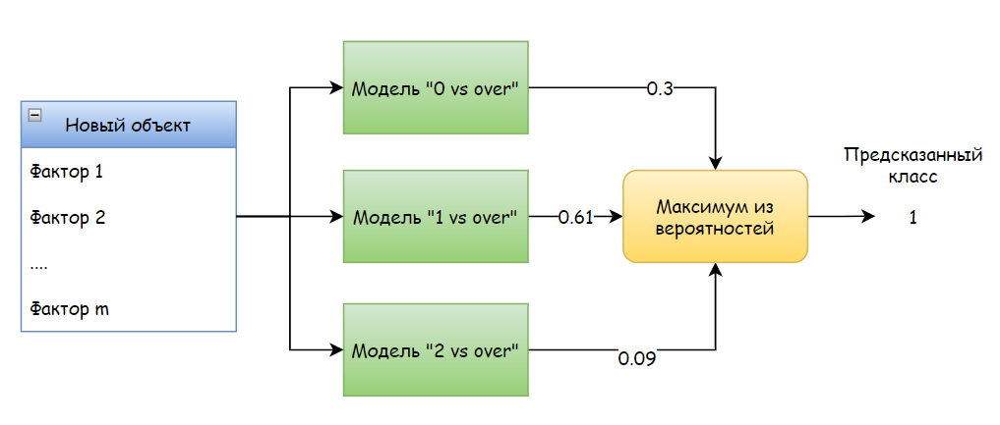

Чтобы преобразовать результат каждой модели в оценку вероятности используется функция `softmax` — многомерный аналог сигмоиды. Она возвращает *нормированные вероятности* (в сумме дающие единицу).


#### Реализация на python

```python
from sklearn import linear_model

log_reg = linear_model.LogisticRegression(
    # penalty='l1',
    # C=10, # коэффициент обратный коэффициенту регуляризации
    # random_state=42,
    # max_iter=1000,
    # solver='sag', # численный метод оптимизации функции потерь
    multi_class='multinomial', # мультиклассовая классификация
)

# обучаем
log_reg.fit(X, y)

# выводим вероятности для каждого класса
log_reg.predict_proba(x)

# чтобы понимать какой индекс соответствует какому классу:
log_reg.classes_
```

#### Плюсы и минусы

Logistic regression применяют для мультиклассовой классификации в первую очередь. У него масса достоинств:

- простой и интерпретируемый,
- быстро работает, не требует много ресурсов
- не зависит от гиперпараметров.

У него есть один недостаток: если классы нельзя разделить линейно (в реальных задачах так чаще всего и бывает), то метод работает плохо. (Эту проблему можно решить добавлением полиномиальные признаков, но тогда придется бороться с переобучением.)

### Decision tree

#### Суть

**Деревья решений** — семейство алгоритмов ML. С помощью моделей на их основе можно решать задачи как классификации, так и регрессии. Они позволяют предсказать целевой признак с помощью вопросов к имеющимся факторам.

Ниже дан пример модели, которая помогат страховому агенту принять правильное решение.


На каждой итерации решение принимается на основе простого правила. Оно называется **решающее правило** или **предикат** (predicate condition).

#### Строение дерева

По топологии дерево решений — это **связный ациклический граф** — такой, где все вершины связаны между собой направленной связью (связный) и при этом не имеющий зацикливаний (ациклический).

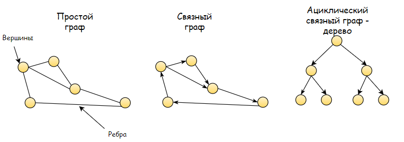

Он имеет три типа вершин:
- **корневая вершина**,
- **внутренние вершины**,
- **листья**.

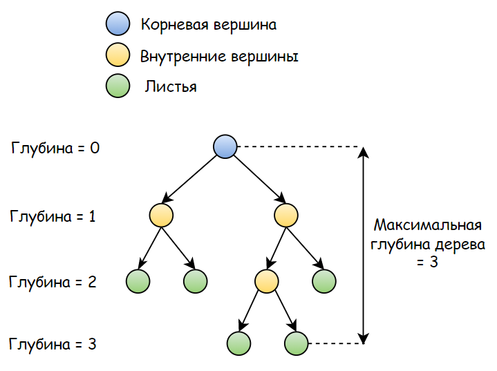

**Максимальная глубина дерева** (max depth) — это кол-во ребер в самой длинной цепочке графа.

#### Алгоритм построения

Существуют разные алгоритмы построения дерева решений. Часть из них [реализована в sklearn](https://scikit-learn.ru/1-10-decision-trees/#tree-algorithms-id3-c4-5-c5-0-and-cart). Мы рассмотрим алгоритм *CART* (Classification and Regression Tree)

Для построения дерева используется рекурсивная функция. При каждом запуске она создает вершину. Если вершина конечная (лист), то она возвращает вершину. Иначе она запускает себя дважды чтобы создать две дочерние вершины, левую и правую.

##### Абстрактная реализация на python

```python
def build_decision_tree(X, y):
    node = Node()
    if stopping_criterion(X, y) is True:
        node = create_leaf_with_prediction(y)
        return node 
    else:
        X_left, y_left, X_rigth, y_rigth = best_split(X, y)
        node.left = build_decision_tree(X_left, y_left)
        node.right = build_decision_tree(X_rigth, y_rigth)
```

В реализации выше `stopping_criterion` может вернуть `True` если все элементы принадлежат к одному классу или если достигнута максимальная глубина.

Самое интересное происходит в функции `best_split`. В ней перебираются все факторы, а для каждого фактора перебираются все возможные значения (от min до max с каким то шагом). Из всех комбинаций факторов и их значений выбирается та пара, которая обеспечивает дальнейшее разбиение *наилучшим образом*.

#### Поиск параметров вершин дерева

Для каждой вершины нужно найти параметры `j` (индекс фактора) и `t` (пороговое значение) индикаторной функции.


Значение предиката для вершины `v` будет единицей если из всех переданных значений факторов `x` именно значение `j`-того фактора меньше или равно `t`.

Чтобы найти `j` и `t` нужно минимизировать функцию `L(j,t)`


Здесь `nᵥ` — кол-во элементов пришедших в вершину, а `H(Q)` — **критерий информативности**. Критерии (левый и правый) будут учитываться в зависимости от того в каких пропорция разделятся элементы.

#### Критерии информативности

**Энтропия Шеннона** (Shannon entropy)


Здесь и ниже `k` — это все классы, a `Pᵢ` — вероятность принадлежности `Q` элементов (всех) к `i`-му классу.

**Критерий Джини** (Gini coefficient)


Функции `P･log₂P` и `P･(1 - P)` похожи по форме, но отличаются по знаку. Обе достигают минимума когда все элементы принадлежат к одному классу.

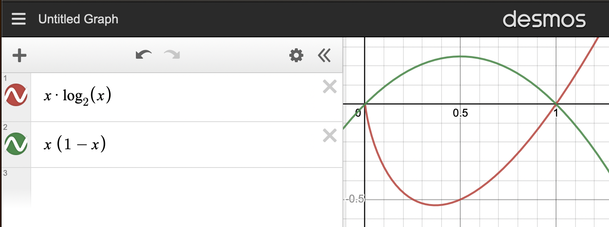

#### Эффективность

Модели на основе дерева решений имеют хорошую обобщающую способность и способны состязаться с моделями на основе логической регрессии. Но важно не переобучить модель! Для этого нужно всегда ограничивать ее при обучении с помощью параметров:
- `max_depth`
- `min_samples_leaf` (мин. кол-во элементов в листе)

#### Значимость (важность) признаков

Модели на основе дерева решений обладают еще одним важным качеством — они умеют определять **значимость признаков** (feature importance). Этим их свойством пользуются для выявления самых важных признаков, когда их кол-во слишком большое и может сильно замедлить скорость обучения.

Данные о значимости находятся в свойстве `feature_importances_` обученной модели. Это коэфициенты значимости, положительные числа от `0` до `1` (их сумма равна единице).

Для определения значимости модель учитывает сложные нелинейные связи, которые не могут быть вычислены с помощью корреляции. (Корреляция определяет коэфициент линейной зависимости между двумя признаками.)

##### Значимость признаков на pythoon

```python
features_df = pd.DataFrame(
    data=[dt_clf_full.feature_importances_],
    columns=dt_clf_full.feature_names_in_,
)

sns.barplot(data=features_df)
```

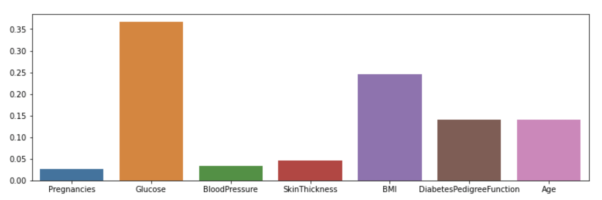

#### Pros & cons

Плюсы

- Не требует стандартизации/нормализации данных
- Не требует очистки данных
- Полученная модель интуитивно понятна
- Вычисляет значимость признаков

Минусы
- Долго обучается (потому что перебирает все признаки и все значения)
- Обучение затратно не только по времени, но и по ресурсам
- Деревья склонны к переобучаемости
- Новые данные могут потребовать переобучения
- При работе с непрерывными числовыми признаками дерево делит их на категории и теряет информацию. (Лучше числовые признаки перевести в категориальные заранее.)

## Ансамбли

### Общее представление

**Ансамблевые модели** или просто **ансамбли** (ensembles) это несколько простых моделей, объединенных для решения одной задачи.

Обычно их применяют тогда, когда уже есть обученная модель, но никак не получается улучшить ее результат.

Ансамбли очень эффективны и соревнуются с нейросетями.

#### Способы объединения

Объединять модели можно по-разному. Например обучить несколько линейных регрессий и затем отправить их результаты в дерево. Но существут три проверенных способа.

- **Бэггинг** (bagging) — *параллельно* обучаем несколько *одинаковых* моделей; конечным решением будет их среднее значение.
- **Стэкинг** (stacking) — *параллельно* обучаем несколько *разных* моделей; их результаты получает финальная модель и принимает конечное решение.
- **Бустинг** (boosting) — *последовательно* обучаем несколько *одинаковых* моделей; каждая новая модель фокусируется на примерах, в которых предыдущая допустила ошибку.

### Бэггинг

В основе метода лежит статистический метод [bootstraping](https://en.wikipedia.org/wiki/Bootstrapping_(statistics)). Он позволяет из выборки размера `n` сделать `k` выборок размера `m` (где `m <= n`). Согласно этому методу экземпляры в выборках могут повторяться.

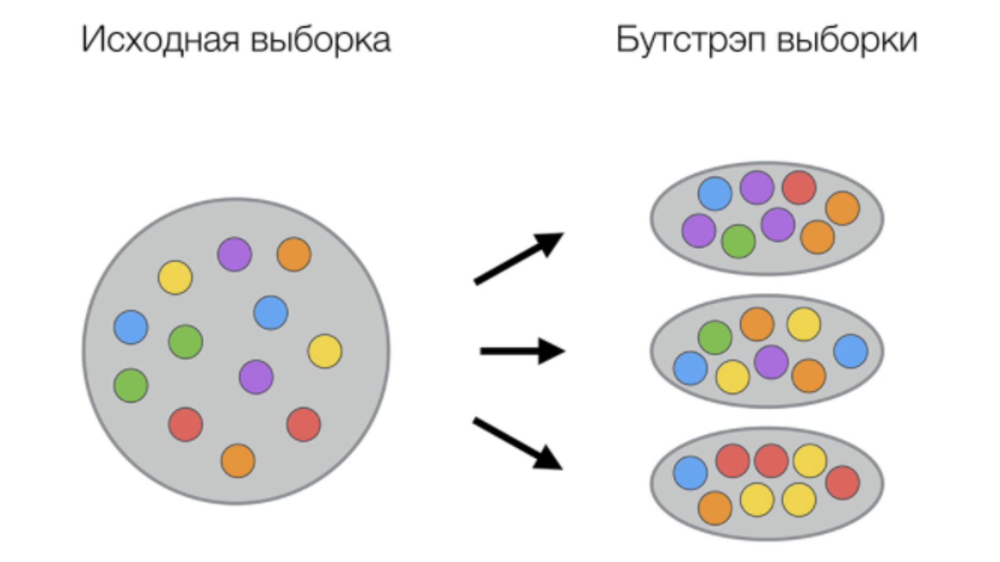

Далее мы обучаем `k` *одинаковых* моделей (base model) на полученных выборках. Для предсказания результата берутся усредненные значения предсказаний всех моделей. (В случае классификации используется *мажоритарное* голсование — принцип большинства.)

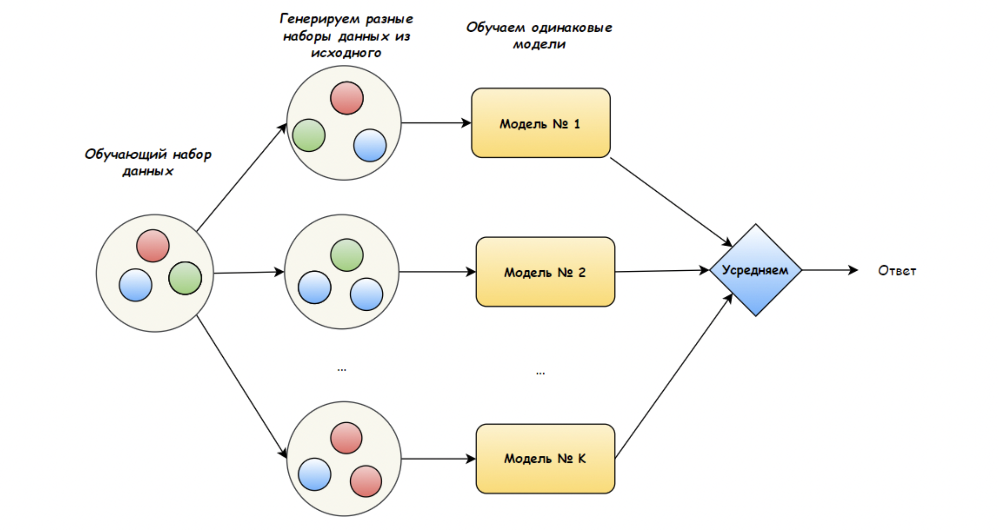

Математически можно показать, что смещение (bias) такой ансамблиевой модели не больше любой из составляющих его моделей, тогда как разброс (variation) ниже в `k` раз.

#### Random forest

**Случайный лес** — самая распространенная реализация беггинга. В качестве базовой модели используется дерево решений. Помимо бутсрапинга он использует также **метод случайных подпространств** (random subspace method), позволяющий уменьшить коррелируемость ответов моделей. Суть метода в том, чтобы каждая выборка обучалась не на всех факторах, а лишь на нескольких, выбранных случайным образом.

Допустим у нас есть исходные данные размером `N × M`, тогда алгоритм подготовки данных для обучения `K` деревьев таков.

1. Сформировать `K` сетов размером `N × M` (размеры сетов совпадают с размером исходной выборки).
2. Для каждого сета выбрать случайным образом `L` критериев (`L < M`) и убрать лишние факторы, чтобы получились сеты размером `N × L`.
3. На каждом сете обучить модель.

##### Реализация на python

```python
from sklearn import ensemble

rf_clf = ensemble.RandomForestClassifier(
    n_estimators=500, # число деревьев
    criterion='entropy', # критерий эффективности
    max_depth=3, # максимальная глубина дерева
    max_features='sqrt', # число признаков для обучения
    random_state=42 # генератор случайных чисел
)
```

## Unsupervised learning / Clustering

### Overview

Кластеризация позволяет группировать схожие данные в *кластеры*. Если данные — это фруктовый салат, то кластеризация покажет, из чего он состоит.


У каждого кластера есть свой центр массы — **центроид**. Чтобы его посчитать нужно найти среднее по каждой оси.

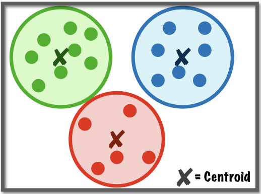

Рассмотрим основные алгоритмы кластеризации.

### Expectation-maximization

EM-алгоритмы кластеризации называются так потому что состоят из двух шагов:

1. На шаге **E**xpectation определяют к какому кластеру относятся элементы.
2. На шаге **M**aximization координаты центроидов пересчитываются.

Мы рассмотрим два EM-алгоритма: *K-means* и *модель Гауссовой смеси*

### K-Means

Этот алгоритм был разработан 1950-х, но используется до сих пор из-за своей высокой эффективности. Для его применения заранее *нужно знать сколько кластеров* будет.

#### Суть метода

Несколько элементов случайным образом выбираются центроидами. Затем все остальные элементы прикрепляются к ближайшему кластеру. После этого центроиды каждого кластера пересчитываются. Далее весь процесс повторяется пока изменения не прекратятся.

Конечные результаты такого процесса могут отличаться на больших выборках поскольку они зависят от первоначальных центроидов, выбранных случайным образом. Поэтому кластеризацию методом K-Means выполняют несколько раз, а затем выбирают наилучшую, используя такую формулу:


Наилучшей является та, у которой `V` меньше.

#### Вариации метода

- **K-Means++** выбирает центроиды не совсем случайно, а стараясь чтобы они не оказались рядом.
- **K-Medians** использует медиану для нахождения центроида
- **K-Medoids** тоже использует медиану для нахождения координат центроида, а далее в качестве центроида не берет ближайший к ней элемент
- **Fuzzy C-Means** относит элементы к кластерам с разной вероятностью (один и тот же элемент может быть в нескольких кластерах)

#### Недостатки метода

- Нужно заранее знать кол-во кластеров
- Чувствителен к выбросам
- Результаты сильно зависят от выбранных случайно центроидов
- Плохо работает с кластерами вытянутой или неправильной формы

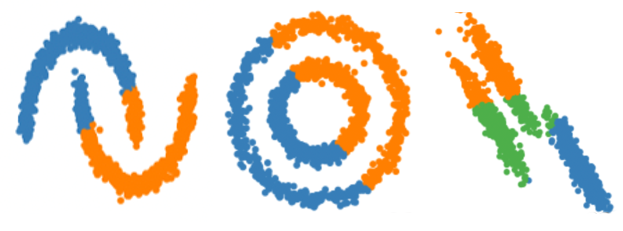

#### Определение оптимального `k`

##### Метод локтя (elbow plot)

Чтобы определить `k` этим методом нужно построить несколько моделей и для каждой отобразить ее инерцию на графике. **Инерция** — это сумма квадратов расстояний каждого объекта до его центроида.

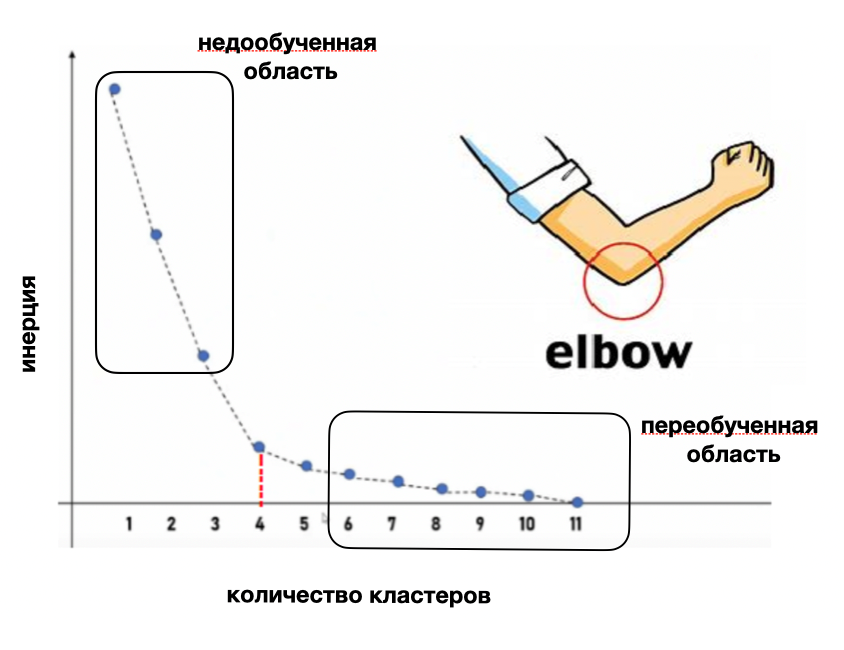

Оптимальное кол-во кластеров будет находиться на сгибе локтя.

##### Метод силуэта (average silhouette method)

Метод локтя не всегда может дать точный ответ, поскольку изгиб может быть плавным. График силуэта интерпретировать значительно легче, так как он имеет единственный пик.

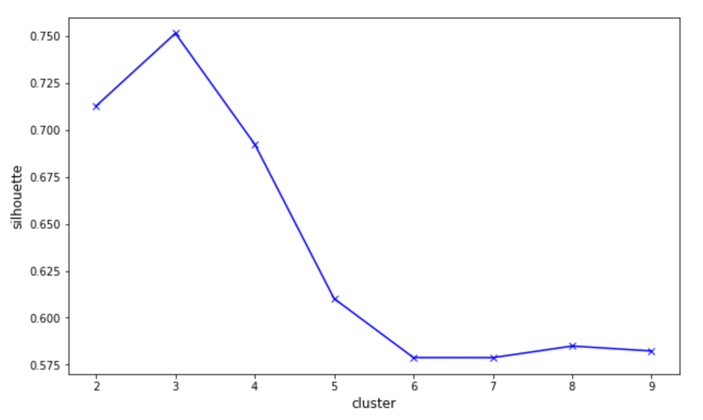

Коэффициент силуэта варьируется от `-1` до `+1` и показывет насколько каждый элемент похож на остальные элементы своего кластера. Если КС равен `1`, то значит кластеры хорошо отделены друг от друга и имеют высокую плотность.

КС рассчитывается как среднее арифметическое каждого элемента. Для каждого элемента КС рассчитывается по формуле:


### Метрики кластеризации

В результате кластеризации мы можем получить лишние и/или неоднородные кластеры.

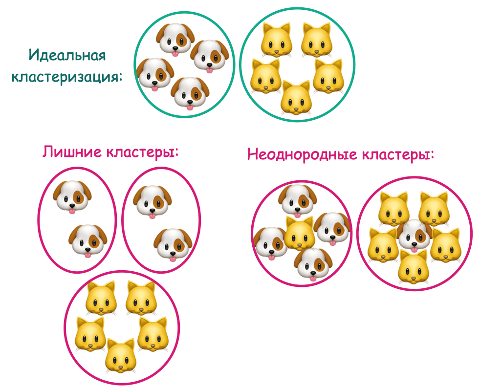

Если мы имеем частично размеченные данные, то сможем оценить эффективность модели с помощью четырех метрик.

1. Homogenity score
2. Completeness score
3. V-measure
4. Rand index

#### Однородность кластеров (homogenity score)

Изменяется от `0` (кластеры максимально неоднородны) до `1` (кластеры полностью однородны).

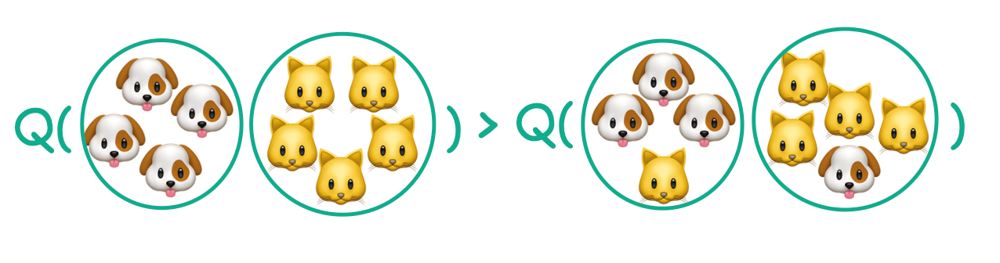

##### Реализация на python

```python
from sklearn.metrics.cluster import homogeneity_score

lbls = [0, 0, 1, 1]
pred = [1, 1, 0, 0]
score = homogeneity_score(labels_true=lbls, labels_pred=pred)
```

#### Полнота кластеров (completeness score)

Изменяется от `0` до `1`. Будет уменьшаться, если однородные элементы собраны не в одном, а в двух и более кластерах. (Но будет равна `1` если и кошки, и собаки окажутся в одном кластере.)

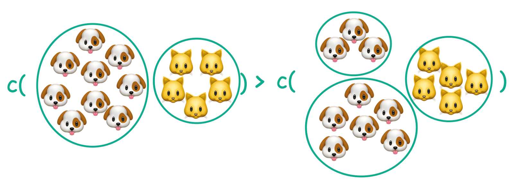

##### Реализация на python

```python
from sklearn.metrics.cluster import completeness_score

lbls = [0, 0, 1, 1]
pred = [1, 1, 0, 0]
score = completeness_score(labels_true=lbls, labels_pred=pred)
```

#### V-мера (V-measure)

Изменяется от `0` до `1`. Эта метрика комбинирует две предыдущие. Она считается по формуле.


С помощью `β` можно управлять важностью составляющих ее метрик: если `β > 1`, то более важной будет полнота, а если `β < 1`, то однородность.

##### Реализация на python

```python
from sklearn.metrics.cluster import v_measure_score

lbls = [0, 0, 1, 1]
pred = [1, 1, 0, 0]
beta = 1.0
score = v_measure_score(labels_true=lbls, labels_pred=pred, beta=beta)
```

#### Индекс Рэнда (Rand index)

Изменяется от `0` до `1`. Показывает соотношение элементов, которые находятся в своих кластерах к общему кол-ву элементов.

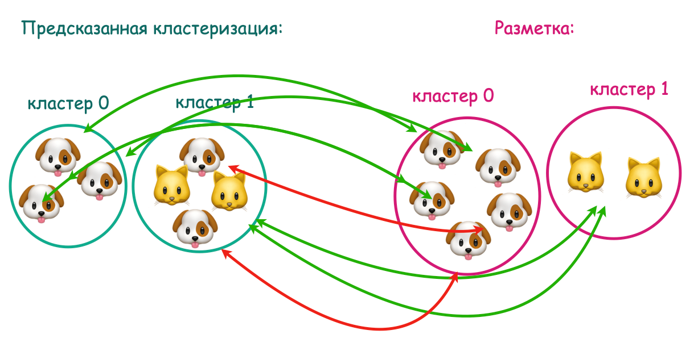

В примере выше индекс будет равен `5/7`

##### Реализация на python

```python
from sklearn.metrics.cluster import rand_score

lbls = [0, 0, 1, 1]
pred = [1, 1, 0, 0]
score = rand_score(labels_true=lbls, labels_pred=pred)
```

### Hierarchical clustering

**Иерархическая кластеризация** — это создание древовидной структуры кластеров. В такой структуре кластер может быть конечным и содержать одни только элементы, или же он может быть промежуточным, и содержать другие клстеры.


#### Методы создания кластеров

**Дивизионный** (divisive) — от общего к частному — кластеры образуются делением на более мелкие.

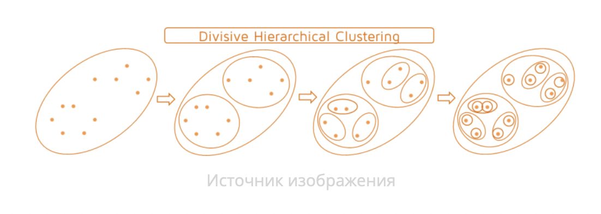

**Агломеративный** (agglomerative) — от частного к общему — кластеры образуются с помощью объединения в более крупные.

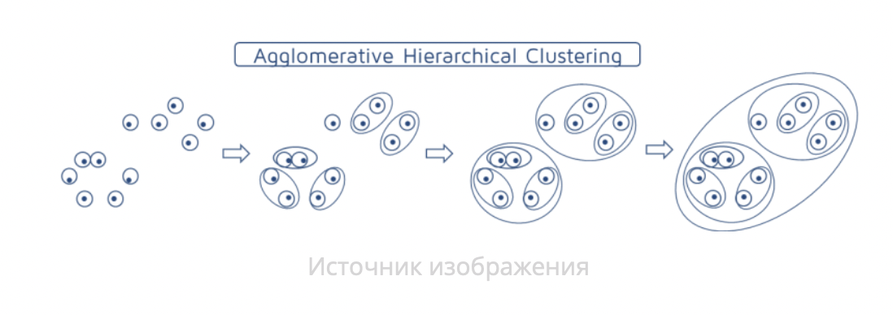

##### Реализация на python

```python
from sklearn.cluster import AgglomerativeClustering

ag_cl = AgglomerativeClustering(n_clusters=4, linkage='ward')
ag_cl.fit(X)

print(ag_cl.labels_)
```

#### Дендрограмма

— это вид диаграмм предназначенный в том числе для представления результатов иерархической кластеризации.

На денрдограмме можно выделить:

- *корень*
- *внуртенние ветки* (с *внутренними нодами*)
- *терминальные ветки* (с *листьями*)

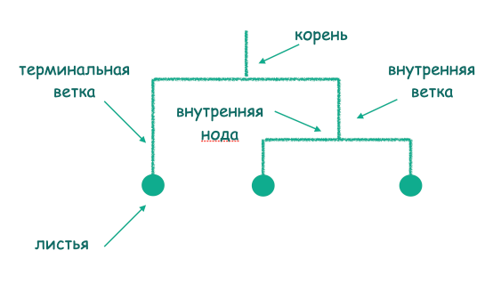

У дендрограммы есть интересная особенность: чем больше схожесть двух элементов, тем короче отходящие от них терминальные ветки.

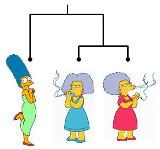

Анализ дендрограммы позволяет:

- понять как объединялись (или делились) кластеры
- насколько похожи соседние кластеры (конечные)
- определить оптимальное кол-во кластеров

Также дендрограмма отвечает на вопрос, сколько будет кластеров, если между ними будет расстояние `y`. Для этого нужно провести горизонтальную линию на высоте `y`: сколько веток она пересекла, столько кластеров и будет.

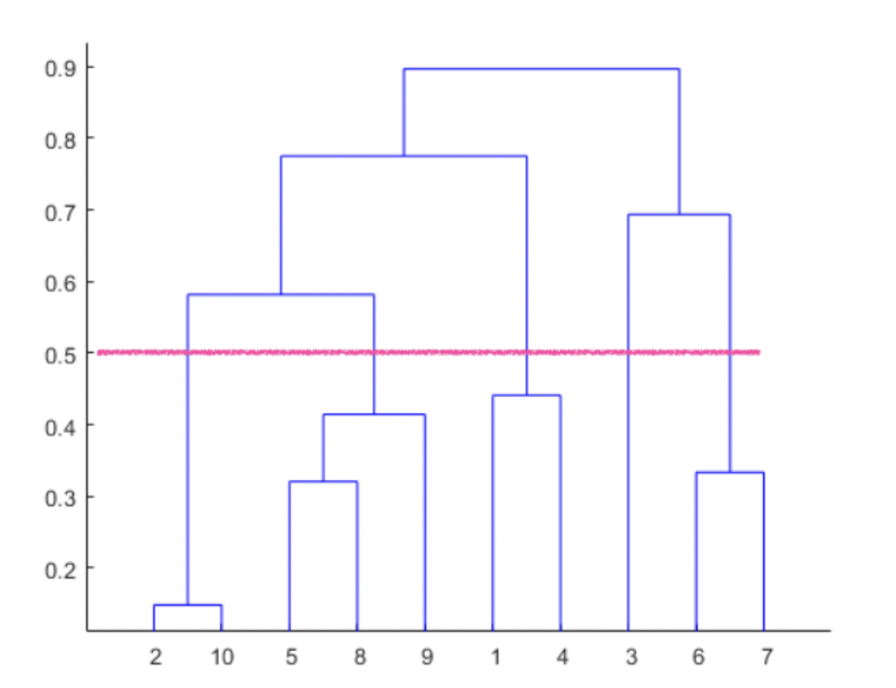

#### Метрица сходств

После того как кластеры созданы, между ними рассчитывают расстояние и помещают их в **матрицу сходств**. Такая матрица используется в дальнейшем для построения денрдрограммы. 

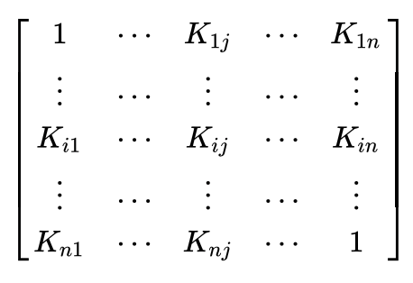

В ней по горизонтали и по вертикали перечислены все кластеры (от `1` до `n`), а на пересечениях — расстояния между ними. Например в `i`-ой строке и `j`-ом столбце будет расстояние между кластерами `i` и `j`. А в диагонали такой матрицы будут единицы.

#### Расстояние между кластерами

Для их рассчета применяются различные методы.

- single linkage
- comlete linkage
- arithmetic mean
- centroid

**Метод одиночной связи** (single linkage) берет расстояние между ближайшими элементами в кластерах.

**Метод полной связи** (complete linkage) берет расстояние меджу самыми отдаленными элементами.

**Метод средней связи** (arithmetic mean) берет среднее всех расстояний между всеми элементами кластеров.

**Центроидный метод** (centroid) берет расстояние между центроидами кластеров.

В зависимости от ситуации применяют разные методы, потому что они проявляют себя с разной эффективностью.

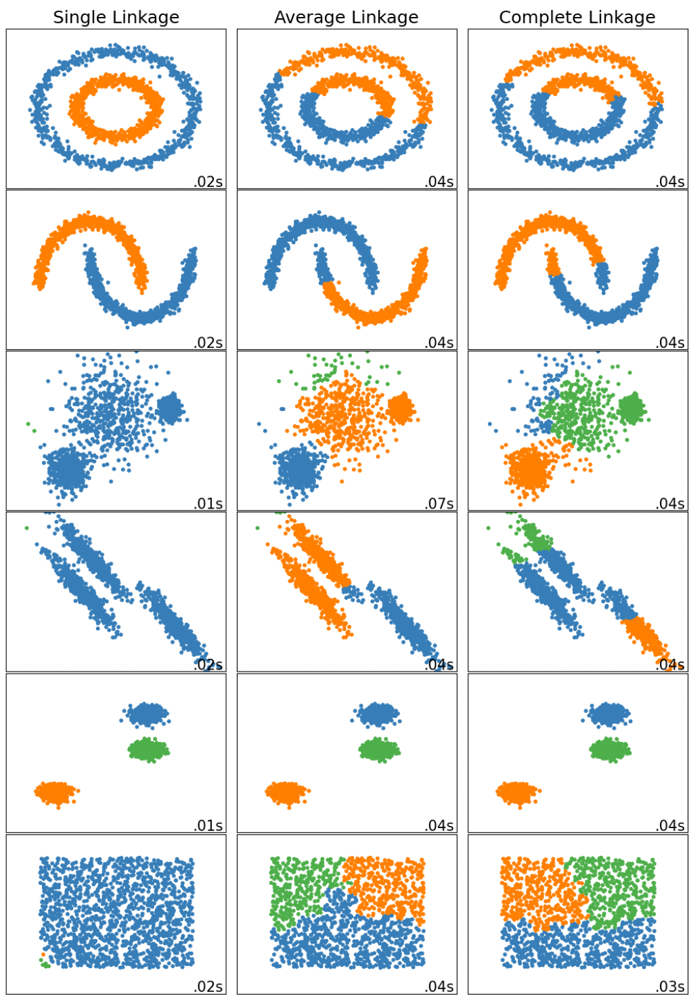

#### Pros & cons

👍 Дендрограмма позволяет узнать оптимальное кол-во кластеров

👍 Алгоритм работает даже на небольшом датасете

👎 Если данных много, то дендрограмму сложно интерпретировать

👎 Может неравномерно разделять данные на кластеры

### Gaussian Mixture Model

K-means алгоритм плохо работает с клатерами, имеющими вытянутую форму. **Модель гауссовой смеси** справляется с этой задачей лучше. (K-means является частным случаем GMM.)


##### Реализация на python

```python
from sklearn.mixture import GaussianMixture

gm_clustering = GaussianMixture(n_components=3, random_state=42)
gm_clustering.fit(X)

gm_clustering.predict(X)
```

##### Pros & cons

Плюсы

- Работает на кластерах эллиптической формы \
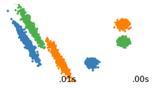
- Справляется с задачей когда элементы находятся между двумя кластерами \
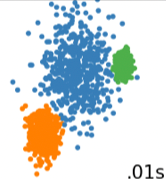

Минусы

- Нужно указывать кол-во кластеров
- Зависит от инициализации
- Может долго сходиться

### Spectral clustering

**Спектральная кластеризация** имеет на вооружении алгоритм, который понижает размерность данных. Он состоит из четырех шагов:

1. Создается граф. Его вершины — элементы, а ребра — расстояния между ними. Данные заносятся в матрицу сходств.\
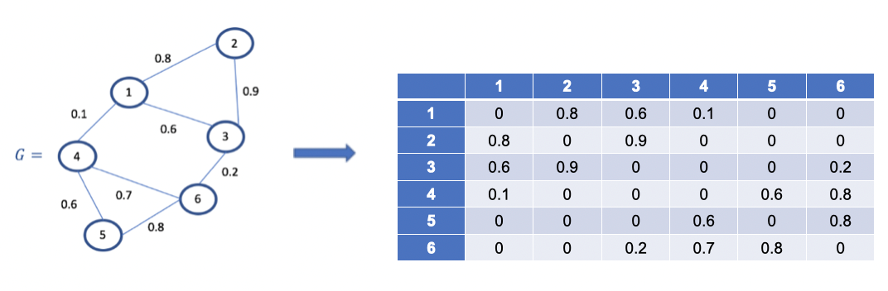
1. С матрицей совершаются математические преобразования.
1. Матрица упрощается (редуцируется в вектор).\
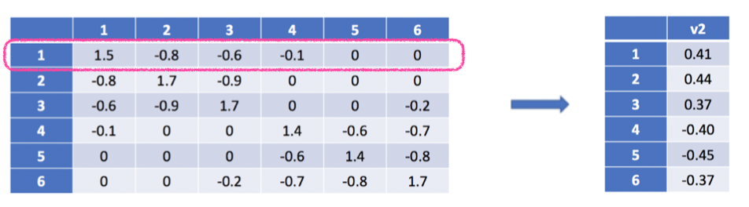
1. По результатам элементы делятся на два кластера.\
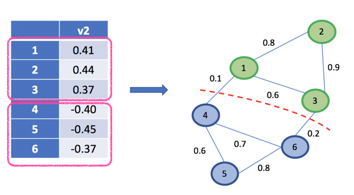

В получившихся кластерах процесс повторяется.

Применяется для очистки изображений от шума.

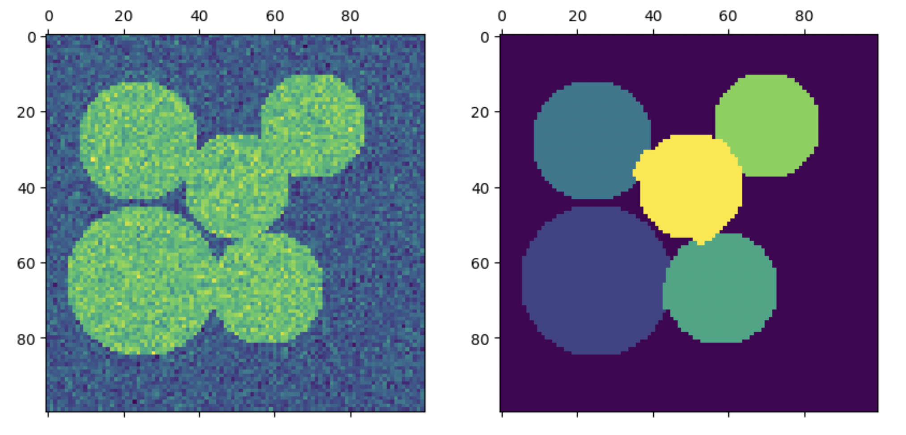

#### Pros & cons

Плюсы

- Работает с большим кол-вом признаков так как редуцирует размерность
- Может работать с разряженными данными
- Хорошо себя показывает почти на любых формах кластеров\
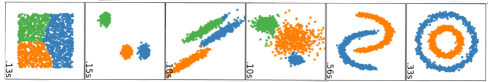

Минусы

- Нужно указывать кол-во кластеров
- Кластеры должны быть сбалансированы (такие в которых кол-во элементов не сильно отличается)

### DBSCAN

**Кластеризация на основе плотности** или DBSCAN (*densiti-based spatial clustering of applications with noise*) хорошо справляется с выбросами, а также сам находит все кластеры — их кол-во не нужно задавать❗️ — даже если они имеют причудливую форму.

#### Принцип работы

| # | Описание этапа | Визуализация |
| - | - | - |
| 1 | Находят все *центральные точки*, т.е. такие, вокруг которых имеются три и более точек (число задается в настройках). Точки без соседей — выбросы — игнорируются. | 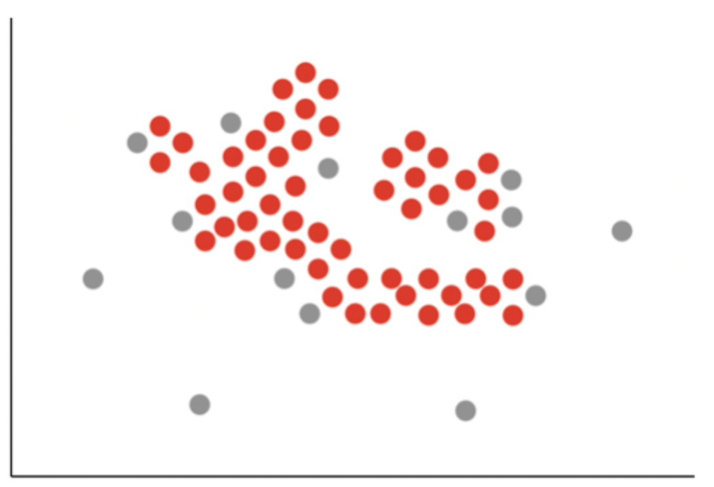 |
| 2 | Выбирают одну из центральных точек и относят ее к первому кластеру. Затем к этому кластеру относят соседние центральные точки, и далее по цепочке. | 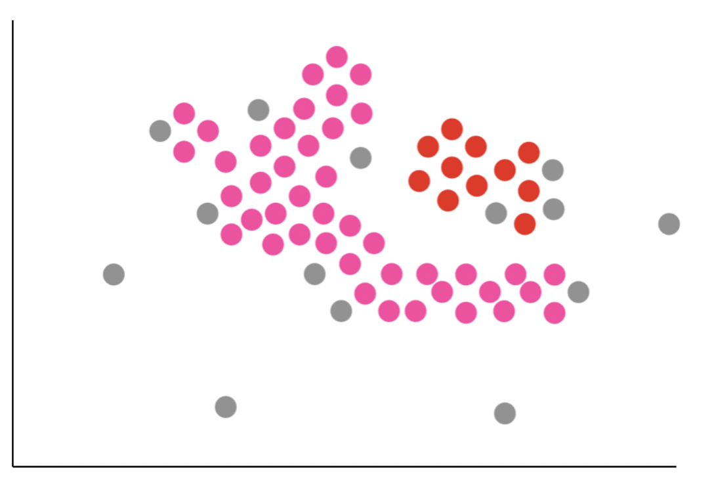 |
| 3 | Далее находят все нецентральные точки в радиусе `r` от точек кластера. Радиус также задается в настройках. |  |
| 4 | Процесс повторяется для центральных точек, не вошедших в первый кластер. И так до тех пор, пока не останется центральных точек без кластера. | 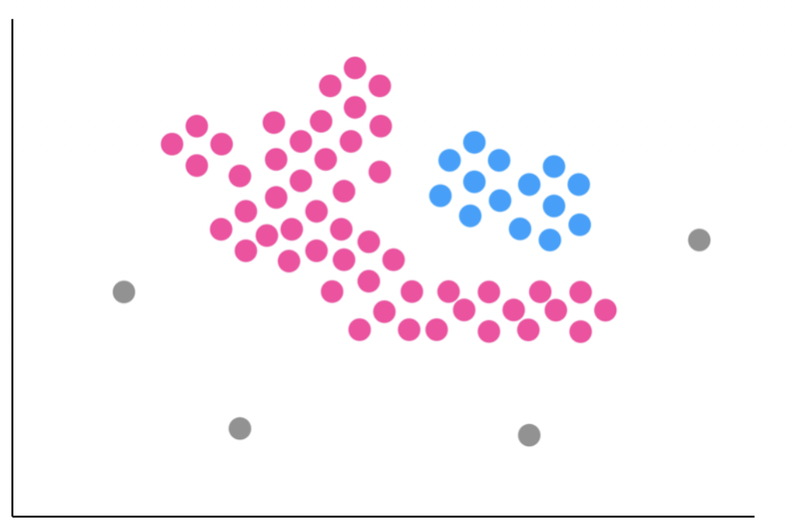 |

#### Реализация на python

```python
from sklearn.cluster import DBSCAN

clustering = DBSCAN(
    min_samples=3, # минимальное кол-во соседей центральной точки
    eps=3, # максимальный радиус до соседней точки
)
clustering.fit(X)

print(clustering.labels_)
```

#### Pros & cons

Плюсы

- Не нужно задавать кол-во кластеров
- Справляется с выбросами
- Необычная форма кластеров — не проблема

Минусы

- Если точка равноудалена от двух кластеров, она будет отнесена к первому
- Плотность элементов *во всех кластерах* должна быть примерно одинаковой
- Иногда трудно подобрать `eps`

### Визуализация кластеризации

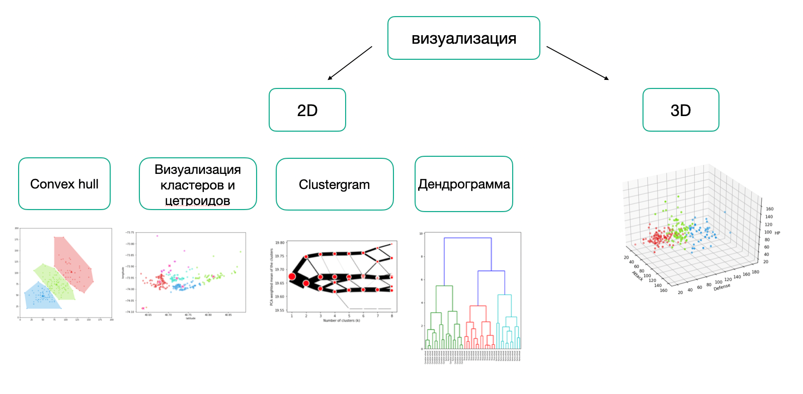

#### Convex hull

Это визуализация выпуклого множества елементов кластера.

##### Реализация на python

```python
from scipy.spatial import ConvexHull

def get_convex_hull_points(points):
    hull = ConvexHull(points)

    return (
        [points[x][0] for x in hull.vertices],
        [points[x][1] for x in hull.vertices],
    )

# points = np.array([[1,1], [1,2], [2,4], [3,0]])
hull_x, hull_y = get_convex_hull_points(points)
plt.fill(hull_x, hull_y, color='#FF0000', alpha=0.2);
```

#### Дендрограмма

Для ее построения необходимы библиотеки [dendrogram](https://docs.scipy.org/doc/scipy/reference/generated/scipy.cluster.hierarchy.dendrogram.html) и [linkage](https://docs.scipy.org/doc/scipy/reference/generated/scipy.cluster.hierarchy.linkage.html)

##### Реализация на python

```python
def draw_dendrogram(data, n_clusters, method):
    agglomerative_clustering = AgglomerativeClustering(n_clusters, linkage=method)
    predictions_ag_model = agglomerative_clustering.fit_predict(data)

    linked = linkage(data, method)

    _fig, ax = figax('dendrogram')

    dendrogram(
        ax=ax,
        Z=linked,
        orientation='top',
        labels=predictions_ag_model,
        distance_sort='ascending'
    )
```

#### Clustergram

Одна диаграмма позволяет понять, как *выбранный алгоритм* поделит данные на два, три, и т.д. кластеров.

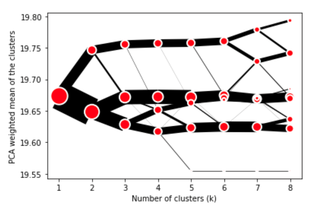

Чем жирнее точка, тем больше элементов входит в кластер. Жирность полос позволяет оценить вклад родительских кластеров.

На данный момент реализация на python поддерживает три алгоритма:

- иерархическую кластеризацию
- k-means
- GMM

Документацию по API можно найти на [Github](https://github.com/martinfleis/clustergram).

##### Реализация на python

```python
# ! pip install clustergram

from clustergram import Clustergram

cgram = Clustergram(range(1, 6), method='kmeans')

cgram.fit(X)

cgram.plot()
```

#### 3D-визуализация Matplotlib

Позволяет быстро оценить результаты кластеризации. Работает с результатами кластеризации, поэтому не зависит от модели.

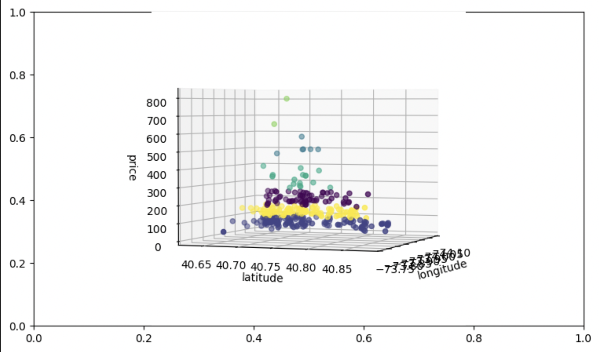

Минус такой визуализации в том, что картинка статична.

##### Реализация на python

```python
from mpl_toolkits.mplot3d import Axes3D

fig, _ax = figax('Axes3D')
ax = Axes3D(fig)
fig.add_axes(ax)

data_x = X['latitude'].to_list()
data_y = X['longitude'].to_list()
data_z = X['price'].to_list()
ax.scatter(data_x, data_y, data_z, c=predictions)

ax.azim = 10
ax.elev = 20

ax.set_xlabel('latitude')
ax.set_ylabel('longitude')
ax.set_zlabel('price')
```

#### 3D визуализация Plotly

Обладает плюсами 3D визуализации Matplotlib, но при этом лишена ее недостатка.

##### Реализация на python

```python
import plotly
import plotly.express as px

fig = px.scatter_3d(
    data_frame=df, 
    x = 'longitude', 
    y = 'latitude', 
    z = 'price', 
    color='clusters', 
    width=1000,
    height=700
)

fig.show()
```