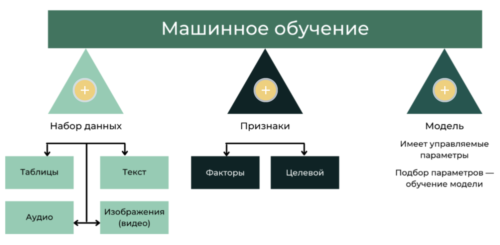

<style>
    h1, h2, h3, h4, h5, h6 { color: darkorange; }
    h1 { filter: hue-rotate(0deg); }
    h2 { filter: hue-rotate(10deg); }
    h3 { filter: hue-rotate(20deg); }
    h4 { filter: hue-rotate(30deg); font-weight: 700; }
    h5 { filter: hue-rotate(40deg); font-weight: 700; }

    strong {
        border-bottom: 2px dotted #ccc;
        filter: hue-rotate(40deg);
    }

    em {
        border-bottom: 2px dotted #ccc;
    }

    a, a:hover {
        text-decoration: underline;
    }

    @media (prefers-color-scheme: dark) {
        body { color: #ccc; }
        strong { border-color: #ccc; }
        em { border-color: #ccc; }
        img { background-color: rgba(255, 255, 255, 0.5) }
        a, a:hover { color: Violet; }
    }
    
    @media (prefers-color-scheme: light) {
        body { color: #333; }
        strong { border-color: #333; }
        em { border-color: #333; }
        /* img { background-color: rgba(0, 0, 0, 0.1) } */
        a, a:hover { color: DodgerBlue; }
    }
</style>

# Machine Learning

## Теоретическая основа

### Искуственный интеллект (Artificial Intelligence)

это комлпексная наука (математика + логика + биология + психология + ...). Её цель — научиться имитировать работу человеческого мозга.

(А еще ИИ называют компьютерную систему, позволяющую имитировать работу мозга человека и решать какую-нибудь прикладную задачу.)

Разделяют cильный и слабый ИИ.

#### Слабый ИИ (Weak AI) 
способен решать определенную задачу не хуже человека, а иногда даже превосходя его.

#### Сильный ИИ (Strong AI)
способен решать множество задач, умеет учиться, осознает себя — это пока что только мечта.


### Машинное обучение (Machine learning)

это набор технологий про самообучающиеся алгоритмы; оно является подразделом науки об ИИ.

Также это одна из трех составляющих Data Science (две другие — *Data analytics* и *Data engineering*)

А также это *главнй навык дата-сайентиста*, поскольку в прикладном смысле Data Science это про использование обученных моделей для бизнес задач.

ML держится на трех столпах:
- набор данных (dataset)
- признаки (features)
- модель (ML model)



Признаки по которым обучается модель, иногда называются **факторами** (factors).

Признак, который модель должна предсказать, называется **целевой признак** (target feature). 

### Глубокое обучение (Deep Learning)

подраздел машинного обучения; в его основе лежит использование искусственных нейронных сетей, имитирующих работу мозга.

## Виды обучения модели

Обучение модели разделяется на три вида

- С учителем (supervised learning)
- Без учителя (unsupervised learning)
- С подкреплением (reinforcement learing)

### Обучение с учителем (supervised learning)

призводится на размеченных данных (с известеными значениями целевого признака). Такой тип обучения позволяет решать задачу *регрессии*, *прогнозирования* и *классификации*.

#### Регрессия (regression)

это предсказание значения целевого признака (некоего вещественного числа).

Регрессия бывает **линейная (Linear)** и **полиномиальная (Polinomial)**. Последняя позволяет более гибко определять подстраиваться под данные, но при этом есть риск переобучения.


#### Прогнозирование (forecasting)

Можно сказать, что это частный случай регрессии, в котором целевая переменная непрерывна и зависит от времени, причем для каждого момента времени существует только одно значение целевой переменной.


#### Классификация

это предсказание принадлежности объекта к одному из нескольких (обычно двух) классов. Если возможных результатов всего два, то это **бинарная классификация**, если более то **многоклассовая классификация**

### Обучение без учителя (unsupervised learning)

производится на данных без разметки.

#### Кластеризация (clustering)

Разбивает данные по функции `p(x`<sub>i</sub>`, x`<sub>j</sub>`)` наименьшего расстояния (различия) между ними. Количество кластеров можно задать самостоятельно или не задавать.

#### Понижение размерности (dimensionality reduction)

Применяется к исходным данным со слишком большим количеством признаков. Цель — получить обобщенные данные без лишних деталей.

Метод позволяет:
- абстрагироваться от лишних деталей;
- ускорить обучение модели на редуцированных данных;
- избавиться от мультиколлинеарности (поскольку в первую очередь объединяет наиболее схожие признаки).


С помощью данного метода была создана модель для определения тематики текстов. Также можно получить рекомендательную систему.

#### Ассоциация (association)

Позволяет находить паттерны поведения:
- пользователей на веб-сайте,
- покупателей в магазине,
- владельцев акций на бирже, и т.д.

### Обучение с подкреплением (reinforcement learing)

Модели обученные таким методом позволяют решать задачи "выживания" некоторого субъекта в некотором мире. Мир этот может быть виртуальный (персонаж в компьютерной игре) или реальный (автопилот на дороге).

Субъект в таких задачах называют "агентом" (**agent**), а мир — "средой" (**environment**). Во время обучения  агент может наблюдать за средой, совершать дейтсвия и получать от среды обратную реакцию (поощрение или наказание).

Агент не может собрать всю информацию о среде и просчитать все варианты. Задача обучения — найти наилучшую стратегию выживания.

Существуют различные алгоритмы для решения данного класса задач:
- Q-learning
- SARSA
- DQN (Depp Q-Network) 
- Genetic algorithms и др.

Генетические алгоритмы основаны на создании случайных моделей, выборе лучших из них, синтезировании улучшенных моделей на их основе и повторении этого цикла. Они применяются все реже, поскольку сильно уступают алгоритмам на основе Q-learning.

## Обзор методологий разработки ПО

### Waterfall

Предполагает поэтапное создание конечного продукта. Каждый этап выполняется один раз, после чего команда приступает к следующему этапу. Возможность вернуться к одному из предыдущих этапов отсутствует. У команды есть только один шанс отдать результат своей работы заказчику. Это значит, что все возможные ошибки к этому моменту должны быть найдены и устранены.

Данную методологию можно применять тогда, когда у команды есть опыт решения аналогичных задач. Именно в этом случае проект можно разбить на этапы, создать для каждого этапа документацию и выполнить все этапа последовдательно без откплонений от ТЗ.


### Agile

Данная методология предполагает бесконечный цикл итераций по улучшению продукта, его эволюцию. Подходит для проектов, не имеющих четких очертаний. Позволяет вернуться к этапу проектирования после неудачной разработки или тестирования.


Минусы данной методологии вытекают из ее основных принципов.

1. Каждый разработчик несет ответственность за конечный результат. Но если все отвечают, значит никто конкретно не отвечает, и крайнего не найти.
2. Каждый цикл имеет жестко заданный временной интервал (обычно 2 недели), и нужно в него уложиться. Но в этой спешке не всегда остается время на качественное тестирование.

### CRISP-DM

Данную методологию придумали специально для задач с данными (*Cross-Industry Standard Process for Data Mining*). Она похожа на Agile тем, что имеет цикл итераций. Она отличается от Agile тем, что у нее другие этапы, лучше подходящие для задач по ML, и их последовательность не опредлена строго (возможен возврат на предыдущий этап, изменение последовательности этапов, а также параллельное выполнение нескольких этапов).


## Supervised learning / Regression

Задача — научить модель по совокупности **факторов** предсказывать **целевой признак**. (И факторы, и целевой признак — это обычные числа.)

То есть в процессе обучения модель должна найти зависимость между входными данными (много чисел) и результатом (одно число).

### Линейная регрессия (Linear regression)

Если, *согласно нашей гипотезе*, описанная выше зависимость имеет линейный характер, то для обучение мы будем использовать алгоритм линейной регрессии.

#### Вычисление целевого признака

Для вычисления целевого признака модель внутри себя использует такую формулу:

`ŷ = w₀ + w₁x₁ + ... + wₘxₘ`

При обучении модели происходит подборка коэфициентов `w` таким обраом, чтобы на выходе получилась функция, правильно предсказывающая целевой . Эти коэфициенты называются **параметрами линейной регрессии**.

##### 2D (один фактор)

Если входной фактор только один, то формула принимает такой вид:

`ŷ = w₀ + w₁x₁`

Такая же формула используется для описания линейной функции на плоскости:

`y = ax + b`

Когда параметры линейной регрессии `w₀` и `w₁` известны, можно построить график такой функции. Как видно он является линией на плоскости.


##### 3D (два фактора)

Если факторов два, то в формулу добавляется новая пара `wx`

`ŷ = w₀ + w₁x₁ + w₂x₂`

При известных значениях параметров линейной регрессии график конечной функции будет выглядеть как плоскость в трехмерном пространстве.


##### ND (M факторов)

Количество факторов может быть любым. Если факторов M, то модель будет вычислять параметры для линейной функции в N-мерном пространстве (N = M + 1)

Конечное уравнение `ŷ = w₀ + w₁x₁ + ... + wₘxₘ`\
будет описывать *гиперплоскость* (hyperplane) в N-мерном пространстве.

#### Вычисление параметров линейной функции

Вычисление параметров `w` осуществляется в процессе обучения модели. В самом начале параметры неизвестны, им присваиваются случайные значения, и модель вычисляет целевой признак наугад.
 
В процессе обучения (которое по сути итеративный процесс) на каждой итерации происходит улучшение параметров, и модель вычисляет целевой признак все лучше.

Как это происходит?

На каждой итерации параметры меняются таким образом, чтобы **функция ошибки** давала наименьший результат.


#### Функция ошибки

Что есть ошибка? Это расхождение между предсказанием и реальностью. 


Мы можем посчитать расхождение для каждой точки и затем просуммировать все расхождения. Или же можно полученную сумму разделить на кол-во точек и получить среднее.

##### MAE

MAE — это **средняя абсолютная ошибка** (mean absolute error).


К несчастью математики еще не научились оптимизировать подобные функции, так как они не дифференциируемы (не имеют производной).

##### MSE

MSE — это **среднеквадратическая ошибка** (mean square error).


По сути данная функция делает то же самое, что MAE, но она дифференциируема, а математики знают, как оптимизировать подобные фунции. Для ее решения мы будем использовать **метод наименьших квадратов, МНК** (по англкийски — ordinary least squares, OLS). Данный метод придумал Гаусс в 1975 году.

##### Вычисление параметров аналитически (с помощью МНК)

Для решения задачи испльзуется формула

`w = Q·Xᵀ·y`, где\
`Q = (Xᵀ·X)⁻¹`

Можно написать функцию для вычисления с помощью `Numpy`, а можно воспользоваться готовым методом `sklearn`

```python
from sklearn import linear_model

lr_model = linear_model.LinearRegression()

lr_model.fit(X, y)

print('w0: {}'.format(lr_lstat.intercept_))
print('w1: {}'.format(lr_lstat.coef_)) 
```

## Метрики регрессии

**Метрика** — это оценка качества модели, выраженная числом.

### Mean Absolute Error (MAE)

Это **средняя абсолютная ошибка** — сумма `|y - ȳ|` деленая на кол-во.


Суть метрики проста и понятна. Минус ее в том, что полученное число мало о чем говорит (если вы не специалист в коркретной области).

### Mean Absolute Percent Error (MAPE)

Это **средняя абсолютная ошибка в процентах**


### Mean Squared Error (MSE)

**Среднеквадратическая ошибка** имеет ту же формулу что и средняя абсолютная ошибка, но вместо модуля берется квадрат ошибки

